---
daksh:
  type: business-requirements
  subtype: null
  stage: "20"
  module: null
---

# Business Requirements

This BRD turns the approved [vision](vision.md)'s thesis — one Order Lifecycle spanning Admin, Delivery Agent, and End User — into testable contracts: eleven use cases, twenty-eight functional requirements each tracing to one, and the acceptance criteria that make every requirement checkable rather than aspirational. It exists because a vision states what the product is; this document states exactly what "done" means for each piece of it, so [stage](glossary#stage) 30 (architecture) and every module spec downstream inherit contracts instead of interpretations. The audience is whoever builds or reviews architecture, module specs, and tests next — read this cold, without the conversation history that produced it, and it should still be unambiguous.

<details>
<summary>Graph: What must be true — and measurable — for the business to accept this?</summary>

```items
---
id: 20-brd-cognition
title: BRD — Acceptance Structure
default_open_depth: 1
default_color_by: kind
color_palette_source: .daksh/color-palette.json
width: 95vw
---
id: 20-brd-cognition
title: BRD — Acceptance Structure
Goals:
  - goal-00 :: Digitize Mini Mart's manual operations end-to-end | kind: goal | summary: "Replace paper/register-only retail with an online ordering, stock, and delivery system." | spec: [Use Cases](business-requirements.md#use-cases) | success_measure: "Admin and end users report both faster checkout and reliable stock visibility within 6 months of launch."
  - goal-01 :: Fast, accurate online checkout | kind: goal | summary: "End users complete checkout quickly with correct pricing and stock deduction." | spec: [Use Cases](business-requirements.md#use-cases) | success_measure: "Checkout completes with no manual price or stock correction needed."
  - goal-02 :: Real-time stock visibility for admin | kind: goal | summary: "Admin always sees current stock levels without a physical recount." | spec: [Use Cases](business-requirements.md#use-cases) | success_measure: "Admin answers \"do we have X in stock\" from the app alone, no register or notebook lookup."
  - goal-03 :: Reliable Phase 1 fulfillment via delivery agents | kind: goal | summary: "Orders placed online reach the customer through a delivery agent without manual phone coordination." | spec: [Use Cases](business-requirements.md#use-cases) | success_measure: "Orders are assigned, delivered, and COD-collected without a phone call between admin and agent."
Users:
  - user-01 :: Admin | kind: user | summary: "Runs the mart's catalog, pricing, and stock, and oversees orders and delivery agents." | spec: [Stakeholders](business-requirements.md#stakeholders) | role: "Mart Admin/Owner" | audience: client | user_type: operator | status: placeholder
  - user-02 :: Delivery Agent | kind: user | summary: "Picks up assigned orders and delivers them to end users, collecting cash on delivery." | spec: [Stakeholders](business-requirements.md#stakeholders) | role: "Delivery Agent" | audience: client | user_type: practitioner | status: placeholder
  - user-03 :: End User | kind: user | summary: "Browses the catalog, places an order, and pays cash on delivery when it arrives." | spec: [Stakeholders](business-requirements.md#stakeholders) | role: "Shopper/Customer" | audience: end_customer | user_type: consumer | status: placeholder
Use Cases:
  - uc-001 :: End User creates an account | kind: flow | summary: "A shopper verifies their email via OTP to create the account checkout requires." | spec: [UC-001](business-requirements.md#uc-001-end-user-creates-an-account) | actor: "End User" | trigger: "Visitor enters email at signup/login" | outcome: "Verified account exists, session started"
  - uc-002 :: End User browses and searches the catalog | kind: flow | summary: "A shopper finds items by category or keyword search before ordering." | spec: [UC-002](business-requirements.md#uc-002-end-user-browses-and-searches-the-catalog) | actor: "End User" | trigger: "User opens the storefront" | outcome: "User finds an item and adds it to cart"
  - uc-003 :: End User places an order | kind: flow | summary: "A shopper checks out a cart into a confirmed, stock-reserved order." | spec: [UC-003](business-requirements.md#uc-003-end-user-places-an-order) | actor: "End User" | trigger: "User proceeds to checkout with items in cart" | outcome: "Order exists in `placed` status with stock reserved"
  - uc-004 :: End User cancels an order before dispatch | kind: flow | summary: "A shopper or admin cancels a just-placed order within the free window." | spec: [UC-004](business-requirements.md#uc-004-end-user-cancels-an-order-before-dispatch) | actor: "End User or Admin" | trigger: "Cancel requested on a `placed` order" | outcome: "Order `cancelled`, stock released, or request rejected if past the window"
  - uc-005 :: End User tracks order status | kind: flow | summary: "A shopper is kept informed as their order moves through the lifecycle." | spec: [UC-005](business-requirements.md#uc-005-end-user-tracks-order-status) | actor: "End User" | trigger: "Order status changes" | outcome: "User is notified in-app and by email"
  - uc-006 :: Admin manages the catalog | kind: flow | summary: "Admin bulk-imports and maintains items, prices, and categories." | spec: [UC-006](business-requirements.md#uc-006-admin-manages-the-catalog) | actor: "Admin" | trigger: "Admin uploads a catalog file or edits an item" | outcome: "Catalog reflects current items, prices, and categories"
  - uc-007 :: Admin manages stock | kind: flow | summary: "Admin records walk-in sales and sees low-stock items proactively." | spec: [UC-007](business-requirements.md#uc-007-admin-manages-stock) | actor: "Admin" | trigger: "A walk-in sale happens, or admin checks stock" | outcome: "Stock count stays accurate across both sales channels"
  - uc-008 :: Admin manages orders and delivery agent assignment | kind: flow | summary: "Admin assigns and, if needed, reassigns orders to delivery agents." | spec: [UC-008](business-requirements.md#uc-008-admin-manages-orders-and-delivery-agent-assignment) | actor: "Admin" | trigger: "A new order needs an agent, or an assigned agent becomes unavailable" | outcome: "Every order has an available, assigned agent"
  - uc-009 :: Delivery agent registers and gets approved | kind: flow | summary: "A prospective agent signs up and is vetted before receiving work." | spec: [UC-009](business-requirements.md#uc-009-delivery-agent-registers-and-gets-approved) | actor: "Delivery Agent" | trigger: "Prospective agent submits a registration" | outcome: "Agent is approved and can receive assignments, or rejected"
  - uc-010 :: Delivery agent fulfills an order | kind: flow | summary: "An agent picks up, delivers, and confirms COD collection, or handles refusal." | spec: [UC-010](business-requirements.md#uc-010-delivery-agent-fulfills-an-order) | actor: "Delivery Agent" | trigger: "Agent is assigned an order" | outcome: "Order `delivered` with COD confirmed, or `cancelled` on refusal"
  - uc-011 :: System releases stock for stale orders | kind: flow | summary: "An order that never gets confirmed or picked up stops holding stock hostage." | spec: [UC-011](business-requirements.md#uc-011-system-releases-stock-for-stale-orders) | actor: "System" | trigger: "An order stays unconfirmed/uncollected past a timeout" | outcome: "Order `cancelled` (reason: stale_timeout), stock released"
Milestones:
  - milestone-01 :: Core Order Lifecycle ready for internal testing | kind: milestone | summary: "Catalog, checkout, admin assignment, agent delivery, and COD confirmation work end to end against test data." | spec: [Use Cases](business-requirements.md#use-cases) | due: "Before production launch" | definition_of_done: "UC-001 through UC-011 all pass acceptance criteria in a staging environment."
  - milestone-02 :: Agent onboarding and notification infrastructure live | kind: milestone | summary: "Agent self-registration/approval and in-app + email notifications are operational, not stubbed." | spec: [UC-009](business-requirements.md#uc-009-delivery-agent-registers-and-gets-approved) | due: "Before production launch" | definition_of_done: "A real agent can self-register, get approved, and receive a real notification for a real assignment."
  - milestone-03 :: Production launch | kind: milestone | summary: "The app is live for real End Users in the fixed service area, not a demo." | spec: [Vision Statement](vision.md#vision-statement) | due: "After milestone-01 and milestone-02" | definition_of_done: "A real order is placed, paid COD, and delivered, with stock reconciling correctly, outside of a test environment."
Decisions:
  - decision-24 :: Stock reserved at order confirmation, not cart-add | kind: decision | summary: "Adding an item to cart never locks stock; only a confirmed checkout reserves it, first to confirm wins." | spec: [FR-008](business-requirements.md#uc-003-end-user-places-an-order) | alternatives: "Reserve stock the moment it's added to cart (a booking-style hold) — more protective of an in-progress cart, but requires a hold-expiry mechanism and is real complexity Phase 1 doesn't need at dozens-of-orders/day scale." | reversal_trigger: "Real usage shows customers frequently lose items to a faster checkout at the last second, frustrating enough to justify a cart-hold mechanism."
  - decision-25 :: Low-stock threshold ships as a fixed default, not per-item configurable | kind: decision | summary: "Admin sees a low-stock flag at a single fixed threshold (e.g. 5 units) across all items in Phase 1, not a per-item configurable value." | spec: [FR-017](business-requirements.md#uc-007-admin-manages-stock) | alternatives: "Per-item configurable threshold — more accurate for items with very different velocities, but adds a settings surface with no evidence yet that a fixed default is wrong." | reversal_trigger: "Admin reports the fixed threshold is meaningfully wrong for specific high- or low-velocity items after real usage."
  - decision-26 :: Order status vocabulary is fixed and canonical | kind: decision | summary: "Five order statuses only — `placed`, `assigned`, `out_for_delivery`, `delivered`, `cancelled` (with a `reason` sub-field) — reused verbatim by every downstream doc, never re-invented per layer." | spec: [Domain Vocabulary](business-requirements.md#domain-vocabulary) | alternatives: "Let TRD or tasks invent their own status labels as needed — rejected; this is exactly the drift the domain-glossary mechanism exists to prevent, called out explicitly as the highest-risk vocabulary in Daksh's own BRD stage rules." | reversal_trigger: "A new order state is discovered that genuinely doesn't fit the five — requires a formal change record, not a silent addition."
  - decision-27 :: Delivery Agent authenticates via email + OTP, same as End User | kind: decision | summary: "Agents log in with the identical email+OTP mechanism as End User — no separate credential system for a second user type." | spec: [BRD Decisions](business-requirements.md#brd-decisions) | alternatives: "Admin-created username + password per agent — avoids an email dependency, but adds password storage and reset handling for a second account type with no offsetting benefit." | reversal_trigger: "Agents need offline/low-connectivity login that email OTP can't reliably support."
  - decision-28 :: OTP expiry is 10 minutes, resend cooldown is 60 seconds | kind: decision | summary: "Fixes the concrete numbers AC-001 needed: a code is valid for 10 minutes and can be resent after 60 seconds, applied to both End User and Delivery Agent OTP." | spec: [BRD Decisions](business-requirements.md#brd-decisions) | alternatives: "Longer/shorter windows were not specifically requested; these are the standard defaults chosen absent a stated reason to deviate." | reversal_trigger: "Real usage shows emails routinely arrive too slowly for a 10-minute window, or the 60-second cooldown invites abuse."
  - decision-29 :: Admin password reset via email link to a registered recovery email | kind: decision | summary: "A standard forgot-password flow — one recovery email registered at setup, reset links sent there." | spec: [BRD Decisions](business-requirements.md#brd-decisions) | alternatives: "No self-service reset, manual/database intervention only — simpler to build but leaves the entire Admin operation locked out on a lost password with no recovery path." | reversal_trigger: "The recovery email itself becomes inaccessible — Phase 1 has no secondary recovery path for that case."
  - decision-30 :: End User can save multiple delivery addresses | kind: decision | summary: "An End User's account holds more than one saved address (e.g. home/work), selected per order, not a single overwritten field." | spec: [BRD Decisions](business-requirements.md#brd-decisions) | alternatives: "Single address on file, overwritten each order — simpler data model, rejected because repeat customers with more than one delivery location would need to re-enter an address every time." | reversal_trigger: "Real usage shows customers only ever use one address, making the extra selection step pure friction."
  - decision-31 :: Cart persists server-side once logged in | kind: decision | summary: "A logged-in End User's cart is stored server-side, tied to their account, and survives closing the tab or switching devices." | spec: [BRD Decisions](business-requirements.md#brd-decisions) | alternatives: "Purely local/browser-only cart — simpler, no backing store, but loses the cart on a device switch or cleared browser data, which login (already required — decision-15) makes unnecessary to accept." | reversal_trigger: "Server-side cart sync proves to add meaningful latency to the browsing experience."
  - decision-32 :: No maximum order size in Phase 1 | kind: decision | summary: "No cap on items or quantity per order — Phase 1's dozens-of-orders/day scale doesn't yet justify designing around an oversized single order." | spec: [BRD Decisions](business-requirements.md#brd-decisions) | alternatives: "A fixed item/quantity cap — protects a single delivery agent's capacity, but there is no evidence yet this is a real problem worth the added checkout friction." | reversal_trigger: "An unusually large order is placed in practice and overwhelms a delivery agent's capacity."
OpenQuestions:
  - oq-21 :: Delivery Agent authentication mechanism | kind: openquestion | summary: "How does an approved Delivery Agent log in day to day? — resolved, see decision-27." | spec: [BRD Decisions](business-requirements.md#brd-decisions)
  - oq-22 :: OTP expiry and resend cooldown | kind: openquestion | summary: "What's the exact OTP expiry window and resend cooldown? — resolved, see decision-28." | spec: [BRD Decisions](business-requirements.md#brd-decisions)
  - oq-23 :: Admin password reset | kind: openquestion | summary: "How does Admin recover from a lost password? — resolved, see decision-29." | spec: [BRD Decisions](business-requirements.md#brd-decisions)
  - oq-24 :: Saved delivery addresses | kind: openquestion | summary: "Can an End User save multiple delivery addresses? — resolved, see decision-30." | spec: [BRD Decisions](business-requirements.md#brd-decisions)
  - oq-25 :: Cart persistence | kind: openquestion | summary: "Does a cart persist server-side across sessions/devices? — resolved, see decision-31." | spec: [BRD Decisions](business-requirements.md#brd-decisions)
  - oq-26 :: Maximum order size | kind: openquestion | summary: "Should there be a cap on items/quantity per order? — resolved, see decision-32." | spec: [BRD Decisions](business-requirements.md#brd-decisions)
goal-00 -> goal-01 | relation: decomposes_into
goal-00 -> goal-02 | relation: decomposes_into
goal-00 -> goal-03 | relation: decomposes_into
user-03 -> uc-002 | relation: experiences
user-03 -> uc-003 | relation: experiences
user-03 -> uc-006 | relation: experiences
user-01 -> uc-006 | relation: owns
user-01 -> uc-007 | relation: owns
user-01 -> uc-008 | relation: owns
user-02 -> uc-009 | relation: owns
user-02 -> uc-010 | relation: owns
milestone-01 -> milestone-02 | relation: enables
milestone-02 -> milestone-03 | relation: enables
milestone-03 -> goal-00 | relation: serves
decision-24 -> uc-003 | relation: governs
decision-25 -> uc-007 | relation: governs
decision-26 -> uc-003 | relation: governs
decision-26 -> uc-010 | relation: governs
decision-27 -> oq-21 | relation: decides
decision-28 -> oq-22 | relation: decides
decision-29 -> oq-23 | relation: decides
decision-30 -> oq-24 | relation: decides
decision-31 -> oq-25 | relation: decides
decision-32 -> oq-26 | relation: decides
decision-27 -> uc-009 | relation: governs
decision-28 -> uc-001 | relation: governs
decision-30 -> uc-003 | relation: governs
decision-31 -> uc-002 | relation: governs
```

</details>

> [!note]
> This graph carries 36 nodes across 6 groups (9 Decisions after a follow-up round resolved all 6 of this stage's original open questions — decision-27 through decision-32). `Goals` and `Users` are reused from vision.md by the same IDs, trimmed to the root and three pillar goals — the full sub-goal tree already lives there and re-drawing it here would be indexed re-listing, not new structure. `Use Cases` are modeled as `Flow` nodes (the correct closed-vocabulary kind for a `User`'s `experiences` edge, unlike `Goal`), `Milestones` are new for this stage. `user-03` and `user-01` each cap at 3 outgoing `experiences`/`owns` edges rather than their full real list (End User also touches UC-001/004/005; Admin also touches UC-006 already listed, no further trim needed there) to stay clear of the mass-broadcast smell threshold — the complete mapping is in the Use Cases prose below, not every edge needs to be drawn.

## Scope

**In scope:** every use case below — End User account creation, catalog browsing, checkout, cancellation, and status tracking; Admin catalog, stock, and order/agent-assignment management; Delivery Agent registration, approval, and order fulfillment including COD confirmation and refusal; and the system-triggered stale-order stock release. This BRD covers Phase 1 only, consistent with [vision.md](vision.md#scope).

**Out of scope:** everything vision.md already deferred to Phase 2 (digital payments, expanded service area, additional languages, role-based Admin access) `[derived/decided · src: vision.md#scope]`, plus anything this BRD leaves as an [open question](#open-questions) for stage 30 to resolve rather than guess at.

## Stakeholders

**Primary:** [user-01](#) Admin (client-side owner of the whole product — accountable for catalog, stock, and order/agent operations) and [user-03](#) End User (the shopper the checkout and catalog experience is built for).

**Secondary:** [user-02](#) Delivery Agent — a newly-created role (see [vision.md's Problem Statements](vision.md#problem-statements)) whose workflow this BRD defines from scratch rather than adapting an existing one.

## Use Cases

### UC-001: End User Creates an Account

**Actors:** End User (primary). **Preconditions:** none — this is the entry point for any first-time visitor who wants to check out.

An End User account is verified by email, not phone (see vision's revised [decision-15](vision.md#vision-decisions)) — this keeps authentication cost near-zero by reusing the same email channel Phase 1 already needs for order-status notifications, and it's the only account-creation path; there is no guest checkout.

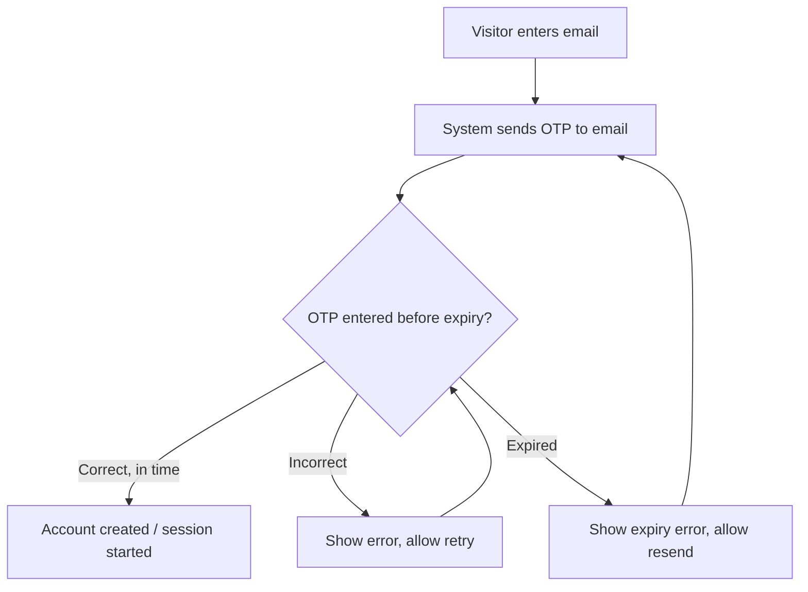

**Alternate flows:** a returning user with an existing account requests a fresh OTP to log in rather than register — the same flow, no separate "login" path.

### UC-002: End User Browses and Searches the Catalog

**Actors:** End User. **Preconditions:** none — browsing does not require an account; only checkout does.

The catalog is organized into categories with a search box (see [decision-18](vision.md#vision-decisions)), and every item shows its current stock status live rather than a stale snapshot.

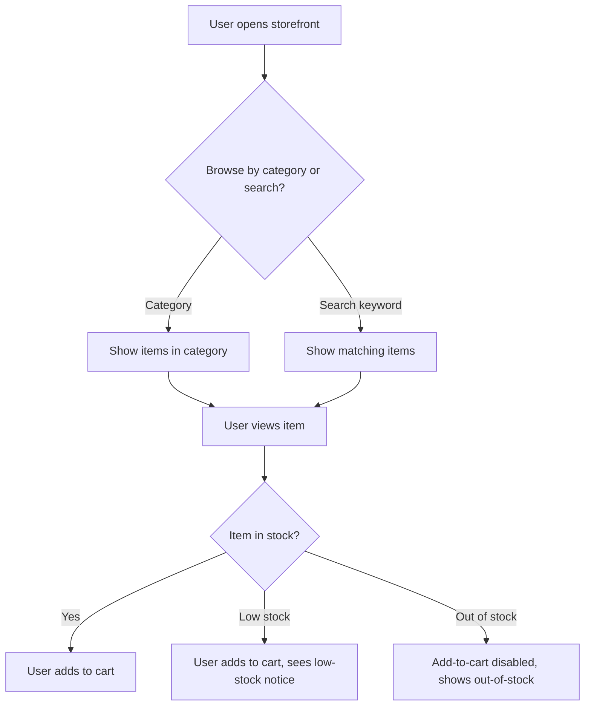

**Alternate flows:** an out-of-stock item remains visible in the catalog (per the "digitize, don't hide" model) rather than disappearing, so admin's low-stock/out-of-stock signal stays visible to end users too.

### UC-003: End User Places an Order

**Actors:** End User. **Preconditions:** UC-001 complete (account exists); at least one item in cart.

Checking out is where stock actually gets reserved — [decision-24](#) fixes this at confirmation time, not at add-to-cart, so browsing never locks inventory away from other shoppers. The delivery fee follows the tiered model from stage 00 ([decision-04](client-context.md#phase-1-decisions)): ₹10 minimum order, free delivery at ₹49+, a fee below that, and pricing is tax-inclusive ([decision-19](vision.md#vision-decisions)).

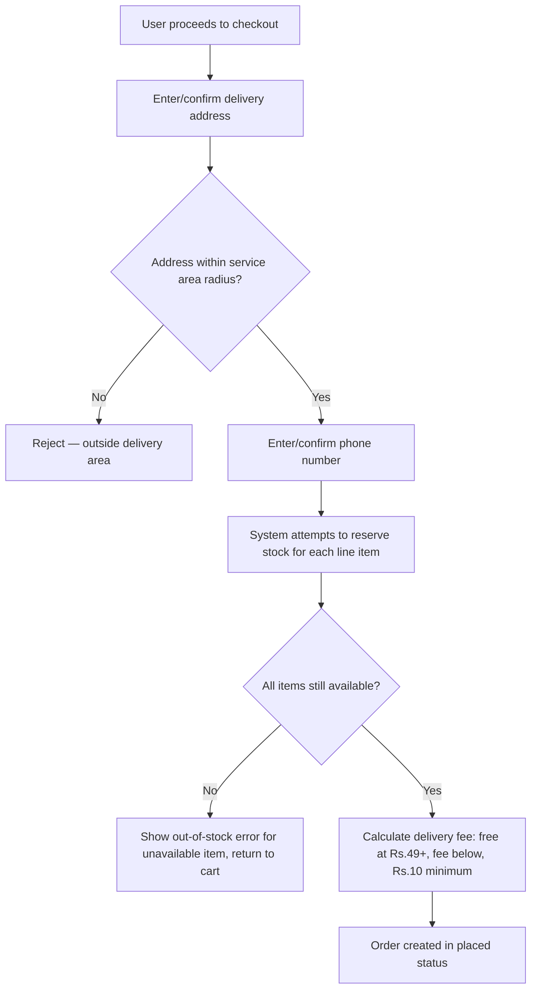

**Alternate flows:** two customers confirming the last unit of an item near-simultaneously — the second to confirm hits the `G -->|No|` branch (FR-008); an address just outside the fixed radius is rejected at `C` rather than silently accepted.

### UC-004: End User Cancels an Order Before Dispatch

**Actors:** End User or Admin. **Preconditions:** an order exists in `placed` status.

The cancellation window is 5 minutes from placement ([decision-16](vision.md#vision-decisions), a `derived/assumed` default flagged for confirmation) — free before it, blocked after. This is distinct from a doorstep COD refusal ([decision-03](client-context.md#phase-1-decisions)), which happens much later in the lifecycle.

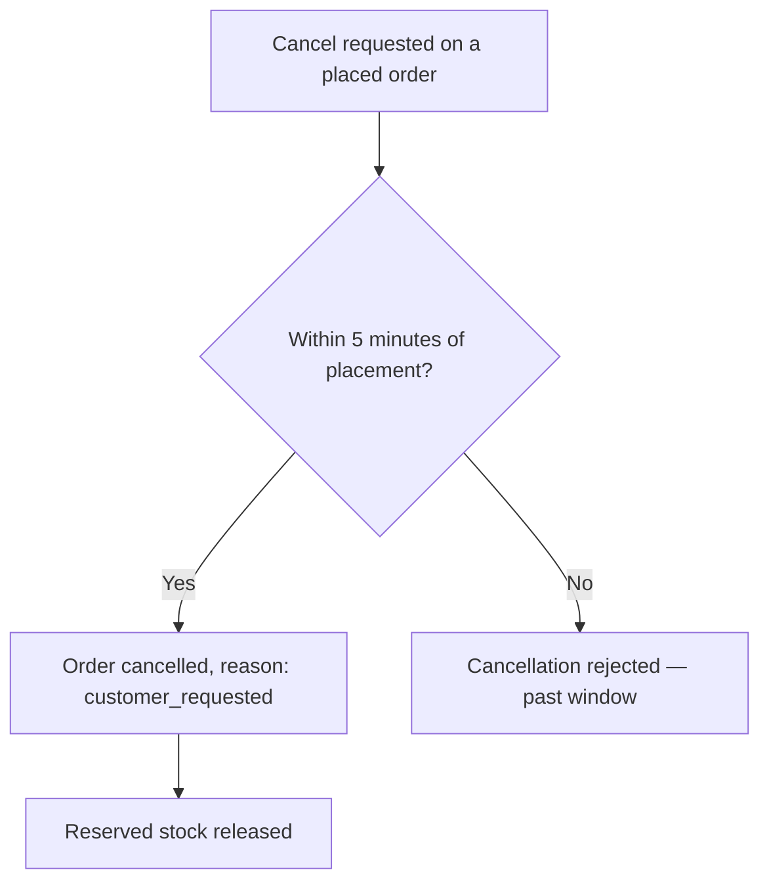

**Alternate flows:** none beyond the two branches shown — this is intentionally a simple, hard cutoff, not a graduated policy.

### UC-005: End User Tracks Order Status

**Actors:** End User. **Preconditions:** an order exists.

Every status transition — `placed` → `assigned` → `out_for_delivery` → `delivered` (or → `cancelled`) — triggers both an in-app notification and an email ([decision-17](vision.md#vision-decisions)); there is no SMS channel in Phase 1.

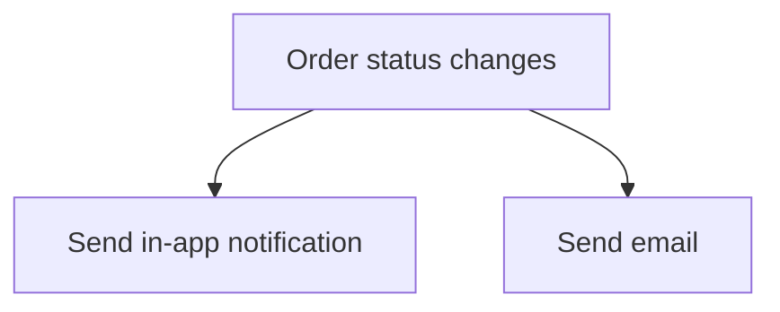

**Alternate flows:** none — this is a simple fan-out, not a decision point. The interesting behavior lives in what triggers a transition, covered by UC-003, UC-008, UC-010, and UC-011.

### UC-006: Admin Manages the Catalog

**Actors:** Admin. **Preconditions:** admin is logged in (single shared login, [decision-22](vision.md#vision-decisions)).

The catalog is populated by bulk import, not one-by-one entry ([decision-06](client-context.md#phase-1-decisions)), with a category assigned per item to support UC-002's browsing structure.

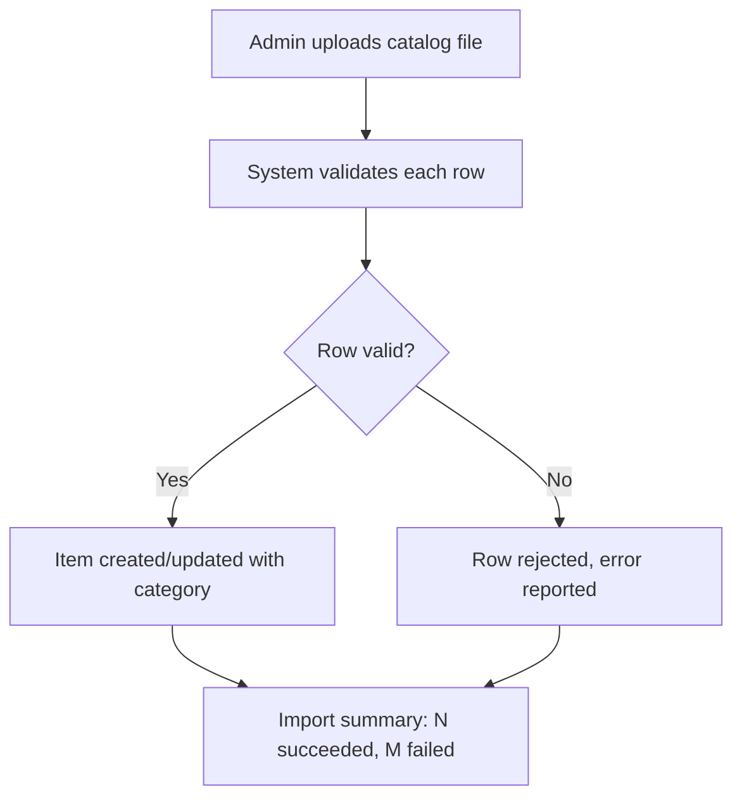

**Alternate flows:** admin edits a single item's price or stock directly outside of a bulk import — a lighter-weight path not diagrammed separately, covered by FR-014's "or edits an item."

### UC-007: Admin Manages Stock

**Actors:** Admin. **Preconditions:** catalog exists (UC-006).

Online orders and walk-in (in-person) sales draw from one shared stock pool ([decision-05](client-context.md#phase-1-decisions)) — admin recording a walk-in sale is what keeps that pool honest for the online side too.

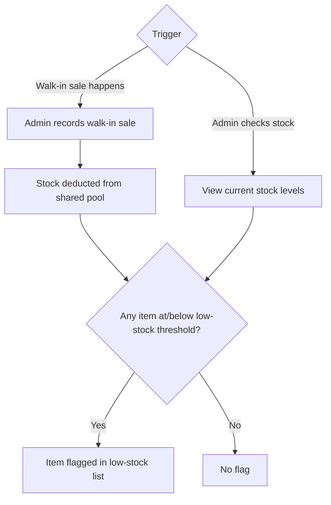

**Alternate flows:** none beyond the two entry triggers shown.

### UC-008: Admin Manages Orders and Delivery Agent Assignment

**Actors:** Admin. **Preconditions:** an order exists in `placed` status past its cancellation window; at least one approved delivery agent exists (UC-009).

Assignment is manual in Phase 1 ([decision-02](client-context.md#phase-1-decisions)), including reassignment if an agent drops out mid-delivery ([decision-23](vision.md#vision-decisions)).

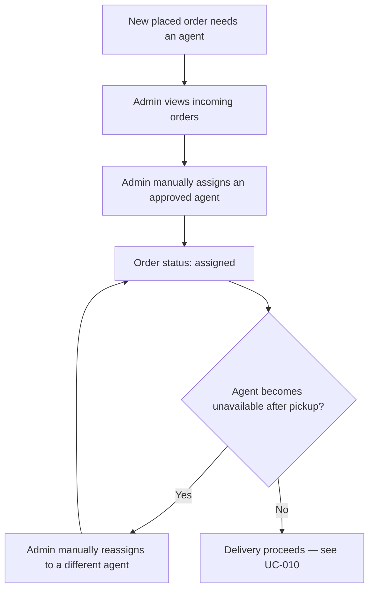

**Alternate flows:** no approved agents are available when an order needs assignment — order stays in `placed`/unassigned until one is; this is a real operational gap, not a system error, and isn't further automated in Phase 1.

### UC-009: Delivery Agent Registers and Gets Approved

**Actors:** Delivery Agent (registers), Admin (approves). **Preconditions:** none — this is the entry point for a role that doesn't exist before this product ([vision.md's Problem Statements](vision.md#problem-statements)).

Agents self-register rather than being pre-created by admin ([decision-20](vision.md#vision-decisions)), but cannot receive assignments until admin approves.

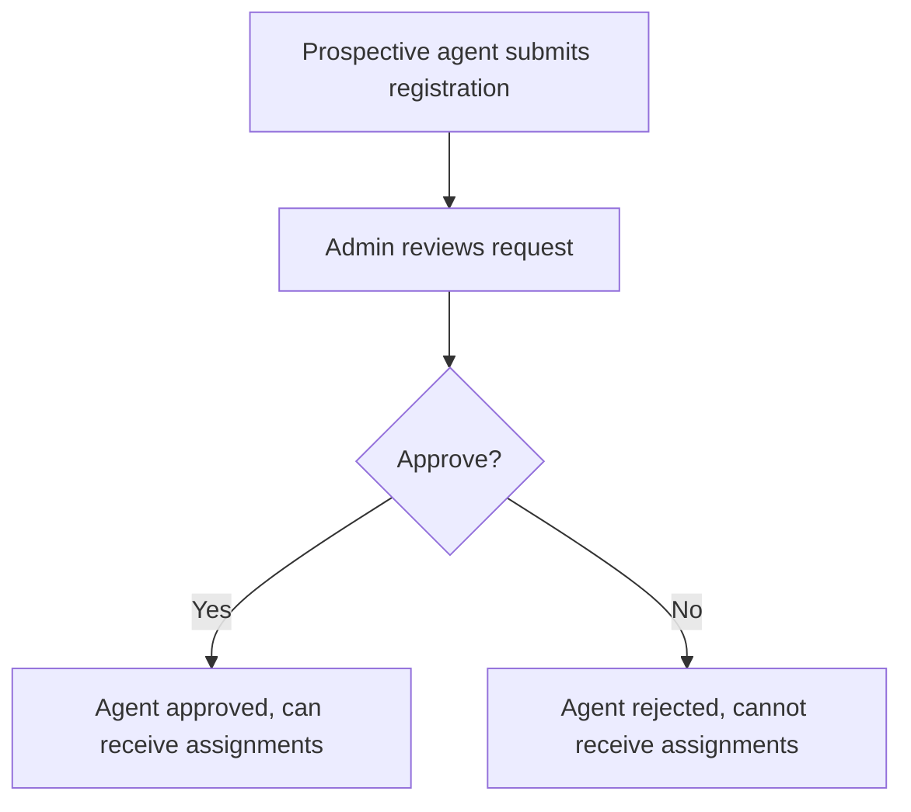

**Alternate flows:** none — approval is a binary gate; there is no partial or provisional approval state in Phase 1.

### UC-010: Delivery Agent Fulfills an Order

**Actors:** Delivery Agent (primary), End User (receives delivery). **Preconditions:** order is `assigned` (UC-008) to this agent.

This is where [decision-09](client-context.md#phase-1-decisions) (in-app COD confirmation) and [decision-03](client-context.md#phase-1-decisions) (cancel-and-restock on refusal) meet — the same flow branches into success or refusal at the door.

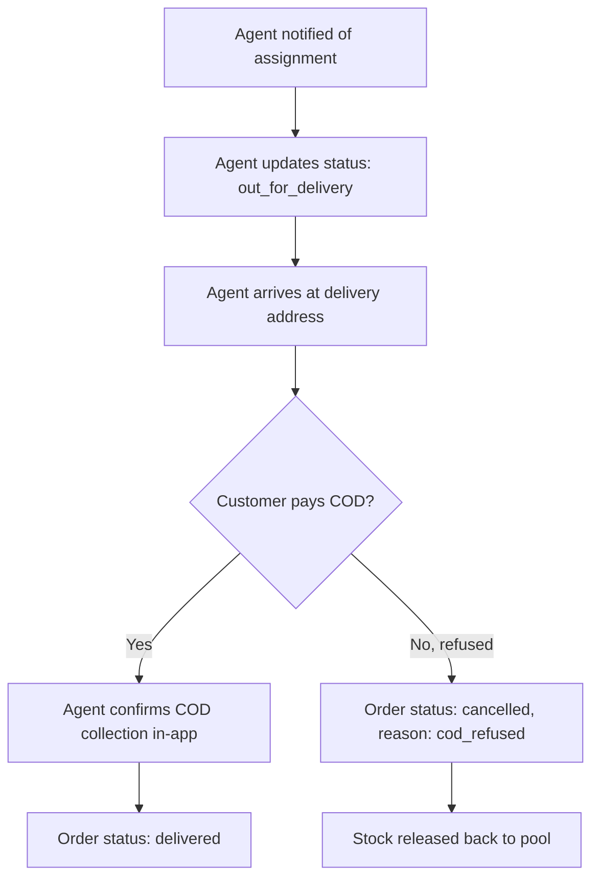

**Alternate flows:** customer is unreachable at the address (no answer, wrong address) — not yet resolved; see [oq-06 in stage 00](client-context.md#open-questions) territory, still genuinely open at this altitude too and folded into this UC's edge cases rather than re-listed as a new item.

### UC-011: System Releases Stock for Stale Orders

**Actors:** System (no human actor). **Preconditions:** an order exists in `placed` or `assigned` status without progressing.

This closes the loop [decision-10](client-context.md#phase-1-decisions) opened at onboarding — the exact timeout value is deliberately left for stage 30d (System spec) to set as a concrete number; this use case fixes the *behavior*, not the number.

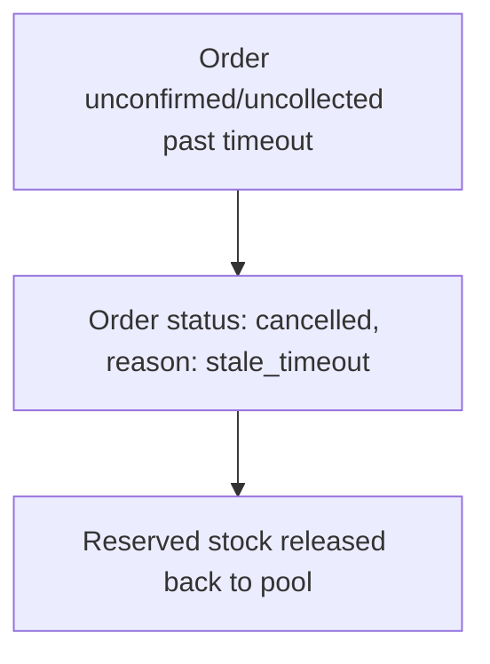

**Alternate flows:** none — this is an unconditional system action once the timeout condition is met; there is no human override path defined in Phase 1.

## Functional Requirements

Every FR traces to exactly one UC; none are orphaned.

| FR | Requirement | Traces to |
|---|---|---|
| FR-001 | System sends a one-time OTP code to the email address entered at signup/login. | UC-001 |
| FR-002 | System creates the account or starts a session only after the correct OTP is entered before it expires. | UC-001 |
| FR-003 | System rejects an incorrect or expired OTP with a clear error and lets the user request a new code. | UC-001 |
| FR-004 | System displays catalog items organized by category. | UC-002 |
| FR-005 | System supports keyword search across item names. | UC-002 |
| FR-006 | System shows live stock status (in stock / low stock / out of stock) on every item. | UC-002 |
| FR-007 | System requires a delivery address within the fixed service-area radius; addresses outside it are rejected at checkout. | UC-003 |
| FR-008 | System reserves stock only at order confirmation, not at add-to-cart; a customer confirming after stock is exhausted sees an out-of-stock error. | UC-003 |
| FR-009 | System collects a phone number as a required checkout field, used only for delivery-agent contact, never for authentication. | UC-003 |
| FR-010 | System calculates the delivery fee per the tiered model (₹10 order minimum, free at ₹49+, fee below), tax-inclusive. | UC-003 |
| FR-011 | Customer or admin can cancel a `placed` order within 5 minutes of placement at no charge, releasing reserved stock. | UC-004 |
| FR-012 | System blocks cancellation once the 5-minute window has elapsed. | UC-004 |
| FR-013 | System sends an in-app notification and an email on every order-status transition. | UC-005 |
| FR-014 | Admin can bulk-import catalog items (name, price, category, stock) via spreadsheet/CSV. | UC-006 |
| FR-015 | Import validates each row independently and reports per-row errors without failing the whole batch. | UC-006 |
| FR-016 | A walk-in sale recorded by admin deducts from the same stock pool as online orders. | UC-007 |
| FR-017 | Items at or below a fixed low-stock threshold are flagged to admin without a manual query. | UC-007 |
| FR-018 | Admin can view all incoming orders and manually assign each to an approved, available delivery agent. | UC-008 |
| FR-019 | Admin can manually reassign an order to a different agent if the original becomes unavailable after pickup. | UC-008 |
| FR-020 | A prospective delivery agent can submit a self-registration request. | UC-009 |
| FR-021 | A self-registered agent cannot receive assignments until admin approves the registration. | UC-009 |
| FR-022 | The assigned delivery agent is notified of a new assignment. | UC-010 |
| FR-023 | The delivery agent can update order status from `assigned` to `out_for_delivery`. | UC-010 |
| FR-024 | The delivery agent must confirm COD collection in-app before an order is marked `delivered`. | UC-010 |
| FR-025 | If COD is refused at the door, the agent marks the order `cancelled` (reason: `cod_refused`) and stock is released. | UC-010 |
| FR-026 | An order unconfirmed/uncollected past a timeout is automatically marked `cancelled` (reason: `stale_timeout`) with stock released; the timeout value is set at stage 30d. | UC-011 |
| FR-027 | Admin authenticates via a single shared login (username/password); no per-staff accounts in Phase 1. | UC-006 |
| FR-028 | All End User-facing text renders in English only. | UC-002 |
| FR-029 | Admin can deactivate a currently-approved delivery agent, immediately preventing new assignments to them. | UC-009 |

## Acceptance Criteria

Each AC is written as Given/When/Then and maps one-to-one to its FR.

| AC | Given / When / Then |
|---|---|
| AC-001 | Given a valid email address, when the user (End User or Delivery Agent, per [decision-27](#)) requests a code, then an OTP is sent to that email and expires 10 minutes later ([decision-28](#)). |
| AC-002 | Given a correct, unexpired OTP, when it's submitted, then an account is created or the user is logged in. |
| AC-003 | Given an incorrect or expired OTP, when it's submitted, then the attempt is rejected with a specific error; a "resend code" option becomes available 60 seconds after the previous code was sent ([decision-28](#)). |
| AC-004 | Given the catalog has items in multiple categories, when a user opens the storefront, then items are grouped and filterable by category. |
| AC-005 | Given a keyword matching one or more item names, when searched, then matching items are returned. |
| AC-006 | Given an item's current stock quantity, when displayed, then its status shows as in stock, low stock, or out of stock consistently with the admin's view. |
| AC-007 | Given a delivery address outside the fixed service-area radius, when checkout is attempted, then it is rejected with a specific "outside delivery area" message. |
| AC-008 | Given two customers checking out the same last-unit item near-simultaneously, when the second confirms, then they see an out-of-stock error, not a silently accepted order. |
| AC-009 | Given checkout is submitted without a phone number, when validated, then checkout is blocked until one is provided. |
| AC-010 | Given a cart total of ₹49 or more, when checkout completes, then delivery is free; given a total between ₹10 and ₹48, then a delivery fee is added; given a total below ₹10, then checkout is blocked. |
| AC-011 | Given a `placed` order less than 5 minutes old, when cancellation is requested, then the order is cancelled and its stock released, at no charge. |
| AC-012 | Given a `placed` order 5 minutes or older, when cancellation is requested, then the request is rejected. |
| AC-013 | Given any order status transition, when it occurs, then both an in-app notification and an email are sent within a reasonable delay. |
| AC-014 | Given a valid catalog file with category assignments, when imported, then all valid rows create or update items with the specified category. |
| AC-015 | Given a catalog file with some invalid rows, when imported, then valid rows still succeed and invalid rows are reported individually. |
| AC-016 | Given a walk-in sale recorded by admin, when saved, then the same item's online-visible stock count decreases by the sold quantity. |
| AC-017 | Given an item's stock at or below the fixed low-stock threshold, when admin views the dashboard, then that item appears on a low-stock list without a manual search. |
| AC-018 | Given a `placed` order past its cancellation window, when admin assigns an agent, then the order status becomes `assigned` and the agent is notified. |
| AC-019 | Given an `assigned` order whose agent becomes unavailable after pickup, when admin reassigns it, then the order is linked to the new agent without losing its history. |
| AC-020 | Given a prospective agent's registration submission, when submitted, then it appears in admin's pending-approval queue. |
| AC-021 | Given a pending agent registration, when admin approves it, then the agent can be assigned orders; when rejected, they cannot. |
| AC-022 | Given an order is assigned to an agent, when the assignment is made, then the agent receives a notification. |
| AC-023 | Given an `assigned` order, when the agent marks pickup, then the order status becomes `out_for_delivery`. |
| AC-024 | Given an `out_for_delivery` order, when the agent confirms COD collection in-app, then the order status becomes `delivered`. |
| AC-025 | Given an `out_for_delivery` order where the customer refuses payment, when the agent records refusal, then the order becomes `cancelled` (reason: `cod_refused`) and stock is released. |
| AC-026 | Given a `placed` or `assigned` order that exceeds the timeout without progressing, when the timeout elapses, then the order becomes `cancelled` (reason: `stale_timeout`) and stock is released automatically, with no admin action required. |
| AC-027 | Given the single Admin login credentials, when entered correctly, then Admin has access to catalog, stock, and order/agent management; given incorrect credentials, then access is denied. |
| AC-028 | Given any End User-facing screen, when rendered, then all text is in English. |
| AC-029 | Given an `approved` delivery agent, when admin deactivates them, then their status becomes `deactivated` and they can no longer receive new order assignments; already-assigned in-flight orders are unaffected by this AC (handled by UC-008's reassignment flow if needed). |

## Non-Functional Requirements

1. **Performance:** pages load in roughly 2 seconds under normal conditions on standard broadband/mobile connections — no formal SLA, no load-testing requirement at Phase 1's dozens-of-orders/day scale `[canonical/given · src: BRD intake, 2026-09-03]`.
2. **Availability:** no 99.9%-style uptime guarantee — standard hosting availability is sufficient for a single-store Phase 1 launch `[canonical/given · src: BRD intake, 2026-09-03]`.
3. **OTP security:** OTP codes expire after 10 minutes and can be resent after a 60-second cooldown ([decision-28](#)), applied to both End User and Delivery Agent login, and must be rate-limited against repeated guesses.
4. **Credential handling:** Admin's login password (and any future agent credential) must be stored hashed, never in plaintext — a baseline expectation independent of the "no special regulatory scope" conclusion from stage 00.
5. **Data handling:** End User PII (email, phone, address) and Delivery Agent PII (name, phone) are accessible only to the Admin and, where operationally necessary, the assigned Delivery Agent for a given order — not exposed publicly or to other End Users.

## Data Models

The core entities below back every use case above; `Order.status` and `DeliveryAgent.status` use the canonical vocabulary from [Domain Vocabulary](#domain-vocabulary) — no downstream doc invents its own labels for these. `AdminAccount`, `Cart`, and `CartLine` are new since the follow-up round: [decision-29](#) needs somewhere to hold Admin's recovery email, [decision-30](#) needs addresses to be a real one-to-many relationship (already modeled below) with a way to mark which is the default, and [decision-31](#) means a cart is now a persisted entity, not transient browser state.

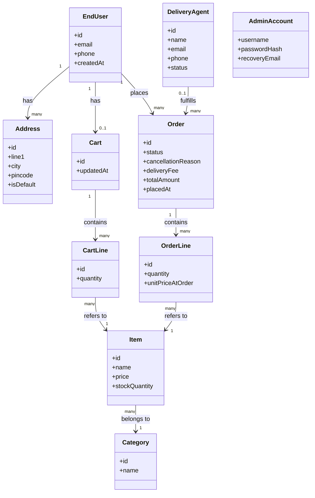

## Domain Vocabulary

New terms introduced in this BRD, appended to `docs/domain-glossary.md` (the client-vocabulary glossary, separate from `docs/glossary.md`'s Daksh process terms):

- **Order status** — the canonical five-value lifecycle: `placed`, `assigned`, `out_for_delivery`, `delivered`, `cancelled`. See [decision-26](#).
- **Cancellation reason** — sub-field on a `cancelled` order: `customer_requested`, `cod_refused`, or `stale_timeout`.
- **Delivery Agent status** — `pending_approval` → `approved` → `deactivated` (admin cuts off a previously-approved agent; see FR-029, CR-001), or `pending_approval` → `rejected` (never approved). `deactivated` is reachable only from `approved`; `rejected` is reachable only from `pending_approval` — the two are not interchangeable.
- **Stock status** — a display-only derived label (`in_stock`, `low_stock`, `out_of_stock`), not a stored field — computed from `stockQuantity` against the low-stock threshold ([decision-25](#)).
- **Walk-in sale** — an in-person purchase at the physical store, recorded by Admin, that deducts from the same stock pool as online orders ([decision-05, stage 00](client-context.md#phase-1-decisions)).
- **Service area** — the fixed delivery radius around the store within which checkout is allowed ([decision-01, stage 00](client-context.md#phase-1-decisions)).

## BRD Decisions

The 6 open questions from the first BRD draft were each closed in a follow-up round with the same stakeholder.

1. **Delivery Agent authenticates via email + OTP, identical to End User** ([decision-27](#)) — no separate credential system for a second user type. Revisit if agents need offline/low-connectivity login.
2. **OTP expires after 10 minutes, resend cooldown is 60 seconds** ([decision-28](#)), for both End User and Delivery Agent. Revisit if real email delivery times make 10 minutes too tight.
3. **Admin password reset is an email link to a registered recovery email** ([decision-29](#)) — standard forgot-password flow. Revisit if that recovery email itself becomes inaccessible; Phase 1 has no secondary path for that case.
4. **End User can save multiple delivery addresses** ([decision-30](#)) — chosen over a single overwritten address for repeat customers with more than one delivery location. Revisit if usage shows one address was always enough.
5. **Cart persists server-side once logged in** ([decision-31](#)) — survives closing the tab or switching devices, since login is already required. Revisit if server-side sync adds noticeable latency.
6. **No maximum order size in Phase 1** ([decision-32](#)) — not worth the checkout friction at current scale. Revisit if an oversized order actually overwhelms a delivery agent in practice.

## Open Questions

None remain open from this BRD draft — all 6 were resolved in the follow-up above; see [BRD Decisions](#brd-decisions). Any new open items that surface during `/daksh architecture` get numbered and tracked in this section's future revisions.

## Approval

Approved by: Bhargav
Role:        PTL
Date:        2026-09-03
Hash:        94ab13d4aca0�

Approved by: Bhargav
Role:        PTL
Date:        2026-09-03
Via:         CR-001
