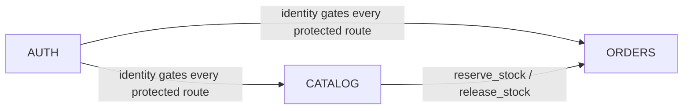

---
daksh:
  type: roadmap
  subtype: null
  stage: "30b"
  module: null
---

# Implementation Roadmap

[Architecture](system-architecture.md) fixed three modules — CATALOG, ORDERS, AUTH — as a single monolithic backend with one network seam; this document fixes the order they get built in and why, so nothing downstream waits on a dependency that hasn't shipped yet. It exists because "three modules" isn't a build plan: AUTH has to exist before anything can be gated behind a login, CATALOG has to exist before ORDERS can reserve stock against it, and knowing that up front is what keeps a solo, AI-assisted build from thrashing between half-finished pieces. The audience is whoever decides what to work on next — this table should answer that question without re-reading Architecture or the BRD.

<details>
<summary>Graph: What order must modules ship in, and what gates each?</summary>

```items
---
id: 30b-roadmap-cognition
title: Roadmap — Build Order and Gates
default_open_depth: 1
default_color_by: kind
color_palette_source: .daksh/color-palette.json
width: 95vw
---
id: 30b-roadmap-cognition
title: Roadmap — Build Order and Gates
Milestones:
  - milestone-04 :: AUTH foundation live | kind: milestone | summary: "End User/Delivery Agent email+OTP accounts, Admin login, the agent approval gate, and JWT sessions all work." | spec: [Build Order](implementation-roadmap.md#build-order) | due: "First build phase, no fixed calendar date" | definition_of_done: "A test End User, test Delivery Agent, and Admin can each authenticate and receive a role-scoped session; an Admin-only route rejects a non-admin token."
  - milestone-05 :: CATALOG foundation live | kind: milestone | summary: "Items, categories, stock quantities, and bulk import work, with reserve/release stock callable by ORDERS." | spec: [Build Order](implementation-roadmap.md#build-order) | due: "Second build phase, after milestone-04" | definition_of_done: "Admin can bulk-import a catalog and see live stock status; CATALOG.reserve_stock()/release_stock() are implemented and unit-tested."
  - milestone-01 :: Core Order Lifecycle ready for internal testing | kind: milestone | summary: "Catalog, checkout, admin assignment, agent delivery, and COD confirmation work end to end against test data." | spec: [Build Order](implementation-roadmap.md#build-order) | due: "Third build phase, after milestone-05" | definition_of_done: "UC-001 through UC-011 all pass acceptance criteria in a staging environment."
  - milestone-02 :: Agent onboarding and notification infrastructure live | kind: milestone | summary: "Agent self-registration/approval and in-app + email notifications are operational, not stubbed." | spec: [Build Order](implementation-roadmap.md#build-order) | due: "After milestone-01" | definition_of_done: "A real agent can self-register, get approved, and receive a real notification for a real assignment."
  - milestone-03 :: Production launch | kind: milestone | summary: "The app is live for real End Users in the fixed service area, not a demo." | spec: [Build Order](implementation-roadmap.md#build-order) | due: "After milestone-01 and milestone-02, hosting-dependent (oq-27, system-architecture.md)" | definition_of_done: "A real order is placed, paid COD, and delivered, with stock reconciling correctly, outside of a test environment."
Components:
  - component-04 :: CATALOG_SERVICE | kind: component | summary: "Owns items, categories, stock quantities, and the reserve/release stock operation every order depends on." | spec: [Module Dependency Graph](implementation-roadmap.md#module-dependency-graph) | boundary: "In: item/category CRUD, bulk import, stock reservation and release. Out: no knowledge of orders, payment, or delivery."
  - component-05 :: ORDERS_SERVICE | kind: component | summary: "Owns cart, checkout, the order status lifecycle, agent assignment, and stale-order release." | spec: [Module Dependency Graph](implementation-roadmap.md#module-dependency-graph) | boundary: "In: cart through delivery confirmation. Out: calls CATALOG for stock, calls AUTH for identity."
  - component-06 :: AUTH_SERVICE | kind: component | summary: "Owns identity for all three roles, OTP, sessions, and the agent approval gate." | spec: [Module Dependency Graph](implementation-roadmap.md#module-dependency-graph) | boundary: "In: account creation, OTP, login, sessions, agent approval. Out: no catalog or order data."
Decisions:
  - decision-44 :: Experience Design Spec (stage 40) selected for all three modules | kind: decision | summary: "Every module runs the optional Design stage before its TRD — CATALOG, ORDERS, and AUTH all get a real screens/IA/interaction pass, not just AUTH/ORDERS." | spec: [Build Order](implementation-roadmap.md#build-order) | alternatives: "Design for only ORDERS/AUTH (the screens End User lives in most), skipping CATALOG's admin-facing bulk-import screens — rejected; the client explicitly asked for an excellent, beautiful, user-friendly UI up front, and Admin's daily-use screens deserve the same design discipline as End User's." | reversal_trigger: "Solo build capacity proves too tight to sustain Design passes for all three modules without meaningfully delaying milestone-03."
  - decision-45 :: Build order is dependency-driven, not business-priority-driven | kind: decision | summary: "AUTH ships before CATALOG ships before ORDERS — because each is a hard technical prerequisite (nothing can be gated without AUTH, ORDERS can't reserve stock without CATALOG), not because of a business ranking." | spec: [Module Dependency Graph](implementation-roadmap.md#module-dependency-graph) | alternatives: "Order by business value (ORDERS first, since it's the revenue-facing module) — rejected; ORDERS literally cannot function without CATALOG's stock data and AUTH's identity, so building it first would mean building against two modules that don't exist yet." | reversal_trigger: "A module's actual dependency shape turns out different once TRDs are written — e.g. if CATALOG's browsing (no-auth-required per UC-002) genuinely doesn't need AUTH at all, see oq-34."
  - decision-46 :: No fixed sprint cadence, but build fast — solo, AI-assisted capacity model | kind: decision | summary: "Build phases are ordered by dependency, not scheduled into calendar sprints — there is one engineer (AI-assisted), and no hard deadline exists. Re-confirmed after a brief false alarm over a one-week date that turned out to be illustrative, not real: every functionality should still be built and improved as quickly as reasonably possible, just without an artificial calendar forcing scope cuts." | spec: [Build Phases and Capacity](implementation-roadmap.md#build-phases-and-capacity) | alternatives: "Fixed 1- or 2-week sprints with dated milestones — rejected; imposing sprint ceremony on a solo build with no external deadline would create false precision without a team to coordinate." | reversal_trigger: "A team grows beyond one engineer, or the client sets a real target date, making sprint-based coordination worth the overhead."
  - decision-47 :: CATALOG waits for AUTH to fully finish, no parallel start | kind: decision | summary: "Even though UC-002's browsing needs no account, CATALOG's build doesn't start until AUTH foundation (milestone-04) is done — strict sequential order, not partial overlap." | spec: [Module Dependency Graph](implementation-roadmap.md#module-dependency-graph) | alternatives: "Start CATALOG's public browsing in parallel with AUTH, since it has no real dependency — rejected; would mean holding two modules partially in progress at once, adding context-switching cost solo capacity doesn't benefit from." | reversal_trigger: "Solo capacity turns out to have real idle time that parallel work would fill productively — unlikely given decision-46's fast-build intent."
  - decision-48 :: Design (stage 40) fully closes before TRD opens, per module | kind: decision | summary: "Within each module's build, the Design stage's screens/IA/interactions are settled before TRD (technical implementation planning) begins — no overlap." | spec: [Build Phases and Capacity](implementation-roadmap.md#build-phases-and-capacity) | alternatives: "Start TRD once Design's core screens are stable, allowing overlap — rejected; risks TRD work needing rework if Design changes mid-stream, a cost not worth the modest time saved solo." | reversal_trigger: "A module's Design stage proves unusually slow to stabilize, and a partial TRD start on its settled portions would clearly save more time than the rework risk costs."
OpenQuestions:
  - oq-33 :: No target launch date set | kind: openquestion | summary: "Is there a target launch date? — resolved: confirmed still no hard deadline, see decision-46's re-confirmation." | spec: [Roadmap Decisions](implementation-roadmap.md#roadmap-decisions)
  - oq-34 :: Could CATALOG's public browsing start before AUTH finishes? | kind: openquestion | summary: "Could CATALOG start in parallel with AUTH? — resolved, see decision-47: no, strict sequential." | spec: [Roadmap Decisions](implementation-roadmap.md#roadmap-decisions)
  - oq-35 :: Must Design (stage 40) fully finish for a module before its TRD starts? | kind: openquestion | summary: "Must Design close before TRD opens? — resolved, see decision-48: yes, no overlap." | spec: [Roadmap Decisions](implementation-roadmap.md#roadmap-decisions)
Risks:
  - risk-01 :: Low online adoption undermines the whole model | kind: risk | summary: "If customers keep expecting an in-person store, digitizing checkout and stock won't matter." | spec: [Milestones](implementation-roadmap.md#milestones) | likelihood: "unknown — unvalidated" | impact: "high — the product has no orders to serve" | mitigation: "Start in a small, well-known service area and gather real order data before wider rollout." | phase: design
  - risk-02 :: Frequent COD refusal erodes trust and margin | kind: risk | summary: "If customers regularly decline to pay on delivery, agents make wasted trips and cash handling becomes unreliable." | spec: [Milestones](implementation-roadmap.md#milestones) | likelihood: "unknown — unvalidated" | impact: "medium — lost delivery time and cash-reconciliation overhead" | mitigation: "Track refusal rate from day one; revisit the payment model for Phase 2 if it's high." | phase: design
  - risk-03 :: Delivery agent shortage delays fulfillment | kind: risk | summary: "If too few agents are available, orders queue up and the reliability goal fails even if checkout and stock work perfectly." | spec: [Milestones](implementation-roadmap.md#milestones) | likelihood: "unknown — unvalidated" | impact: "medium — directly undermines the Core Order Lifecycle milestone" | mitigation: "Confirm agent headcount/availability with the client before committing to a service-area size." | phase: design
milestone-04 -> milestone-05 | relation: enables
milestone-05 -> milestone-01 | relation: enables
milestone-01 -> milestone-02 | relation: enables
milestone-02 -> milestone-03 | relation: enables
component-06 -> milestone-04 | relation: serves
component-04 -> milestone-05 | relation: serves
component-05 -> milestone-01 | relation: serves
decision-44 -> milestone-04 | relation: governs
decision-45 -> milestone-01 | relation: governs
decision-46 -> milestone-03 | relation: governs
risk-01 -> milestone-03 | relation: threatens
risk-02 -> milestone-03 | relation: threatens
risk-03 -> milestone-01 | relation: threatens
decision-46 -> oq-33 | relation: decides
decision-47 -> oq-34 | relation: decides
decision-48 -> oq-35 | relation: decides
decision-47 -> milestone-05 | relation: governs
decision-48 -> milestone-04 | relation: governs
```

</details>

> [!note]
> This graph carries 20 nodes across 5 groups — deliberately thinner than the 30-node floor other stages hit, because stage 30b's own typical entities (`Milestone`, `Component`, `Decision`) are a narrower set than a BRD or Architecture graph's, and padding it with fabricated milestones or components would misrepresent how much roadmap-specific structure actually exists at this altitude. `Components` are the same three module entities from `system-architecture.md`, reused by ID since a roadmap orders existing modules, it doesn't invent new ones. `Risks` are reused from `vision.md` with fresh `threatens` edges into this stage's `Milestones` — the roadmap's own framing ("build order with the risk retired by each step") is exactly what those edges make explicit. All 3 original open questions resolved into `decision-46` (re-confirmed) through `decision-48` in a follow-up round.

## Priority Rule and Constraints

The priority rule is dependency, not business value: a module builds when what it needs already exists, not when it seems most important ([decision-45](#)). The constraints shaping everything below: solo, AI-assisted capacity with no fixed sprint cadence ([decision-46](#)); no hard deadline from the client (`client-context.md`); and cost-consciousness carried through every stage so far — nothing here proposes infrastructure or tooling beyond what [system-architecture.md](system-architecture.md) already fixed.

## Module Dependency Graph



`AUTH` has no dependency on the other two — it's the root. `CATALOG` depends only on `AUTH` for its admin-write endpoints; its public browse endpoints (UC-002) technically don't need a login, but [decision-47](#) keeps the build strictly sequential anyway — CATALOG doesn't start until `AUTH` foundation is done. `ORDERS` depends on both: it calls `CATALOG.reserve_stock()`/`release_stock()` for every checkout, and calls `AUTH` to resolve who's placing, cancelling, or fulfilling an order.

## Build Order

1. **AUTH foundation** ([milestone-04](#)) — retires the risk that nothing else can be gated or attributed to a real identity. Nothing else can be meaningfully tested end-to-end without it.
2. **CATALOG foundation** ([milestone-05](#)) — retires the risk that ORDERS has no real stock to reserve against. Depends on AUTH only for its admin-write side.
3. **ORDERS core lifecycle** ([milestone-01](#)) — retires [risk-03](#) (agent shortage undermining reliability) by making the actual assignment/fulfillment flow real, and is the module the whole product's value proposition depends on.
4. **Agent onboarding and notifications operational** ([milestone-02](#)) — retires the risk that orders exist but can't actually reach a customer, since AUTH's approval gate and ORDERS' notification triggers only become real (not stubbed) here.
5. **Production launch** ([milestone-03](#)) — retires [risk-01](#) and [risk-02](#) by putting the product in front of real customers, the only way either risk actually gets measured rather than assumed.

Each module still runs its own full stage stack (Solution → System → Design → TRD → Test Specification → Tasks → Implementation) internally — this build order sequences the *modules* relative to each other, not the stages within one.

## Milestones

See the graph above for full `summary`/`due`/`definition_of_done` triples. [milestone-01](#), [milestone-02](#), and [milestone-03](#) are reused by ID from `business-requirements.md` — the same commitments, not a fresh set. [milestone-04](#) and [milestone-05](#) are new: the BRD's milestones assumed AUTH and CATALOG already existed, but nothing before this roadmap actually said how they'd get built.

## Build Phases and Capacity

One engineer, AI-assisted, no fixed sprint length, moving as fast as reasonably possible without an artificial calendar forcing scope cuts ([decision-46](#)) — phases are ordered, not dated:

| Phase | Milestone | Depends on |
|---|---|---|
| 1 | [milestone-04](#) AUTH foundation | Nothing — the root |
| 2 | [milestone-05](#) CATALOG foundation | Phase 1, strictly sequential ([decision-47](#)) |
| 3 | [milestone-01](#) Core Order Lifecycle | Phases 1 and 2 |
| 4 | [milestone-02](#) Agent onboarding + notifications | Phase 3 |
| 5 | [milestone-03](#) Production launch | Phases 1–4, plus the hosting decision (`oq-27`, system-architecture.md) |

Within each phase, the module's own stage stack applies in strict order, no overlap ([decision-48](#)): `/daksh solution [MODULE]` → `/daksh system [MODULE]` → `/daksh design [MODULE]` → `/daksh trd [MODULE]` → `/daksh test [MODULE]` → `/daksh tasks` → `/daksh impl`.

## Progress Table

This table is the one thing meant to change often without touching Architecture or this roadmap's own reasoning above it.

| Module | Phase | Solution | System | Design | TRD | Test Spec | Tasks | Impl |
|---|---|---|---|---|---|---|---|---|
| AUTH | 1 | not started | not started | not started | not started | not started | not started | not started |
| CATALOG | 2 | not started | not started | not started | not started | not started | not started | not started |
| ORDERS | 3 | not started | not started | not started | not started | not started | not started | not started |

## Roadmap Decisions

The 3 open questions this stage's first draft raised were closed in a follow-up round — one of them (the launch date) after a brief false alarm worth recording honestly: a one-week date was floated, flagged as unrealistic against the scoped build, and the client confirmed it was illustrative, not a real commitment.

1. **No hard deadline exists, but build fast anyway** ([decision-46](#), re-confirmed) — a one-week date was raised, checked against the actual scope (three modules, full stage stack each), found unrealistic, and clarified as not a real deadline. The instruction that survives it: keep building every functionality, quickly, without an artificial calendar forcing scope cuts.
2. **CATALOG waits for AUTH to fully finish** ([decision-47](#)) — strict sequential order even though UC-002's browsing has no real technical dependency on AUTH, because solo capacity doesn't benefit from holding two modules partially in progress.
3. **Design fully closes before TRD opens, per module** ([decision-48](#)) — no overlap, to avoid TRD work needing rework if Design changes mid-stream.

## Open Questions

None remain open from this roadmap draft — all 3 were resolved in the follow-up above; see [Roadmap Decisions](#roadmap-decisions).

## Approval

Approved by: Bhargav
Role:        PTL
Date:        2026-09-03
Hash:        ab2a294f88ad…
