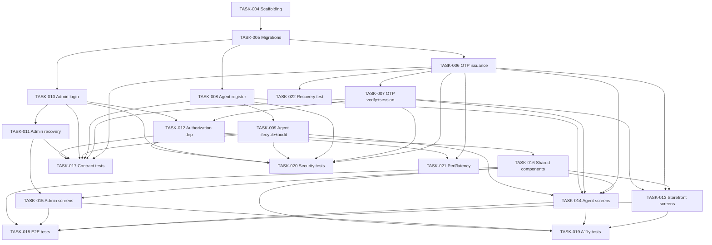

---
daksh:
  type: tasks
  subtype: null
  stage: "50c"
  module: AUTH
---

# AUTH Tasks

AUTH's [TRD](trd.md) and [Test Specification](test-specification.md) are both approved; this document turns them into 19 executable tickets under one epic — [milestone-04](../../implementation-roadmap.md#milestones) "AUTH foundation live." The audience is whoever picks up a ticket next: every task names its TRD section, its Test IDs, and which judgment calls are theirs to make versus which need a second opinion, so no one has to re-read the whole pipeline cold to start. This is a solo, AI-assisted build ([decision-46](../../implementation-roadmap.md#roadmap-decisions)) with no fixed sprint calendar — every task's `Sprint` field reads "Phase 1" rather than a dated sprint number, and `Assignee` role is a proxy for judgment-call weight, not a real team assignment.

<details>
<summary>Graph: What can be parallel, what is gated, and who owns each piece?</summary>

```items
---
id: 50c-auth-tasks-cognition
title: AUTH Tasks — Sequencing and Gates
default_open_depth: 1
default_color_by: kind
color_palette_source: .daksh/color-palette.json
width: 95vw
---
id: 50c-auth-tasks-cognition
title: AUTH Tasks — Sequencing and Gates
Tasks:
  - task-004 :: Backend scaffolding | kind: task | summary: "app/auth package structure, Alembic wiring, JWT secret / OTP pepper config surface." | spec: [Detailed Task List](tasks.md#detailed-task-list) | estimate: "2 points" | acceptance: "uv-managed app/auth package imports cleanly; Alembic can run an empty migration against LOCAL"
  - task-005 :: Database migrations | kind: task | summary: "All 7 auth_* tables per TRD §5a/Data Model, including the auth_admin_accounts singleton seed." | spec: [Detailed Task List](tasks.md#detailed-task-list) | estimate: "3 points" | acceptance: "Fresh LOCAL DB migrates cleanly; TEST-AUTH-014 (singleton CHECK) passes"
  - task-006 :: OTP issuance and rate limiting | kind: task | summary: "POST /v1/auth/otp/request — hashing, supersession, 5/hour rate limit." | spec: [Detailed Task List](tasks.md#detailed-task-list) | estimate: "5 points" | acceptance: "TEST-AUTH-007, 010 pass"
  - task-007 :: OTP verify and session issuance | kind: task | summary: "POST /v1/auth/otp/verify — find-or-create identity, JWT issuance, wrong-guess-doesn't-consume." | spec: [Detailed Task List](tasks.md#detailed-task-list) | estimate: "5 points" | acceptance: "TEST-AUTH-008, 009, 011 pass"
  - task-008 :: Agent registration | kind: task | summary: "POST /v1/auth/agent/register — dupe-email rejection, photo_url passthrough." | spec: [Detailed Task List](tasks.md#detailed-task-list) | estimate: "3 points" | acceptance: "TEST-AUTH-012 passes"
  - task-009 :: Agent lifecycle actions and audit log | kind: task | summary: "Admin approve/reject/deactivate/reactivate — atomic status + audit-log write." | spec: [Detailed Task List](tasks.md#detailed-task-list) | estimate: "5 points" | acceptance: "TEST-AUTH-013 passes, including the forced-rollback atomicity check"
  - task-010 :: Admin login and IP rate limiting | kind: task | summary: "POST /v1/auth/admin/login — Argon2id verify, no-lockout, per-IP slowapi limiter." | spec: [Detailed Task List](tasks.md#detailed-task-list) | estimate: "3 points" | acceptance: "TEST-AUTH-015, 042 pass"
  - task-011 :: Admin password recovery | kind: task | summary: "Reset request/confirm — supersession, single-use, enumeration resistance." | spec: [Detailed Task List](tasks.md#detailed-task-list) | estimate: "5 points" | acceptance: "TEST-AUTH-016, 017, 018 pass"
  - task-012 :: Authorization dependency and session revocation | kind: task | summary: "get_current_user()/require_role() FastAPI dependency; jti revocation check; logout." | spec: [Detailed Task List](tasks.md#detailed-task-list) | estimate: "5 points" | acceptance: "TEST-AUTH-019, 020, 021 pass"
  - task-013 :: FRONTEND_STOREFRONT auth screens | kind: task | summary: "ds-auth-001/002/003 — End User email+OTP entry, verify, rate-limited state." | spec: [Detailed Task List](tasks.md#detailed-task-list) | estimate: "5 points" | acceptance: "Matches the published prototype; TEST-AUTH-030, 034 pass"
  - task-014 :: FRONTEND_AGENT auth and registration screens | kind: task | summary: "ds-auth-001/002/003 (agent context) plus ds-auth-004/005/006." | spec: [Detailed Task List](tasks.md#detailed-task-list) | estimate: "5 points" | acceptance: "Matches the published prototype; TEST-AUTH-031, 035 pass"
  - task-015 :: FRONTEND_ADMIN login and recovery screens | kind: task | summary: "ds-auth-007 through 010." | spec: [Detailed Task List](tasks.md#detailed-task-list) | estimate: "5 points" | acceptance: "Matches the published prototype; TEST-AUTH-032, 036 pass"
  - task-016 :: Shared session-expired and error components | kind: task | summary: "ds-auth-011/012, StatusBadge, ErrorStatePanel — reused across all 3 frontend apps." | spec: [Detailed Task List](tasks.md#detailed-task-list) | estimate: "3 points" | acceptance: "TEST-AUTH-033, 037 pass"
  - task-017 :: Contract test suite | kind: task | summary: "schemathesis/pytest against all 8 endpoint schemas in TRD §API Contracts." | spec: [Detailed Task List](tasks.md#detailed-task-list) | estimate: "3 points" | acceptance: "TEST-AUTH-022, TEST-AUTH-023, TEST-AUTH-024, TEST-AUTH-025, TEST-AUTH-026, TEST-AUTH-027, TEST-AUTH-028, TEST-AUTH-029 pass"
  - task-018 :: End-to-end journey test suite | kind: task | summary: "Playwright against the 4 user journeys." | spec: [Detailed Task List](tasks.md#detailed-task-list) | estimate: "5 points" | acceptance: "TEST-AUTH-030, TEST-AUTH-031, TEST-AUTH-032, TEST-AUTH-033 pass"
  - task-019 :: Accessibility test suite | kind: task | summary: "axe-core + Playwright across all 12 DS-AUTH screens." | spec: [Detailed Task List](tasks.md#detailed-task-list) | estimate: "3 points" | acceptance: "TEST-AUTH-034, TEST-AUTH-035, TEST-AUTH-036, TEST-AUTH-037 pass, zero axe-core violations"
  - task-020 :: Security hardening test suite | kind: task | summary: "Hashing unit tests, singleton constraint, no-secrets-in-logs, admin-login IP limiter." | spec: [Detailed Task List](tasks.md#detailed-task-list) | estimate: "3 points" | acceptance: "TEST-AUTH-001, TEST-AUTH-002, TEST-AUTH-003, TEST-AUTH-004, TEST-AUTH-005, TEST-AUTH-006, TEST-AUTH-014, TEST-AUTH-038, TEST-AUTH-042 pass"
  - task-021 :: Performance and OTP-latency tests | kind: task | summary: "Sub-100ms authz overhead; 60s OTP delivery — both need PREVIEW, not LOCAL." | spec: [Detailed Task List](tasks.md#detailed-task-list) | estimate: "2 points" | acceptance: "TEST-AUTH-040, 041 pass once run against PREVIEW"
  - task-022 :: Recovery/failure-mode test | kind: task | summary: "EMAIL_PROVIDER outage doesn't lose the OTP row or crash the request." | spec: [Detailed Task List](tasks.md#detailed-task-list) | estimate: "2 points" | acceptance: "TEST-AUTH-039 passes"
Decisions:
  - decision-task-backend-first :: Backend Stories gate frontend Stories, no parallel start | kind: decision | summary: "task-013 through task-016 (frontend) all depend on the relevant backend tasks and on task-012 (authorization) — frontend work doesn't start until the endpoints it calls are real, not stubbed." | spec: [Parallel Work Plan](tasks.md#parallel-work-plan) | alternatives: "Build frontend against experience-design.md's mock contracts in parallel with backend, wire up later — rejected; a solo build doesn't benefit from holding two integration surfaces open at once, and the mock contracts were already reconciled with the real API in the TRD (no drift expected, but zero benefit to assuming none)." | reversal_trigger: "A second engineer joins and frontend/backend split becomes genuinely parallel capacity, not context-switching for one person."
  - decision-task-dedicated-test-suites :: Contract/e2e/a11y/security/perf work gets its own Tasks, not folded into each Story | kind: decision | summary: "task-017 through task-022 exist as standalone Tasks rather than being buried inside each Story's own Definition of Done — so test-suite coverage is visible, sizeable, and can't be silently skipped when a solo builder is moving fast (decision-46, roadmap.md)." | spec: [Parallel Work Plan](tasks.md#parallel-work-plan) | alternatives: "Fold all test-writing into each Story's own DoD checklist — simpler ticket count, but makes 'did the contract tests actually get written' invisible at the board level for a fast-moving solo build with no reviewer to catch the gap." | reversal_trigger: "A team grows and code review naturally catches missing test coverage per-PR, making dedicated tracking tickets redundant overhead."
task-004 -> task-005 | relation: enables
task-005 -> task-006 | relation: enables
task-005 -> task-008 | relation: enables
task-005 -> task-010 | relation: enables
task-006 -> task-007 | relation: enables
task-008 -> task-009 | relation: enables
task-010 -> task-011 | relation: enables
task-007 -> task-012 | relation: enables
task-012 -> task-016 | relation: enables
task-016 -> task-013 | relation: enables
task-016 -> task-014 | relation: enables
task-016 -> task-015 | relation: enables
task-012 -> task-017 | relation: enables
task-013 -> task-018 | relation: enables
task-014 -> task-018 | relation: enables
task-015 -> task-018 | relation: enables
task-016 -> task-019 | relation: enables
task-006 -> task-021 | relation: enables
task-006 -> task-022 | relation: enables
task-004 -> milestone-04 | relation: serves
task-012 -> milestone-04 | relation: serves
task-016 -> milestone-04 | relation: serves
decision-task-backend-first -> task-016 | relation: governs
decision-task-dedicated-test-suites -> task-017 | relation: governs
decision-task-dedicated-test-suites -> task-018 | relation: governs
decision-task-dedicated-test-suites -> task-019 | relation: governs
decision-task-dedicated-test-suites -> task-020 | relation: governs
decision-task-dedicated-test-suites -> task-021 | relation: governs
decision-task-dedicated-test-suites -> task-022 | relation: governs
milestone-04 :: AUTH foundation live | kind: milestone | summary: "Reused from implementation-roadmap.md — End User/Agent OTP accounts, Admin login, the approval gate, and JWT sessions all work." | spec: [implementation-roadmap.md](../../implementation-roadmap.md#milestones) | due: "First build phase, no fixed calendar date" | definition_of_done: "A test End User, test Delivery Agent, and Admin can each authenticate and receive a role-scoped session; an Admin-only route rejects a non-admin token."
```

</details>

> [!note]
> This graph carries 21 nodes across 2 real groups (`Tasks`, `Decisions`) plus `milestone-04` as a single reused root item rather than a fake one-member "Milestones" group — consistent with how thin this project's other module-level docs have honestly run, and for the same reason: a 19-task breakdown for one module's foundation genuinely has two kinds of new structure (the tasks themselves, and the two sequencing calls worth recording), not sixteen. `milestone-04` is reused by ID from `implementation-roadmap.md`, not redefined. Edges above are the **backbone** sequencing chain, not every fan-out — the full dependency detail (every task's complete `Depends on` list) lives in the [Detailed Task List](#detailed-task-list) and the Mermaid diagram in [Dependency Graph](#dependency-graph), per this project's established graph-vs-detail split.

## Task Summary Table

| ID | Summary | Points | Sprint | Assignee | Depends on |
|---|---|---|---|---|---|
| TASK-AUTH-004 | Backend scaffolding | 2 | Phase 1 | Senior | None |
| TASK-AUTH-005 | Database migrations | 3 | Phase 1 | Senior | TASK-AUTH-004 |
| TASK-AUTH-006 | OTP issuance and rate limiting | 5 | Phase 1 | Senior | TASK-AUTH-005 |
| TASK-AUTH-007 | OTP verify and session issuance | 5 | Phase 1 | Senior | TASK-AUTH-006 |
| TASK-AUTH-008 | Agent registration | 3 | Phase 1 | Mid | TASK-AUTH-005 |
| TASK-AUTH-009 | Agent lifecycle actions and audit log | 5 | Phase 1 | Senior | TASK-AUTH-008 |
| TASK-AUTH-010 | Admin login and IP rate limiting | 3 | Phase 1 | Senior | TASK-AUTH-005 |
| TASK-AUTH-011 | Admin password recovery | 5 | Phase 1 | Senior | TASK-AUTH-010 |
| TASK-AUTH-012 | Authorization dependency and session revocation | 5 | Phase 1 | Senior | TASK-AUTH-007, TASK-AUTH-010 |
| TASK-AUTH-013 | FRONTEND_STOREFRONT auth screens | 5 | Phase 1 | Mid | TASK-AUTH-006, TASK-AUTH-007, TASK-AUTH-012, TASK-AUTH-016 |
| TASK-AUTH-014 | FRONTEND_AGENT auth and registration screens | 5 | Phase 1 | Mid | TASK-AUTH-006, TASK-AUTH-007, TASK-AUTH-008, TASK-AUTH-009, TASK-AUTH-012, TASK-AUTH-016 |
| TASK-AUTH-015 | FRONTEND_ADMIN login and recovery screens | 5 | Phase 1 | Mid | TASK-AUTH-010, TASK-AUTH-011, TASK-AUTH-012, TASK-AUTH-016 |
| TASK-AUTH-016 | Shared session-expired and error components | 3 | Phase 1 | Mid | TASK-AUTH-012 |
| TASK-AUTH-017 | Contract test suite | 3 | Phase 1 | Senior | TASK-AUTH-006, TASK-AUTH-007, TASK-AUTH-008, TASK-AUTH-009, TASK-AUTH-010, TASK-AUTH-011, TASK-AUTH-012 |
| TASK-AUTH-018 | End-to-end journey test suite | 5 | Phase 1 | Mid | TASK-AUTH-013, TASK-AUTH-014, TASK-AUTH-015, TASK-AUTH-016 |
| TASK-AUTH-019 | Accessibility test suite | 3 | Phase 1 | Mid | TASK-AUTH-013, TASK-AUTH-014, TASK-AUTH-015, TASK-AUTH-016 |
| TASK-AUTH-020 | Security hardening test suite | 3 | Phase 1 | Senior | TASK-AUTH-006, TASK-AUTH-007, TASK-AUTH-008, TASK-AUTH-009, TASK-AUTH-010, TASK-AUTH-012 |
| TASK-AUTH-021 | Performance and OTP-latency tests | 2 | Phase 1 | Senior | TASK-AUTH-006, TASK-AUTH-012 (also blocked on `oq-27`, system-architecture.md) |
| TASK-AUTH-022 | Recovery/failure-mode test | 2 | Phase 1 | Mid | TASK-AUTH-006 |

**Total: 69 points** across 19 tasks — no task exceeds 5 (the "plan before coding" ceiling), so nothing needed splitting per the sizing rubric's 13-point rule.

## Dependency Graph



## Detailed Task List

#### TASK-AUTH-004: Backend scaffolding

- **Type:** Task
- **Epic:** AUTH Foundation (milestone-04)
- **Sprint:** Phase 1 — no fixed calendar date ([decision-46](../../implementation-roadmap.md#roadmap-decisions))
- **Points:** 2
- **Assignee:** Senior
- **Traces to:** [system-architecture.md's Backend Architecture](../../system-architecture.md#backend-architecture), [Technology Choices](trd.md#technology-choices)
- **Depends on:** None
- **Description:** Create the `app/auth` package inside the existing FastAPI monolith per [decision-33](../../system-architecture.md#backend-architecture). Wire Alembic for `app/auth`'s migrations. Add the four env vars from [TRD §10a Configuration Surface](trd.md#10a-deployment-and-operations) (`DATABASE_URL` already exists project-wide; add `JWT_SIGNING_SECRET`, `OTP_HMAC_PEPPER`, `RESEND_API_KEY`) to local `.env.example` and CI secrets config. Add `argon2-cffi`, `PyJWT`, `slowapi` to `pyproject.toml` via `uv add`.
- **Decision budget:**
  - Junior can decide: exact internal module layout inside `app/auth` (routers/schemas/services/models file split)
  - Escalate to TL/PTL: any deviation from the four fixed env var names above, since downstream tasks reference them by name
- **Acceptance criteria:**
  - [ ] `app/auth` imports cleanly with no circular imports against `app/catalog`/`app/orders`
  - [ ] `alembic upgrade head` runs cleanly against an empty LOCAL database
  - [ ] All three new dependencies resolve via `uv sync`
- **Definition of Done:**
  - [ ] Jira ticket updated to Done
  - [ ] PR reviewed and merged to module branch
  - [ ] `.env.example` updated

#### TASK-AUTH-005: Database migrations

- **Type:** Task
- **Epic:** AUTH Foundation (milestone-04)
- **Sprint:** Phase 1
- **Points:** 3
- **Assignee:** Senior
- **Traces to:** [TRD §5a Persistence Constraints](trd.md#5a-persistence-constraints), [Data Model](trd.md#data-model), TRD-AUTH-001
- **Depends on:** TASK-AUTH-004
- **Description:** Write the Alembic migration(s) implementing every table in [TRD's DDL](trd.md#data-model) exactly — `auth_end_users`, `auth_delivery_agents`, `auth_admin_accounts` (with the singleton seed row and `CHECK` constraint), `auth_otp_codes`, `auth_sessions`, `auth_reset_tokens`, `auth_agent_status_log` — including every index named in [5a](trd.md#5a-persistence-constraints).
- **Decision budget:**
  - Junior can decide: migration file naming/splitting (one file vs several)
  - Escalate to TL/PTL: any deviation from the DDL's column types, constraints, or index list — the schema is a binding contract, not a starting point
- **Acceptance criteria:**
  - [ ] Given a fresh LOCAL database, when `alembic upgrade head` runs, then all 7 tables exist with the exact columns/types/constraints in [TRD's DDL](trd.md#data-model)
  - [ ] `TEST-AUTH-014` (singleton constraint rejects a second admin row) passes
- **Definition of Done:**
  - [ ] Jira ticket updated to Done
  - [ ] TEST-AUTH-014 passes
  - [ ] PR reviewed and merged to module branch

#### TASK-AUTH-006: OTP issuance and rate limiting

- **Type:** Story
- **Epic:** AUTH Foundation (milestone-04)
- **Sprint:** Phase 1
- **Points:** 5
- **Assignee:** Senior
- **Traces to:** [SS-AUTH-001](solution.md#business-flow-inventory), [SY-AUTH-001](system.md#testable-behaviors), TRD-AUTH-003, TRD-AUTH-005, TRD-AUTH-007, TRD-AUTH-015, [interface-auth-identity v1](trd.md#api-contracts), TEST-AUTH-007, TEST-AUTH-010
- **Depends on:** TASK-AUTH-005
- **Description:** Implement `POST /v1/auth/otp/request` per [TRD's schema](trd.md#api-contracts): generate a 6-digit code, hash it with keyed HMAC-SHA256, supersede any prior unconsumed row for the same `(email, role)`, enforce the 5/hour rate limit via the Postgres COUNT query in [TRD §Business Rules and Validation](trd.md#business-rules-and-validation), send the OTP via the `EMAIL_PROVIDER` client (fake in tests, real Resend in PREVIEW+).
- **Decision budget:**
  - Junior can decide: exact SQLAlchemy query shape for the rate-limit COUNT, as long as it's indexed per [5a](trd.md#5a-persistence-constraints)
  - Escalate to TL/PTL: any change to the 5/hour threshold or the HMAC-SHA256 choice — both are approved decisions, not implementation details
- **Acceptance criteria:**
  - [ ] Given no prior OTP for an email+role, when requested, then a row is created and `202` returned
  - [ ] Given a 6th request within an hour for the same email+role, when requested, then `429 rate_limited` is returned
  - [ ] `TEST-AUTH-007`, `TEST-AUTH-010` pass
- **Definition of Done:**
  - [ ] Jira ticket updated to Done
  - [ ] Mapped Test IDs pass
  - [ ] PR reviewed and merged to module branch
  - [ ] No plaintext OTP code appears in logs ([inv-auth-no-secrets-in-logs](trd.md#security-design))

#### TASK-AUTH-007: OTP verify and session issuance

- **Type:** Story
- **Epic:** AUTH Foundation (milestone-04)
- **Sprint:** Phase 1
- **Points:** 5
- **Assignee:** Senior
- **Traces to:** [SS-AUTH-001](solution.md#business-flow-inventory), [SY-AUTH-002](system.md#testable-behaviors), [SY-AUTH-003](system.md#testable-behaviors), [SY-AUTH-004](system.md#testable-behaviors), TRD-AUTH-009, [interface-auth-identity v1](trd.md#api-contracts), TEST-AUTH-008, TEST-AUTH-009, TEST-AUTH-011
- **Depends on:** TASK-AUTH-006
- **Description:** Implement `POST /v1/auth/otp/verify` per [TRD's schema](trd.md#api-contracts): constant-time-compare the hashed code, find-or-create the `AuthEndUser`/`AuthDeliveryAgent` row by `(email, role)`, issue a JWT (PyJWT/HS256) with `sub`/`role`/`jti`/`exp` claims, insert the matching `auth_sessions` row. A wrong-code attempt must **not** set `consumed_at`.
- **Decision budget:**
  - Junior can decide: internal service function signatures
  - Escalate to TL/PTL: any change to the JWT claim shape — downstream tasks (TASK-AUTH-012) depend on it exactly
- **Acceptance criteria:**
  - [ ] Given a valid unconsumed OTP and the correct code, when verified, then a session is issued and `200` returned
  - [ ] Given the correct OTP row but a wrong code, when verified, then `401` is returned and the row's `consumed_at` is still null
  - [ ] `TEST-AUTH-008`, `TEST-AUTH-009`, `TEST-AUTH-011` pass
- **Definition of Done:**
  - [ ] Jira ticket updated to Done
  - [ ] Mapped Test IDs pass
  - [ ] PR reviewed and merged to module branch

#### TASK-AUTH-008: Agent registration

- **Type:** Story
- **Epic:** AUTH Foundation (milestone-04)
- **Sprint:** Phase 1
- **Points:** 3
- **Assignee:** Mid
- **Traces to:** [SS-AUTH-002](solution.md#business-flow-inventory), [SY-AUTH-005](system.md#testable-behaviors), TRD-AUTH-014, [interface-auth-agent-mgmt v1](trd.md#api-contracts), TEST-AUTH-012
- **Depends on:** TASK-AUTH-005
- **Description:** Implement `POST /v1/auth/agent/register` per [TRD's schema](trd.md#api-contracts): insert into `auth_delivery_agents` with `status = pending_approval`; reject a duplicate email with `409`. `photo_url` is accepted as-is (already-uploaded to S3 by the frontend) — this task does not touch object storage.
- **Decision budget:**
  - Junior can decide: field-level validation error messages
  - Escalate to TL/PTL: none expected — this is the most mechanical of the backend Stories
- **Acceptance criteria:**
  - [ ] Given no existing row for an email, when registered, then a `pending_approval` row is created and `201` returned
  - [ ] Given an existing row for that email (any status), when registered again, then `409 email_already_registered` is returned
  - [ ] `TEST-AUTH-012` passes
- **Definition of Done:**
  - [ ] Jira ticket updated to Done
  - [ ] Mapped Test IDs pass
  - [ ] PR reviewed and merged to module branch

#### TASK-AUTH-009: Agent lifecycle actions and audit log

- **Type:** Story
- **Epic:** AUTH Foundation (milestone-04)
- **Sprint:** Phase 1
- **Points:** 5
- **Assignee:** Senior
- **Traces to:** [SS-AUTH-002](solution.md#business-flow-inventory), [SY-AUTH-006](system.md#testable-behaviors), [SY-AUTH-007](system.md#testable-behaviors), [SY-AUTH-008](system.md#testable-behaviors), TRD-AUTH-011, [sm-auth-agent-status](trd.md#5b-state-machines), TEST-AUTH-013
- **Depends on:** TASK-AUTH-008
- **Description:** Implement Admin's approve/reject/deactivate/reactivate actions on `interface-auth-agent-mgmt` per [TRD §5b](trd.md#5b-state-machines)'s exact transition table. Every transition must update `auth_delivery_agents.status` and insert one `auth_agent_status_log` row **in the same database transaction** — this is the one non-negotiable implementation detail in this ticket ([inv-auth-audit-atomicity](trd.md#5a-persistence-constraints)).
- **Decision budget:**
  - Junior can decide: whether the 4 actions are 4 endpoints or 1 endpoint with an action enum (not fixed by the TRD either way)
  - Escalate to TL/PTL: any transition not in [sm-auth-agent-status](trd.md#5b-state-machines)'s table (e.g. `rejected -> approved`) must be rejected, never silently allowed
- **Acceptance criteria:**
  - [ ] Given a `pending_approval` agent, when approved/rejected, then status updates and one log row is inserted, atomically
  - [ ] Given the atomicity check forces a rollback mid-transaction, when inspected, then neither the status update nor the log row persisted
  - [ ] `TEST-AUTH-013` passes
- **Definition of Done:**
  - [ ] Jira ticket updated to Done
  - [ ] Mapped Test IDs pass
  - [ ] PR reviewed and merged to module branch

#### TASK-AUTH-010: Admin login and IP rate limiting

- **Type:** Story
- **Epic:** AUTH Foundation (milestone-04)
- **Sprint:** Phase 1
- **Points:** 3
- **Assignee:** Senior
- **Traces to:** [SS-AUTH-003](solution.md#business-flow-inventory), [SY-AUTH-009](system.md#testable-behaviors), [SY-AUTH-010](system.md#testable-behaviors), TRD-AUTH-002, TRD-AUTH-006, TRD-AUTH-015, [interface-auth-admin-login v1](trd.md#api-contracts), TEST-AUTH-015, TEST-AUTH-042
- **Depends on:** TASK-AUTH-005
- **Description:** Implement `POST /v1/auth/admin/login` per [TRD's schema](trd.md#api-contracts): verify the password with Argon2id, issue a session identically to TASK-AUTH-007's mechanism (reuse the same JWT-issuance helper, don't duplicate it). Wire `slowapi` for the 10-attempts-per-15-minutes-per-IP limiter — this is **not** account lockout; a different IP must still succeed immediately.
- **Decision budget:**
  - Junior can decide: slowapi's storage backend for the counter (in-memory is fine at Phase 1 scale, per [decision-73](trd.md#security-design)'s no-new-infra intent)
  - Escalate to TL/PTL: none expected
- **Acceptance criteria:**
  - [ ] Given correct credentials, when submitted, then `200` and a session issued
  - [ ] Given incorrect username or incorrect password, when submitted, then the identical `401 invalid_credentials` shape is returned either way
  - [ ] Given 11 attempts from one IP within 15 minutes, when the 11th is submitted, then `429`; a 1st attempt from a different IP in the same window still resolves normally
  - [ ] `TEST-AUTH-015`, `TEST-AUTH-042` pass
- **Definition of Done:**
  - [ ] Jira ticket updated to Done
  - [ ] Mapped Test IDs pass
  - [ ] PR reviewed and merged to module branch

#### TASK-AUTH-011: Admin password recovery

- **Type:** Story
- **Epic:** AUTH Foundation (milestone-04)
- **Sprint:** Phase 1
- **Points:** 5
- **Assignee:** Senior
- **Traces to:** [SS-AUTH-004](solution.md#business-flow-inventory), [SY-AUTH-011](system.md#testable-behaviors), [SY-AUTH-012](system.md#testable-behaviors), TRD-AUTH-007, TRD-AUTH-008, TRD-AUTH-010, [interface-auth-admin-login v1](trd.md#api-contracts), TEST-AUTH-016, TEST-AUTH-017, TEST-AUTH-018
- **Depends on:** TASK-AUTH-010
- **Description:** Implement `POST /v1/auth/admin/password-reset/request` (always `202 {}`, never reveals a match — [decision-77](trd.md#api-contracts)) and `POST /v1/auth/admin/password-reset/confirm` (single-use, superseded by a fresh request) per [TRD's schema](trd.md#api-contracts). The password-update and `used_at` write happen in one transaction, same pattern as TASK-AUTH-009's atomicity requirement.
- **Decision budget:**
  - Junior can decide: reset-link URL format/routing (frontend concern, TASK-AUTH-015's job to consume it)
  - Escalate to TL/PTL: none expected
- **Acceptance criteria:**
  - [ ] Given any email (matching or not), when a reset is requested, then `202 {}` is returned identically either way
  - [ ] Given a valid unused token, when confirmed with a new password, then the password updates and the token cannot confirm again
  - [ ] `TEST-AUTH-016`, `TEST-AUTH-017`, `TEST-AUTH-018` pass
- **Definition of Done:**
  - [ ] Jira ticket updated to Done
  - [ ] Mapped Test IDs pass
  - [ ] PR reviewed and merged to module branch

#### TASK-AUTH-012: Authorization dependency and session revocation

- **Type:** Story
- **Epic:** AUTH Foundation (milestone-04)
- **Sprint:** Phase 1
- **Points:** 5
- **Assignee:** Senior
- **Traces to:** [SS-AUTH-005](solution.md#business-flow-inventory), [SY-AUTH-013](system.md#testable-behaviors), [SY-AUTH-014](system.md#testable-behaviors), TRD-AUTH-004, TRD-AUTH-013, [sm-auth-session](trd.md#5b-state-machines), TEST-AUTH-019, TEST-AUTH-020, TEST-AUTH-021
- **Depends on:** TASK-AUTH-007, TASK-AUTH-010
- **Description:** Implement `get_current_user()`/`require_role()` as FastAPI `Depends()` per [decision-76](trd.md#security-design): verify JWT signature+`exp`, then look up `jti_hash` in `auth_sessions` to reject a revoked token even with a valid signature. Implement `POST /v1/auth/logout` (revokes only the caller's own `jti`). This is the dependency `app/catalog` and `app/orders` will import once they exist — its public function signature is a cross-module contract, not an internal detail.
- **Decision budget:**
  - Junior can decide: internal caching of the `auth_sessions` lookup within one request's lifecycle (not across requests)
  - Escalate to TL/PTL: the function signature itself — CATALOG/ORDERS' future TRDs will call it by name per [system-architecture.md](../../system-architecture.md#backend-architecture)
- **Acceptance criteria:**
  - [ ] Given a valid, unrevoked session, when a protected route is called, then it resolves to the correct role and proceeds
  - [ ] Given a valid signature but a revoked `jti`, when called, then `401`, identical in shape to a missing session
  - [ ] Given a valid session but the wrong role for the route, when called, then `403`
  - [ ] `TEST-AUTH-019`, `TEST-AUTH-020`, `TEST-AUTH-021` pass
- **Definition of Done:**
  - [ ] Jira ticket updated to Done
  - [ ] Mapped Test IDs pass
  - [ ] PR reviewed and merged to module branch
  - [ ] Function signature documented for CATALOG/ORDERS to consume later

#### TASK-AUTH-013: FRONTEND_STOREFRONT auth screens

- **Type:** Story
- **Epic:** AUTH Foundation (milestone-04)
- **Sprint:** Phase 1
- **Points:** 5
- **Assignee:** Mid
- **Traces to:** [SS-AUTH-001](solution.md#business-flow-inventory), [ds-auth-001 through 003](experience-design.md#4c-design-execution), TEST-AUTH-030, TEST-AUTH-034
- **Depends on:** TASK-AUTH-006, TASK-AUTH-007, TASK-AUTH-012, TASK-AUTH-016
- **Description:** Build [ds-auth-001](experience-design.md#4c-design-execution) (email entry), [ds-auth-002](experience-design.md#4c-design-execution) (OTP entry with paste/autofill per [decision-64](experience-design.md#4a-primary-design-primitives)), [ds-auth-003](experience-design.md#4c-design-execution) (rate-limited state) inside `FRONTEND_STOREFRONT`, matching the [published prototype](experience-design.md#prototype-evidence) exactly — same tokens, same copy (locked per [decision-66](experience-design.md#open-questions)).
- **Decision budget:**
  - Junior can decide: React component internal structure/file split
  - Escalate to TL/PTL: any visual or copy deviation from the prototype
- **Acceptance criteria:**
  - [ ] Given a real email, when the flow is followed, then it matches [journey-enduser-signin](experience-design.md#user-journeys) exactly
  - [ ] `TEST-AUTH-030`, `TEST-AUTH-034` pass
- **Definition of Done:**
  - [ ] Jira ticket updated to Done
  - [ ] Mapped Test IDs pass
  - [ ] PR reviewed and merged to module branch
  - [ ] Visual match against the prototype confirmed

#### TASK-AUTH-014: FRONTEND_AGENT auth and registration screens

- **Type:** Story
- **Epic:** AUTH Foundation (milestone-04)
- **Sprint:** Phase 1
- **Points:** 5
- **Assignee:** Mid
- **Traces to:** [SS-AUTH-002](solution.md#business-flow-inventory), [ds-auth-001 through 006](experience-design.md#4c-design-execution), TEST-AUTH-031, TEST-AUTH-035
- **Depends on:** TASK-AUTH-006, TASK-AUTH-007, TASK-AUTH-008, TASK-AUTH-009, TASK-AUTH-012, TASK-AUTH-016
- **Description:** Build the agent-context reuse of [ds-auth-001](experience-design.md#4c-design-execution)/[002](experience-design.md#4c-design-execution)/[003](experience-design.md#4c-design-execution) plus [ds-auth-004](experience-design.md#4c-design-execution) (registration form, including the photo-upload field per [decision-65](experience-design.md#4a-primary-design-primitives)), [ds-auth-005](experience-design.md#4c-design-execution) (submitted confirmation), [ds-auth-006](experience-design.md#4c-design-execution) (status screen, all 4 [dc-auth-001](experience-design.md#4c-design-execution) StatusBadge states) inside `FRONTEND_AGENT`.
- **Decision budget:**
  - Junior can decide: photo-upload UI mechanics (file picker vs drag-drop), as long as the resulting `photo_url` field matches TASK-AUTH-008's contract
  - Escalate to TL/PTL: any visual or copy deviation from the prototype
- **Acceptance criteria:**
  - [ ] Given a new registration, when submitted, then it matches [journey-agent-onboarding](experience-design.md#user-journeys) through to an `approved` or `rejected` outcome
  - [ ] All 4 StatusBadge colors render correctly on [ds-auth-006](experience-design.md#4c-design-execution)
  - [ ] `TEST-AUTH-031`, `TEST-AUTH-035` pass
- **Definition of Done:**
  - [ ] Jira ticket updated to Done
  - [ ] Mapped Test IDs pass
  - [ ] PR reviewed and merged to module branch
  - [ ] Visual match against the prototype confirmed

#### TASK-AUTH-015: FRONTEND_ADMIN login and recovery screens

- **Type:** Story
- **Epic:** AUTH Foundation (milestone-04)
- **Sprint:** Phase 1
- **Points:** 5
- **Assignee:** Mid
- **Traces to:** [SS-AUTH-003](solution.md#business-flow-inventory), [SS-AUTH-004](solution.md#business-flow-inventory), [ds-auth-007 through 010](experience-design.md#4c-design-execution), TEST-AUTH-032, TEST-AUTH-036
- **Depends on:** TASK-AUTH-010, TASK-AUTH-011, TASK-AUTH-012, TASK-AUTH-016
- **Description:** Build [ds-auth-007](experience-design.md#4c-design-execution) (login), [ds-auth-008](experience-design.md#4c-design-execution) (reset request), [ds-auth-009](experience-design.md#4c-design-execution) (reset confirm via emailed link token), [ds-auth-010](experience-design.md#4c-design-execution) (expired/used-link state) inside `FRONTEND_ADMIN`.
- **Decision budget:**
  - Junior can decide: reset-link token URL parameter naming
  - Escalate to TL/PTL: any visual or copy deviation from the prototype
- **Acceptance criteria:**
  - [ ] Given correct credentials, when logging in, then it matches [journey-admin-recovery](experience-design.md#user-journeys)'s login leg
  - [ ] Given an already-used reset link, when revisited, then [ds-auth-010](experience-design.md#4c-design-execution) renders, not a generic error
  - [ ] `TEST-AUTH-032`, `TEST-AUTH-036` pass
- **Definition of Done:**
  - [ ] Jira ticket updated to Done
  - [ ] Mapped Test IDs pass
  - [ ] PR reviewed and merged to module branch
  - [ ] Visual match against the prototype confirmed

#### TASK-AUTH-016: Shared session-expired and error components

- **Type:** Story
- **Epic:** AUTH Foundation (milestone-04)
- **Sprint:** Phase 1
- **Points:** 3
- **Assignee:** Mid
- **Traces to:** [SS-AUTH-005](solution.md#business-flow-inventory), [ds-auth-011](experience-design.md#4c-design-execution), [ds-auth-012](experience-design.md#4c-design-execution), TEST-AUTH-033, TEST-AUTH-037
- **Depends on:** TASK-AUTH-012
- **Description:** Build [dc-auth-002](experience-design.md#4c-design-execution) ErrorStatePanel and the session-expired interrupt ([ds-auth-011](experience-design.md#4c-design-execution)) as shared components importable by all three frontend apps ([Secondary Component Library](experience-design.md#secondary-component-library)) — this ticket exists precisely so TASK-AUTH-013/014/015 don't each build their own copy. Both states are announced via `aria-live`, per [constraint-a11y](experience-design.md#4a-primary-design-primitives).
- **Decision budget:**
  - Junior can decide: component library placement (shared package vs monorepo path)
  - Escalate to TL/PTL: any change to the `aria-live` announcement behavior
- **Acceptance criteria:**
  - [ ] Given a session expiring mid-use, when the next request fails, then [ds-auth-011](experience-design.md#4c-design-execution) interrupts without losing the current page
  - [ ] Given a network/server failure, when it occurs on any AUTH screen, then [ds-auth-012](experience-design.md#4c-design-execution) renders identically regardless of which screen it happened on
  - [ ] `TEST-AUTH-033`, `TEST-AUTH-037` pass
- **Definition of Done:**
  - [ ] Jira ticket updated to Done
  - [ ] Mapped Test IDs pass
  - [ ] PR reviewed and merged to module branch

#### TASK-AUTH-017: Contract test suite

- **Type:** Task
- **Epic:** AUTH Foundation (milestone-04)
- **Sprint:** Phase 1
- **Points:** 3
- **Assignee:** Senior
- **Traces to:** [Interface and Contract Tests](test-specification.md#interface-and-contract-tests), TEST-AUTH-022, TEST-AUTH-023, TEST-AUTH-024, TEST-AUTH-025, TEST-AUTH-026, TEST-AUTH-027, TEST-AUTH-028, TEST-AUTH-029
- **Depends on:** TASK-AUTH-006, TASK-AUTH-007, TASK-AUTH-008, TASK-AUTH-009, TASK-AUTH-010, TASK-AUTH-011, TASK-AUTH-012
- **Description:** Write the schemathesis/pytest suite validating all 8 endpoints against [TRD's API Contracts](trd.md#api-contracts) exactly — every documented status code and field shape, not just the happy path.
- **Decision budget:**
  - Junior can decide: test file organization (one file per endpoint vs grouped)
  - Escalate to TL/PTL: any contract mismatch discovered — flows back through `/daksh change AUTH`, never silently "fixed" in the test to match what the code happens to do
- **Acceptance criteria:**
  - [ ] `TEST-AUTH-022`, `TEST-AUTH-023`, `TEST-AUTH-024`, `TEST-AUTH-025`, `TEST-AUTH-026`, `TEST-AUTH-027`, `TEST-AUTH-028`, `TEST-AUTH-029` all pass in `pipeline-01`
- **Definition of Done:**
  - [ ] Jira ticket updated to Done
  - [ ] Suite runs in `pipeline-01` on every PR
  - [ ] PR reviewed and merged to module branch

#### TASK-AUTH-018: End-to-end journey test suite

- **Type:** Task
- **Epic:** AUTH Foundation (milestone-04)
- **Sprint:** Phase 1
- **Points:** 5
- **Assignee:** Mid
- **Traces to:** [End-to-End Tests](test-specification.md#end-to-end-tests), TEST-AUTH-030, TEST-AUTH-031, TEST-AUTH-032, TEST-AUTH-033
- **Depends on:** TASK-AUTH-013, TASK-AUTH-014, TASK-AUTH-015, TASK-AUTH-016
- **Description:** Write the Playwright suite covering all 4 journeys per [test-specification.md](test-specification.md#end-to-end-tests). Runs against a locally-hosted equivalent until `oq-27` resolves and `PREVIEW` is real (per the Test Specification's own noted timing caveat).
- **Decision budget:**
  - Junior can decide: Playwright fixture/page-object structure
  - Escalate to TL/PTL: none expected
- **Acceptance criteria:**
  - [ ] `TEST-AUTH-030`, `TEST-AUTH-031`, `TEST-AUTH-032`, `TEST-AUTH-033` all pass
- **Definition of Done:**
  - [ ] Jira ticket updated to Done
  - [ ] Suite runs in `pipeline-01` (against the local-equivalent target)
  - [ ] PR reviewed and merged to module branch

#### TASK-AUTH-019: Accessibility test suite

- **Type:** Task
- **Epic:** AUTH Foundation (milestone-04)
- **Sprint:** Phase 1
- **Points:** 3
- **Assignee:** Mid
- **Traces to:** [Frontend and Accessibility Tests](test-specification.md#frontend-and-accessibility-tests), [metric-a11y-contrast](experience-design.md#usability-and-accessibility-criteria), TEST-AUTH-034, TEST-AUTH-035, TEST-AUTH-036, TEST-AUTH-037
- **Depends on:** TASK-AUTH-013, TASK-AUTH-014, TASK-AUTH-015, TASK-AUTH-016
- **Description:** Wire axe-core into the Playwright suite from TASK-AUTH-018, asserting zero violations at the 4.5:1 contrast threshold across all 12 `DS-AUTH-NNN` screens, plus keyboard-only completion and `aria-live` verification per [test-specification.md](test-specification.md#frontend-and-accessibility-tests).
- **Decision budget:**
  - Junior can decide: whether axe-core runs as a shared Playwright fixture or per-test setup
  - Escalate to TL/PTL: any screen that can't pass 4.5:1 without a design change — routes back to a design percolation, not a silently-lowered bar
- **Acceptance criteria:**
  - [ ] `TEST-AUTH-034`, `TEST-AUTH-035`, `TEST-AUTH-036`, `TEST-AUTH-037` all pass, zero axe-core violations
- **Definition of Done:**
  - [ ] Jira ticket updated to Done
  - [ ] Suite runs in `pipeline-01`
  - [ ] PR reviewed and merged to module branch

#### TASK-AUTH-020: Security hardening test suite

- **Type:** Task
- **Epic:** AUTH Foundation (milestone-04)
- **Sprint:** Phase 1
- **Points:** 3
- **Assignee:** Senior
- **Traces to:** [Unit Tests](test-specification.md#unit-tests), [Edge, Failure, Security, Performance, and Recovery Tests](test-specification.md#edge-failure-security-performance-and-recovery-tests), TRD-AUTH-001, TRD-AUTH-002, TRD-AUTH-003, TRD-AUTH-012, TRD-AUTH-015, TEST-AUTH-001, TEST-AUTH-002, TEST-AUTH-003, TEST-AUTH-004, TEST-AUTH-005, TEST-AUTH-006, TEST-AUTH-014, TEST-AUTH-038, TEST-AUTH-042
- **Depends on:** TASK-AUTH-006, TASK-AUTH-007, TASK-AUTH-008, TASK-AUTH-009, TASK-AUTH-010, TASK-AUTH-012
- **Description:** Write the pytest suite for hashing round-trips (Argon2id, HMAC-SHA256), the JWT round-trip, the password-length validator, the `role`-field schema check, the admin singleton constraint, the no-secrets-in-logs log-capture assertion, and the admin-login IP rate limiter. Also complete `TEST-AUTH-003` (constant-time comparison) as a **code-review checklist item**, not an automated test — add it to the PR template or review checklist for `app/auth`, per [test-specification.md's own note](test-specification.md#unit-tests).
- **Decision budget:**
  - Junior can decide: log-capture assertion mechanics (caplog fixture vs custom handler)
  - Escalate to TL/PTL: where to add the constant-time-comparison review checklist item so it's actually checked, not forgotten
- **Acceptance criteria:**
  - [ ] `TEST-AUTH-001`, `TEST-AUTH-002`, `TEST-AUTH-003`, `TEST-AUTH-004`, `TEST-AUTH-005`, `TEST-AUTH-006`, `TEST-AUTH-014`, `TEST-AUTH-038`, `TEST-AUTH-042` all pass
  - [ ] The `hmac.compare_digest` review checklist item exists somewhere a reviewer will actually see it
- **Definition of Done:**
  - [ ] Jira ticket updated to Done
  - [ ] Suite runs in `pipeline-01`
  - [ ] PR reviewed and merged to module branch

#### TASK-AUTH-021: Performance and OTP-latency tests

- **Type:** Task
- **Epic:** AUTH Foundation (milestone-04)
- **Sprint:** Phase 1
- **Points:** 2
- **Assignee:** Senior
- **Traces to:** [system.md's Module Quality Budgets](system.md#module-quality-budgets), TEST-AUTH-040, TEST-AUTH-041
- **Depends on:** TASK-AUTH-006, TASK-AUTH-012 — also blocked on `oq-27` (system-architecture.md) resolving, since both tests need `PREVIEW`, not `LOCAL`
- **Description:** Write the pytest-benchmark authorization-overhead test and the real-Resend OTP-delivery-latency test, scheduled against `PREVIEW` rather than every PR, per [test-specification.md's own timing note](test-specification.md#open-questions). **This task cannot fully complete until `oq-27` resolves** — write the test code now, defer the first real run.
- **Decision budget:**
  - Junior can decide: benchmark sample size / statistical method
  - Escalate to TL/PTL: whether to gate `milestone-04`'s definition-of-done on this task's first real run, or accept the code-complete-but-unrun state until `PREVIEW` exists
- **Acceptance criteria:**
  - [ ] Both tests are written and pass against a manually-approximated `PREVIEW`-equivalent, or are explicitly flagged blocked pending `oq-27`
- **Definition of Done:**
  - [ ] Jira ticket updated to Done (or explicitly flagged Blocked, not silently left In Progress)
  - [ ] PR reviewed and merged to module branch

#### TASK-AUTH-022: Recovery/failure-mode test

- **Type:** Task
- **Epic:** AUTH Foundation (milestone-04)
- **Sprint:** Phase 1
- **Points:** 2
- **Assignee:** Mid
- **Traces to:** [TRD §6a Idempotency and Failure Contracts](trd.md#6a-idempotency-and-failure-contracts), [risk-auth-email-outage](trd.md#10a-deployment-and-operations), TEST-AUTH-039
- **Depends on:** TASK-AUTH-006
- **Description:** Write the test proving that a fake `EMAIL_PROVIDER` failure during OTP request still creates the `auth_otp_codes` row and returns `202` without an unhandled exception — confirms the fire-and-forget design in [6a](trd.md#6a-idempotency-and-failure-contracts) actually holds.
- **Decision budget:**
  - Junior can decide: how the fake email double is configured to raise
  - Escalate to TL/PTL: none expected
- **Acceptance criteria:**
  - [ ] `TEST-AUTH-039` passes
- **Definition of Done:**
  - [ ] Jira ticket updated to Done
  - [ ] Suite runs in `pipeline-01`
  - [ ] PR reviewed and merged to module branch

## Parallel Work Plan

Within Phase 1, three tracks can run genuinely in parallel once their gates clear:

1. **Backend track** (TASK-AUTH-004 → 005 → {006 → 007, 008 → 009, 010 → 011} → 012): the three business-flow branches (OTP, agent lifecycle, admin) fan out from migrations and reconverge at the authorization dependency, per [decision-task-backend-first](#) — but within that fan-out, OTP/agent/admin work is independent enough that a second engineer (if this ever stops being solo) could take one branch each.
2. **Frontend track** (TASK-AUTH-013, 014, 015): all three depend only on TASK-AUTH-016 (shared components) and the relevant backend Stories, not on each other — genuinely parallel once their gates clear.
3. **Test-suite track** (TASK-AUTH-017 through 022): per [decision-task-dedicated-test-suites](#), these are separable from the feature work itself and can be written test-first or test-after per whoever's picking up the ticket, as long as they land before `milestone-04` is called done.

Since this is a solo, AI-assisted build ([decision-46](../../implementation-roadmap.md#roadmap-decisions)), "parallel" here means *not blocked on each other*, not *worked simultaneously by different people* — the practical benefit is being able to context-switch to an unblocked ticket if one is stuck, not true concurrency.

## Open Questions

- **TASK-AUTH-021's completion criteria while `oq-27` (hosting) stays open:** should `milestone-04`'s own definition-of-done wait on a real `PREVIEW` run of the performance/latency tests, or accept "code complete, first real run pending hosting" as sufficient to call the milestone done? Not decided here — flagged for whoever calls Phase 1 complete.
- **Jira sync:** these 19 tickets exist only in this document until `/daksh jira push` runs — not yet done, since no Jira project reference has been confirmed for this solo project.

## Approval

Approved by: Bhargav
Role:        PTL
Date:        2026-09-04
Hash:        00ad183eef60…


#### TASK-AUTH-023: [CR-004] Session delivery must be httpOnly-cookie-only, not also echoed in the JSON response body, to actually get decision-35's XSS protection
- **Depends on:** none
- **Decision budget:** 30 min
- **Status:** todo

**Acceptance criteria:**
- [ ] All changes listed in CR-004 ## Change Summary are applied
- [ ] CR-004 approved via `/daksh approve CR-004`
- [ ] Patched docs pass `/daksh preflight`


#### TASK-AUTH-024: [CR-005] trd.md never documented an endpoint for Admin's agent approve/reject/deactivate/reactivate actions
- **Depends on:** none
- **Decision budget:** 30 min
- **Status:** todo

**Acceptance criteria:**
- [ ] All changes listed in CR-005 ## Change Summary are applied
- [ ] CR-005 approved via `/daksh approve CR-005`
- [ ] Patched docs pass `/daksh preflight`


#### TASK-AUTH-025: [CR-006] Token contract table doesn't match the published prototype's actual palette/typography (color values, dark theme, Fredoka)
- **Depends on:** none
- **Decision budget:** 30 min
- **Status:** todo

**Acceptance criteria:**
- [ ] All changes listed in CR-006 ## Change Summary are applied
- [ ] CR-006 approved via `/daksh approve CR-006`
- [ ] Patched docs pass `/daksh preflight`
