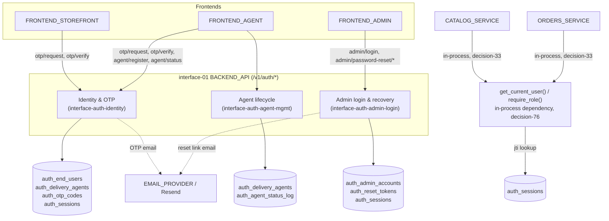
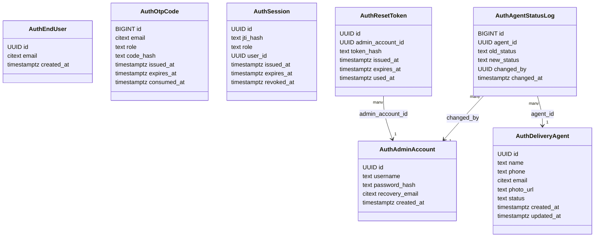
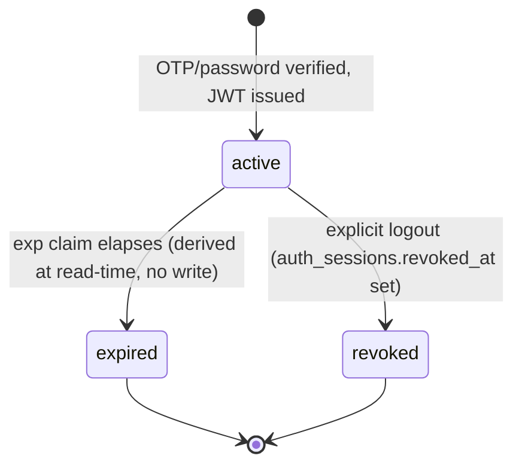
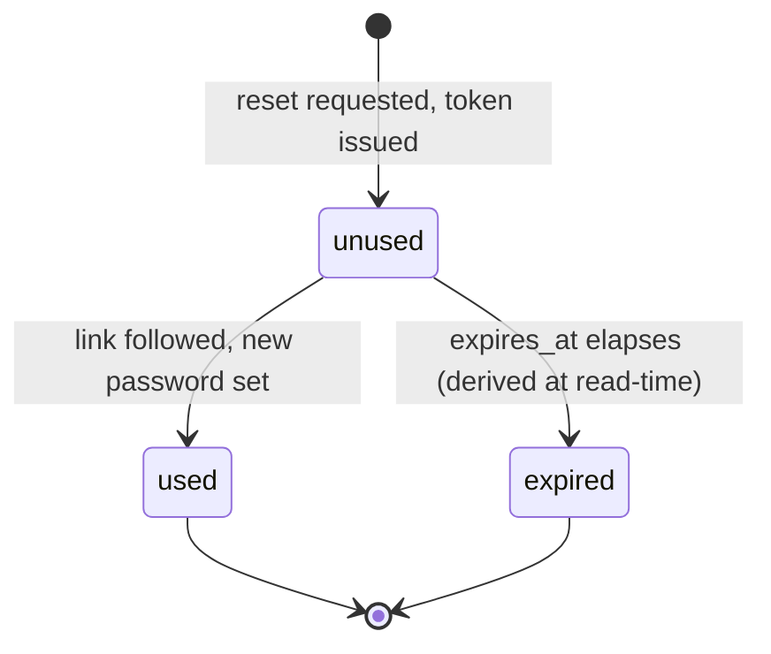
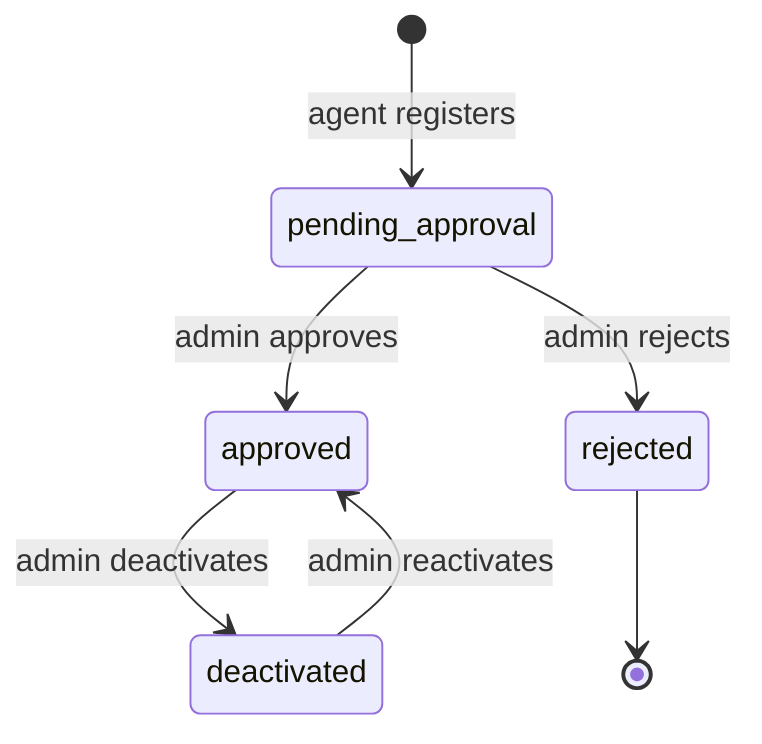
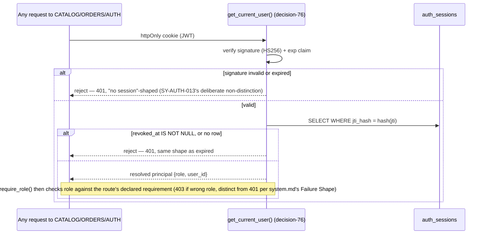
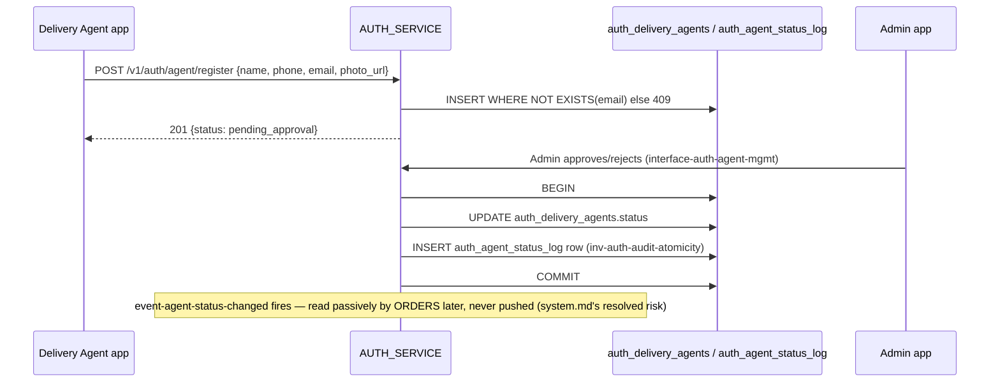

---
daksh:
  type: trd
  subtype: null
  stage: "50a"
  module: AUTH
---

# AUTH TRD

AUTH's [System spec](system.md) fixed *what* the module must do — fourteen testable behaviors, three state machines, seven logical data shapes — and its [Experience Design Spec](experience-design.md) fixed the frontend contract those behaviors serve. This document fixes *how*: the concrete Postgres schema, the password/OTP/token hashing algorithms, the JWT session mechanism (and how it reconciles with a `revoked` state despite architecture's stateless-JWT call), the formal API contracts for all eight `/v1/auth/*` routes, and the failure/idempotency behavior a frontend engineer can build against without guessing. Every design flow this TRD rests on ([dt-auth-001](experience-design.md#4b-design-task-breakdown) through [dt-auth-005](experience-design.md#4b-design-task-breakdown)) is complete — all twelve `DS-AUTH-NNN` screens have 4C evidence and prototype coverage, none pending. The audience is whoever implements `app/auth` next (stage 50d), and whoever writes AUTH's Test Specification (stage 50b) against the `TRD-AUTH-NNN` requirements below.

<details>
<summary>Graph: Where are AUTH's seams and contracts, and what crosses them?</summary>

```items
---
id: 50a-auth-trd-cognition
title: AUTH TRD — Seams and Contracts
default_open_depth: 1
default_color_by: kind
color_palette_source: .daksh/color-palette.json
width: 95vw
---
id: 50a-auth-trd-cognition
title: AUTH TRD — Seams and Contracts
Components:
  - component-06 :: AUTH_SERVICE | kind: component | summary: "The `app/auth` Python package inside the single FastAPI deployable — owns every identity/session concern for all three roles." | spec: [Architecture Overview](trd.md#architecture-overview) | boundary: "In: OTP/agent/admin identity, sessions, authorization. Out: no catalog or order data — reused unchanged from architecture.md and system.md, not re-split into fake sub-components, per decision-33's import-discipline (not seam-discipline) internal boundary."
  - infra-01 :: DATABASE | kind: infrastructure | summary: "The shared Postgres 16 instance — AUTH owns seven `auth_*`-prefixed tables in it, no separate database." | spec: [Data Model](trd.md#data-model) | kind_detail: managed_db
  - infra-02 :: EMAIL_PROVIDER (Resend) | kind: infrastructure | summary: "The only external service AUTH calls — OTP codes and Admin's reset link, fire-and-forget, no inbound callback." | spec: [Idempotency and Failure Contracts](trd.md#6a-idempotency-and-failure-contracts) | kind_detail: external_saas
Interfaces:
  - interface-auth-identity :: Identity & OTP interface | kind: interface | summary: "End User/Agent OTP request+verify, now carrying the CR-002 `role` discriminator — deepened here with the concrete request/response schema." | spec: [API Contracts](trd.md#api-contracts) | shape: "[API Contracts §otp](trd.md#api-contracts)" | version: "v1" | compatibility: additive
  - interface-auth-agent-mgmt :: Agent registration & lifecycle interface | kind: interface | summary: "Registration plus Admin's approve/reject/deactivate/reactivate actions, now with a concrete photo-upload field (decision-65, experience-design.md)." | spec: [API Contracts](trd.md#api-contracts) | shape: "[API Contracts §agent](trd.md#api-contracts)" | version: "v1" | compatibility: additive
  - interface-auth-admin-login :: Admin login & recovery interface | kind: interface | summary: "Password login, password reset request/confirm, and the shared logout endpoint every role uses." | spec: [API Contracts](trd.md#api-contracts) | shape: "[API Contracts §admin](trd.md#api-contracts)" | version: "v1" | compatibility: additive
StateMachines:
  - sm-auth-session :: Session lifecycle | kind: statemachine | summary: "Reused from system.md, now concrete: `active`/`expired` are derived at read-time from a JWT's `exp` claim, never written; `revoked` is the one real write, to `auth_sessions.revoked_at` (decision-71)." | spec: [State Machines](trd.md#5b-state-machines) | entity: "Session (JWT + auth_sessions row)"
  - sm-auth-reset-token :: Password reset token lifecycle | kind: statemachine | summary: "Reused from system.md; `used`/`expired` map to `auth_reset_tokens.used_at`/a read-time expiry check, single-use enforced by [inv-auth-single-use-tokens](#)." | spec: [State Machines](trd.md#5b-state-machines) | entity: "PasswordResetToken (auth_reset_tokens row)"
  - sm-auth-agent-status :: Delivery Agent status lifecycle | kind: statemachine | summary: "Reused from system.md unchanged at the state-machine level; TRD adds only the concrete `auth_delivery_agents.status` column and its paired `auth_agent_status_log` write." | spec: [Persistence Constraints](trd.md#5a-persistence-constraints) | entity: "DeliveryAgent (auth_delivery_agents row)"
Decisions:
  - decision-68 :: Argon2id for Admin password hashing | kind: decision | summary: "The one password AUTH stores (Admin's) is hashed with Argon2id (`argon2-cffi`), OWASP's current default recommendation for new systems — memory-hard, resists GPU/ASIC cracking better than bcrypt for the single highest-value credential in the system." | spec: [Security Design](trd.md#security-design) | alternatives: "bcrypt — more ubiquitous in Python/FastAPI examples, no memory-hardness tuning needed, but weaker against GPU-parallelized cracking than Argon2id for the account decision-51 explicitly left with no second factor." | reversal_trigger: "argon2-cffi becomes unmaintained or a real compatibility problem surfaces with the eventual hosting target (oq-27, system-architecture.md)."
  - decision-69 :: Keyed HMAC-SHA256 for OTP/reset-token hashing, not a slow password hash | kind: decision | summary: "OTP codes and reset tokens are hashed at rest with HMAC-SHA256 keyed by a server-only pepper (env var), not Argon2id — they're either high-entropy random (reset token) or short-lived and rate-limited (OTP), so a slow hash buys nothing a fast, defense-in-depth-keyed hash doesn't already cover, and a fast hash keeps verification cheap on the hottest-traffic AUTH path." | spec: [Security Design](trd.md#security-design) | alternatives: "Argon2id for everything, for uniformity — rejected; needlessly slows the highest-frequency AUTH operation (every OTP verify) for a threat model (offline dictionary attack on a low-entropy user-chosen secret) that doesn't apply to a random 6-digit rate-limited code or a 256-bit token. Bare unkeyed SHA-256 — rejected; a stolen-DB-only leak (app secrets intact) would let an attacker brute-force 6-digit OTPs offline in milliseconds with no pepper to stop them." | reversal_trigger: "OTP length or entropy changes in a way that makes offline brute-force of the hash itself a real threat even with rate-limiting."
  - decision-70 :: PyJWT with HS256 for session tokens | kind: decision | summary: "Sessions are signed JWTs via PyJWT using HS256 (single shared secret) — implementing architecture's [decision-35](../../system-architecture.md#permission-model-and-governance) (stateless JWT sessions) concretely. HS256 over RS256 because there is exactly one verifying process (the monolith itself, per decision-33) — no second service needs to verify a token without holding the signing secret." | spec: [Security Design](trd.md#security-design) | alternatives: "python-jose — supports more of the JOSE spec, but has a rockier CVE history than PyJWT and AUTH needs none of the extra spec surface. RS256 (asymmetric) — right call if a second, independent verifier ever exists; premature complexity (key pair generation, rotation, distribution) for a single-process monolith today." | reversal_trigger: "A second, independently-deployed service needs to verify AUTH-issued tokens without holding the shared secret — the classic RS256 trigger."
  - decision-71 :: A lightweight Postgres revocation list reconciles stateless JWT with the `revoked` state | kind: decision | summary: "Architecture's decision-35 rejected a Redis-backed *session store* (full session state held server-side); it did not rule out a much smaller revocation *list*. `auth_sessions` stores one row per issued JWT — a hashed `jti`, role, `issued_at`, `expires_at`, `revoked_at` (nullable) — and every authorization check does one indexed lookup by `jti` alongside verifying the JWT's signature and `exp`. This is genuinely how [sm-auth-session](#)'s `revoked` transition becomes possible at all without contradicting decision-35: a revocation *marker*, not session *state*." | spec: [5b State Machines](trd.md#5b-state-machines) | alternatives: "Fully stateless (no revocation table) — true to decision-35's letter, but makes `revoked` in system.md's own state machine physically impossible to implement, silently breaking an already-approved spec. Redis-backed full session store — exactly what decision-35 rejected, and unjustified for a revocation-only need." | reversal_trigger: "The `auth_sessions` table's write volume (one row per login) becomes a measured bottleneck at real traffic — unlikely at Phase 1's dozens-of-orders/day scale."
  - decision-72 :: OTP rate limiting via a Postgres COUNT query, not Redis | kind: decision | summary: "The 5-per-hour-per-email limit ([decision-53](../solution.md#business-states-decisions-and-recovery)) is enforced by counting `auth_otp_codes` rows for that `(email, role)` within the last hour at request time — no new infrastructure, consistent with every other cost-conscious infra call this project has made." | spec: [Business Rules and Validation](trd.md#business-rules-and-validation) | alternatives: "Redis with a sliding-window counter — faster under high concurrency, but AUTH has no Redis dependency anywhere else (decision-35 explicitly avoided it) and Phase 1 volume doesn't need it." | reversal_trigger: "Concurrent OTP request volume makes the COUNT query a measured latency problem — unlikely at dozens-of-orders/day scale."
  - decision-73 :: Per-IP rate limiting on Admin login, distinct from account lockout | kind: decision | summary: "`POST /v1/auth/admin/login` is rate-limited to 10 attempts per 15 minutes per source IP (via the `slowapi` library, an in-process limiter, no new infra) — this slows automated credential-stuffing without ever disabling the account itself, so it does not contradict [decision-51](../solution.md#business-flow-inventory)'s explicit no-lockout call. The account stays reachable by its legitimate owner at all times; only a high-frequency automated attacker from one IP is slowed." | spec: [Security Design](trd.md#security-design) | alternatives: "No rate limiting at all, matching decision-51 literally — rejected; decision-51 rejected *account lockout* specifically (its own stated concern was friction for the legitimate single Admin), not all defense-in-depth, and the single most powerful account having zero brute-force friction is a real, avoidable gap. Account lockout after N failures — explicitly what decision-51 already rejected." | reversal_trigger: "The eventual hosting target (oq-27) provides its own edge-level rate limiting, making the in-process limiter redundant."
  - decision-74 :: A fresh OTP or reset-token request supersedes the prior unconsumed one | kind: decision | summary: "Requesting a new OTP (same email+role) or a new Admin password reset invalidates any earlier unconsumed one for that same key — verify/confirm only ever checks the most recently issued row. Prevents an ambiguous case where an old and a new code could both still validate." | spec: [Business Rules and Validation](trd.md#business-rules-and-validation) | alternatives: "Allow multiple valid outstanding codes/tokens at once — simpler query (no supersession logic), but means a user who requests twice in quick succession could have two different valid codes active, a confusing and unnecessarily wide validity window that decision-56 (system.md)'s single-use intent argues against by extension." | reversal_trigger: "A real UX complaint surfaces from an old code being silently invalidated by a new request the user didn't intend (e.g. an accidental double-tap on 'resend')."
  - decision-75 :: No automatic purge of OTP, session, or reset-token rows in Phase 1 | kind: decision | summary: "Extends [decision-58](../system.md#logical-data-ownership-and-invariants)'s reasoning (already applied to agent records) to `auth_otp_codes`, `auth_sessions`, and `auth_reset_tokens` — expired/consumed/revoked rows stay; expiry is enforced by a read-time check regardless of whether the row still exists, so there's no correctness reason to delete it, and no stated storage-cost pressure to justify a cleanup job yet." | spec: [5a Persistence Constraints](trd.md#5a-persistence-constraints) | alternatives: "A scheduled cleanup job (the in-process scheduler already exists for [decision-38](../../system-architecture.md#uc-011-system-releases-stock-for-stale-orders)'s stale-order release, so adding a second job is cheap) — deferred; no measured storage or query-performance need yet, matching decision-58's own precedent exactly." | reversal_trigger: "Table size or index bloat on `auth_otp_codes`/`auth_sessions` becomes a measured performance concern."
  - decision-76 :: FastAPI dependency-injection implements the existing in-process authorization contract | kind: decision | summary: "`get_current_user()`/`require_role()` — already fixed as a function-level contract in [system-architecture.md](../../system-architecture.md#backend-architecture) — are implemented as FastAPI `Depends()` dependencies, so every protected route in CATALOG/ORDERS/AUTH declares its role requirement in its own signature rather than through a global middleware that has to special-case public routes." | spec: [Security Design](trd.md#security-design) | alternatives: "A global ASGI middleware checking every request — would need an explicit allow-list of public routes (OTP request/verify, agent register, admin login) to avoid blocking them, which is easy to get wrong by omission; a per-route `Depends()` is opt-in by construction, so a new route is unprotected-by-default until someone deliberately adds the dependency, which is safer to review." | reversal_trigger: "The number of protected routes grows large enough that repeating `Depends(require_role(...))` on every one becomes real, error-prone boilerplate a middleware would remove."
  - decision-77 :: Admin's password-reset request never reveals whether the account/email matched | kind: decision | summary: "`POST /v1/auth/admin/password-reset/request` returns an identical `202 {}` whether or not the submitted email matches the registered recovery address — already sketched in [experience-design.md's mock contract](../experience-design.md#mock-contracts-and-data), formalized here as a security decision: it prevents an attacker from using the reset flow to confirm the recovery email address of the system's single most powerful account." | spec: [API Contracts](trd.md#api-contracts) | alternatives: "Return a distinct error when the email doesn't match — more informative to a legitimate Admin who mistyped their recovery email, but leaks account existence to anyone probing the endpoint." | reversal_trigger: "None expected — this is a standard, low-cost anti-enumeration pattern with no real downside at this scale (there is exactly one Admin, so a mistyped recovery email is self-evidently wrong to whoever mistyped it)."
  - decision-78 :: OTP and reset-token verification use constant-time comparison | kind: decision | summary: "Comparing a submitted OTP/reset-token's hash against the stored hash uses `hmac.compare_digest` (constant-time), never `==` — prevents a timing side-channel from narrowing down a valid code/token byte-by-byte, cheap to guarantee and easy to get silently wrong without naming it explicitly." | spec: [Security Design](trd.md#security-design) | alternatives: "Plain string/byte equality — functionally identical on the happy path, but leaks timing information proportional to how many leading bytes match, a well-known class of attack against exactly this kind of secret comparison." | reversal_trigger: "None expected — this is a strictly-better-with-no-cost choice."
  - decision-79 :: No dedicated security-event logging for failed auth attempts in Phase 1 | kind: decision | summary: "A wrong OTP, wrong Admin password, or rate-limit hit is captured in normal application logs like any other request outcome — not flagged as a distinct security-event type. No LOGGING_MONITORING provider is chosen yet ([infra-04](../../system-architecture.md#project-wide-quality-requirements)) and no alerting threshold has been requested." | spec: [Open Questions](trd.md#open-questions) | alternatives: "Design a distinct 'failed auth attempt' event/log tag now, ahead of a provider choice, so alerting could be wired up later without a schema change — deferred; speculative design for a monitoring capability that doesn't exist yet." | reversal_trigger: "A LOGGING_MONITORING provider is chosen and a real alerting need (e.g. credential-stuffing detection) is raised."
  - decision-80 :: Rejected Delivery Agent status stays permanently terminal, no dedicated reconsideration flow | kind: decision | summary: "A `rejected` agent has no built-in re-application path — matches how [decision-55](../system.md#state-machines)'s reactivation is the only reversal this state machine grants, and `deactivated`, not `rejected`, is the reversible one by design. Admin can still manually re-open a case by directly editing the record if a real reconsideration ever comes up, but no UI/flow is built for it." | spec: [5b State Machines](trd.md#5b-state-machines) | alternatives: "A formal reconsideration/re-application flow — more agent-friendly, but a new business flow nothing upstream (Solution, System) ever asked for, for a case with no evidence yet of being common." | reversal_trigger: "Rejected applicants requesting reconsideration becomes a real, recurring pattern."
  - decision-81 :: Admin password policy is length-only, no composition or breach-list rules | kind: decision | summary: "The 12-character minimum already set in [API Contracts](trd.md#api-contracts) is the complete password policy — no character-class requirements, no breach-corpus check (e.g. HaveIBeenPwned). Matches current NIST/OWASP guidance favoring length over composition, and no compliance requirement forces more ([client-context.md](../../client-context.md#phase-1-decisions)'s no-special-regulatory-scope conclusion)." | spec: [API Contracts](trd.md#api-contracts) | alternatives: "Breach-list checking via an external API at password-set time — meaningfully raises the bar for the single most powerful account for one extra network call, but adds an external dependency and a new failure mode (what happens if that API is unreachable during a password reset) with no compliance driver requiring it yet." | reversal_trigger: "A real credential-stuffing or breached-password incident affecting the Admin account, or a client-communicated compliance requirement."
Events:
  - event-agent-status-changed :: Agent status changed | kind: event | summary: "Reused unchanged from system.md — fires on every `sm-auth-agent-status` transition, read passively by ORDERS, persisted permanently to `auth_agent_status_log` in the same DB transaction as the status write ([inv-auth-audit-atomicity](#))." | spec: [5a Persistence Constraints](trd.md#5a-persistence-constraints) | payload_shape: "agent_id, old_status, new_status, changed_by (admin_account_id), changed_at"
Invariants:
  - inv-auth-singleton-admin :: Exactly one row in auth_admin_accounts, always | kind: invariant | summary: "Enforced at the database level (fixed-literal primary key, no INSERT code path exists beyond the one-time migration seed), not just by convention — realizes [dm-adminaccount](../system.md#logical-data-ownership-and-invariants)'s 'exactly one row exists' shape as a structural guarantee, not a hope." | spec: [5a Persistence Constraints](trd.md#5a-persistence-constraints) | violation_signal: "A second row in auth_admin_accounts, or a migration/INSERT attempting to create one — should be structurally impossible, not just monitored."
  - inv-auth-audit-atomicity :: Every agent status write and its audit-log row commit together | kind: invariant | summary: "A `sm-auth-agent-status` transition and its paired `auth_agent_status_log` insert happen inside one database transaction — realizing [decision-60](../system.md#logical-data-ownership-and-invariants)'s accountability intent as a hard guarantee: there is no code path where a status changes without a log row, or vice versa." | spec: [5a Persistence Constraints](trd.md#5a-persistence-constraints) | violation_signal: "An `auth_delivery_agents.status` value with no corresponding terminal row in `auth_agent_status_log`, or a log row with no matching status value — either indicates a bypassed transaction boundary."
  - inv-auth-no-secrets-in-logs :: No plaintext password, OTP code, or reset token ever appears in application logs | kind: invariant | summary: "A concrete operational rule for whoever wires up [infra-04](../../system-architecture.md#project-wide-quality-requirements) `LOGGING_MONITORING`: request/response logging middleware must redact the `code`, `new_password`, and `token` request fields by name before any log line is written." | spec: [Security Design](trd.md#security-design) | violation_signal: "Any log line, error report, or trace containing a raw OTP digit string, admin password, or reset token — a single occurrence is a real incident, not a metric to trend."
  - inv-auth-single-use-tokens :: A consumed OTP or reset token can never validate again | kind: invariant | summary: "Concretizes [decision-56](../system.md#state-machines)'s single-use rule as a persistence fact: `auth_otp_codes.consumed_at` and `auth_reset_tokens.used_at`, once set, are never cleared or overwritten by any code path." | spec: [5a Persistence Constraints](trd.md#5a-persistence-constraints) | violation_signal: "A successful verify/confirm against a row whose `consumed_at`/`used_at` is already non-null."
Risks:
  - risk-auth-email-outage :: EMAIL_PROVIDER outage blocks OTP-based login, signup, and Admin recovery | kind: risk | summary: "If Resend is down or degraded, no End User or Delivery Agent can sign up or log in, and Admin cannot recover a lost password — every identity path except Admin's direct password login depends on email delivery." | spec: [10a Deployment and Operations](trd.md#10a-deployment-and-operations) | likelihood: "unknown — unvalidated, Resend has no historical incident data for this project" | impact: "high — blocks nearly all authentication" | mitigation: "No automated failover in Phase 1 (no second email provider wired up, consistent with cost-conscious infra decisions); the existing resend button/cooldown is the only retry path a user has. Revisit if a real outage is observed." | phase: runtime
  - risk-auth-jwt-secret-leak :: JWT signing secret compromise invalidates session integrity for every active session | kind: risk | summary: "Because HS256 uses one shared secret (decision-70), a leak lets an attacker forge a session for any role instantly and for every currently-issued token — there is no per-token blast radius." | spec: [10a Deployment and Operations](trd.md#10a-deployment-and-operations) | likelihood: "unknown — unvalidated, no incident to date on a project with no deployed history yet" | impact: "high — full authentication bypass for every role" | mitigation: "Secret lives only in an environment variable (never in code or the repo), rotated by the PTL if ever suspected leaked; rotating it invalidates every outstanding session at once (a deliberate, acceptable cost of the stateless design) — see 10a's Configuration Surface." | phase: runtime
component-06 -> interface-auth-identity | relation: produces
component-06 -> interface-auth-agent-mgmt | relation: produces
component-06 -> interface-auth-admin-login | relation: produces
component-06 -> event-agent-status-changed | relation: produces
infra-02 -> component-06 | relation: enables
decision-68 -> component-06 | relation: governs
decision-69 -> component-06 | relation: governs
decision-70 -> sm-auth-session | relation: governs
decision-71 -> sm-auth-session | relation: governs
decision-72 -> interface-auth-identity | relation: governs
decision-73 -> interface-auth-admin-login | relation: governs
decision-74 -> interface-auth-identity | relation: governs
decision-74 -> interface-auth-admin-login | relation: governs
decision-75 -> component-06 | relation: governs
decision-76 -> component-06 | relation: governs
decision-77 -> interface-auth-admin-login | relation: governs
decision-78 -> interface-auth-identity | relation: governs
decision-78 -> interface-auth-admin-login | relation: governs
decision-79 -> component-06 | relation: governs
decision-80 -> sm-auth-agent-status | relation: governs
decision-81 -> interface-auth-admin-login | relation: governs
risk-auth-email-outage -> interface-auth-identity | relation: threatens
risk-auth-email-outage -> interface-auth-admin-login | relation: threatens
risk-auth-jwt-secret-leak -> sm-auth-session | relation: threatens
inv-auth-singleton-admin -> component-06 | relation: watches
inv-auth-audit-atomicity -> component-06 | relation: watches
inv-auth-no-secrets-in-logs -> component-06 | relation: watches
inv-auth-single-use-tokens -> sm-auth-reset-token | relation: watches
```

</details>

> [!note]
> This graph carries 29 nodes across 7 groups — just under the 30-60 target this stage's own contract states, and worth explaining rather than padding: three of the seven groups (`Components`, `Interfaces`, `StateMachines`) are near-total reuse by ID from `system-architecture.md` and `system.md` — TRD deepens what they mean, it does not re-invent them, and the Cognition Contract's own graph-vs-schema boundary keeps the actual new content (the Postgres schema, the OpenAPI contracts) out of the graph and in the dedicated sections below, where `spec:` links point. The 14 `Decisions`, 4 `Invariants`, and 2 `Risks` are where this stage's real new material lives, and every one of them is genuinely load-bearing — none is a filler node manufactured to hit a number. `component-06` is deliberately **not** re-split into sub-components (e.g. a separate "OTP Service" or "Session Service" node): decision-33 already fixed AUTH's internals as import-discipline-enforced, not seam-enforced, and inventing internal seams that don't pass the deletion test would misrepresent the architecture, not deepen it. `decision-79` through `decision-81` were added after the first draft, resolving this stage's original 3 open questions — all 3 confirmed the design's own tentative default (normal logging, no reconsideration flow, length-only password policy), so nothing else in this document changed as a result.

## Scope

This TRD designs `app/auth`'s concrete implementation: the Postgres schema for AUTH's seven logical data shapes, the password/OTP/token hashing and JWT session mechanism, the formal `/v1/auth/*` API contracts (eight endpoints), idempotency and failure behavior, and AUTH's slice of deployment configuration. It rests on all five design tasks in [experience-design.md](experience-design.md#4b-design-task-breakdown) — [dt-auth-001](experience-design.md#4b-design-task-breakdown) through [dt-auth-005](experience-design.md#4b-design-task-breakdown) are complete, all twelve `DS-AUTH-NNN` screens have 4C evidence and prototype coverage; none is pending, so nothing here designs against an unexecuted flow.

**Explicit non-goals:** no CATALOG or ORDERS implementation detail (only the already-fixed in-process `get_current_user()`/`require_role()` contract they call). No frontend component code — that's stage 50d, and the frontend's mock contract already exists in [experience-design.md](experience-design.md#mock-contracts-and-data). No test cases (stage 50b). No hosting/infrastructure-provider decision (`oq-27`, system-architecture.md, still open) — this TRD names the environments and pipelines by ID without redefining them.

## Architecture Overview

AUTH ships as the `app/auth` package inside the single FastAPI process ([decision-33](../../system-architecture.md#backend-architecture)) — no new deployable, no new network seam beyond the already-fixed [interface-01](../../system-architecture.md#module-interactions-and-versioned-logical-interfaces) `BACKEND_API`'s `/v1/auth/*` prefix. Internally it is organized as three logical concerns matching its three existing interfaces one-to-one — identity/OTP, agent lifecycle, admin login/recovery — plus one cross-cutting authorization dependency every protected route in every module calls. This TRD deliberately does not carve those three concerns into separately-versioned internal components: [decision-33](../../system-architecture.md#backend-architecture) already committed to import-discipline over network/seam discipline inside the monolith, and none of the three would survive the deletion test as an independently replaceable unit — they share one database, one deploy, one team.

The one genuine architectural tension this TRD resolves is between [decision-35](../../system-architecture.md#permission-model-and-governance) (stateless JWT, no server-side session store) and [sm-auth-session](system.md#state-machines)'s `revoked` state, which requires *some* server-side memory of "this token is no longer good." [decision-71](#) resolves it: a small Postgres table recording one row per issued token (not full session state) is not the session store decision-35 rejected — it is the minimum server-side memory the already-approved state machine requires to be implementable at all.

## Component Diagram



All three `/v1/auth/*` route groups and the shared authorization dependency live in one process against one Postgres instance ([infra-01](../../system-architecture.md#database-architecture) `DATABASE`); the only outbound external call is to [infra-02](../../system-architecture.md#shared-platform-rules-and-cross-cutting-concerns) `EMAIL_PROVIDER`, fire-and-forget, with no inbound callback surface.

## Data Model

AUTH owns seven Postgres tables, one per logical shape [system.md](system.md#logical-data-ownership-and-invariants) already named, prefixed `auth_` per [system-architecture.md](../../system-architecture.md#database-architecture)'s per-module table-naming convention. `role`/status values reuse exactly the vocabulary already fixed upstream — `end_user`/`delivery_agent`/`admin` ([system-architecture.md](../../system-architecture.md#permission-model-and-governance)) and `pending_approval`/`approved`/`deactivated`/`rejected` ([domain-glossary.md](../../domain-glossary.md#delivery-agent-status)) — no new synonym is introduced anywhere below.



`AuthSession.user_id` is deliberately not drawn as a class relationship above: it references whichever of `AuthEndUser`/`AuthDeliveryAgent`/`AuthAdminAccount` the row's `role` names, which Postgres has no native polymorphic foreign key for — see [5a](#5a-persistence-constraints) for how this is enforced instead.

### DDL

```sql
CREATE EXTENSION IF NOT EXISTS citext;
CREATE EXTENSION IF NOT EXISTS pgcrypto; -- gen_random_uuid()

CREATE TABLE auth_end_users (
    id UUID PRIMARY KEY DEFAULT gen_random_uuid(),
    email CITEXT NOT NULL UNIQUE,
    created_at TIMESTAMPTZ NOT NULL DEFAULT now()
);

CREATE TYPE auth_agent_status AS ENUM ('pending_approval', 'approved', 'deactivated', 'rejected');

CREATE TABLE auth_delivery_agents (
    id UUID PRIMARY KEY DEFAULT gen_random_uuid(),
    name TEXT NOT NULL,
    phone TEXT NOT NULL,
    email CITEXT NOT NULL UNIQUE,
    photo_url TEXT NOT NULL,
    status auth_agent_status NOT NULL DEFAULT 'pending_approval',
    created_at TIMESTAMPTZ NOT NULL DEFAULT now(),
    updated_at TIMESTAMPTZ NOT NULL DEFAULT now()
);

CREATE TABLE auth_admin_accounts (
    id UUID PRIMARY KEY DEFAULT '00000000-0000-0000-0000-000000000001'::uuid,
    username TEXT NOT NULL UNIQUE,
    password_hash TEXT NOT NULL,
    recovery_email CITEXT NOT NULL,
    created_at TIMESTAMPTZ NOT NULL DEFAULT now(),
    CONSTRAINT auth_admin_accounts_singleton CHECK (id = '00000000-0000-0000-0000-000000000001'::uuid)
);
-- TRD-AUTH-001 (inv-auth-singleton-admin): the CHECK + fixed-default PK means a second row
-- can only ever be inserted with the SAME id, which the PRIMARY KEY constraint then rejects outright.

CREATE TABLE auth_otp_codes (
    id BIGSERIAL PRIMARY KEY,
    email CITEXT NOT NULL,
    role TEXT NOT NULL CHECK (role IN ('end_user', 'delivery_agent')),
    code_hash TEXT NOT NULL,
    issued_at TIMESTAMPTZ NOT NULL DEFAULT now(),
    expires_at TIMESTAMPTZ NOT NULL,
    consumed_at TIMESTAMPTZ
);
CREATE INDEX ix_auth_otp_codes_email_role_issued ON auth_otp_codes (email, role, issued_at DESC);

CREATE TABLE auth_sessions (
    id UUID PRIMARY KEY DEFAULT gen_random_uuid(),
    jti_hash TEXT NOT NULL UNIQUE,
    role TEXT NOT NULL CHECK (role IN ('end_user', 'delivery_agent', 'admin')),
    user_id UUID NOT NULL, -- app-enforced reference into auth_end_users/auth_delivery_agents/auth_admin_accounts by role; see 5a
    issued_at TIMESTAMPTZ NOT NULL DEFAULT now(),
    expires_at TIMESTAMPTZ NOT NULL,
    revoked_at TIMESTAMPTZ
);
CREATE UNIQUE INDEX ix_auth_sessions_jti_hash ON auth_sessions (jti_hash);

CREATE TABLE auth_reset_tokens (
    id UUID PRIMARY KEY DEFAULT gen_random_uuid(),
    admin_account_id UUID NOT NULL REFERENCES auth_admin_accounts(id) ON DELETE CASCADE,
    token_hash TEXT NOT NULL UNIQUE,
    issued_at TIMESTAMPTZ NOT NULL DEFAULT now(),
    expires_at TIMESTAMPTZ NOT NULL,
    used_at TIMESTAMPTZ
);

CREATE TABLE auth_agent_status_log (
    id BIGSERIAL PRIMARY KEY,
    agent_id UUID NOT NULL REFERENCES auth_delivery_agents(id) ON DELETE RESTRICT,
    old_status auth_agent_status NOT NULL,
    new_status auth_agent_status NOT NULL,
    changed_by UUID NOT NULL REFERENCES auth_admin_accounts(id) ON DELETE RESTRICT,
    changed_at TIMESTAMPTZ NOT NULL DEFAULT now()
);
CREATE INDEX ix_auth_agent_status_log_agent ON auth_agent_status_log (agent_id, changed_at);
```

## 5a Persistence Constraints

| Entity | Primary key | Uniqueness | FK / on-delete | Indexes (query served) | Retention | Migration policy | Dedupe key |
|---|---|---|---|---|---|---|---|
| `auth_end_users` | Surrogate UUID (`gen_random_uuid()`) — no natural key is stable (email can theoretically change in a future phase) | `email` unique (CITEXT, case-insensitive) | None outward | PK only; email uniqueness index serves OTP verify's lookup | Indefinite, no auto-purge ([decision-59](../system.md#logical-data-ownership-and-invariants), no self-service deletion) | Additive-only | `email` (case-insensitive) |
| `auth_delivery_agents` | Surrogate UUID | `email` unique — one agent identity per email, independent of `auth_end_users`' own uniqueness ([decision-49](../solution.md#business-states-decisions-and-recovery) allows cross-**table** reuse, not cross-**row** duplication within this table) | None outward; never hard-deleted ([decision-57](../system.md#logical-data-ownership-and-invariants)) | PK; email uniqueness index serves registration's dupe check and OTP verify's lookup | Indefinite, no auto-purge ([decision-58](../system.md#logical-data-ownership-and-invariants)) | Additive-only | `email` |
| `auth_admin_accounts` | Fixed-literal UUID, enforced singleton via `CHECK` ([inv-auth-singleton-admin](#)) | `username` unique (redundant with the singleton constraint but kept for query clarity) | None outward | PK only | Indefinite (one row, always) | Additive-only | N/A — singleton |
| `auth_otp_codes` | Surrogate `BIGSERIAL` — pure append log, no natural key, cheap sequential PK fits an insert-only table | None (multiple rows per email/role over time are expected; supersession is logical, not a DB constraint — see [decision-74](#)) | None outward | `(email, role, issued_at DESC)` — serves the rate-limit COUNT ([decision-72](#)) and "find latest OTP for email+role" lookup (SY-AUTH-002/003) | No auto-purge ([decision-75](#)) | Additive-only | None — every request is a new row by design |
| `auth_sessions` | Surrogate UUID | `jti_hash` unique | `user_id` is **not** a DB foreign key — no single table it can point to, since `role` picks among three; enforced application-side by always resolving `(user_id, role)` together, never `user_id` alone | `jti_hash` unique index — serves SY-AUTH-013's per-request revocation check, the hottest query path in AUTH | No auto-purge ([decision-75](#)) | Additive-only | `jti_hash` (one row per issued token by construction) |
| `auth_reset_tokens` | Surrogate UUID | `token_hash` unique | `admin_account_id` FK, `ON DELETE CASCADE` (harmless in practice — the admin account is a permanent singleton that's never deleted, but CASCADE is the structurally correct behavior if it ever were) | `token_hash` unique index — serves SY-AUTH-012's lookup | No auto-purge ([decision-75](#)) | Additive-only | `admin_account_id` — a new request supersedes the prior outstanding token ([decision-74](#)) |
| `auth_agent_status_log` | Surrogate `BIGSERIAL` — append-only, sequential order matters for audit review | None (every transition is its own row) | `agent_id` FK `ON DELETE RESTRICT` (agents are never deleted per decision-57, so this should never fire — RESTRICT documents the intent explicitly rather than leaving it undefined); `changed_by` FK `ON DELETE RESTRICT` (the singleton Admin account is never deleted either) | `(agent_id, changed_at)` — serves "history for this agent" (the read [decision-60](../system.md#logical-data-ownership-and-invariants)'s accountability rationale implies Admin will eventually want) | Permanent, never deleted ([decision-60](../system.md#logical-data-ownership-and-invariants)) | Additive-only, append-only (no UPDATE/DELETE code path should ever target this table) | None — one row per transition, transitions aren't naturally deduped |

**`AuthSession.user_id`'s missing FK**, spelled out: Postgres foreign keys point at one table. Since `auth_sessions.role` can be `end_user`, `delivery_agent`, or `admin`, `user_id` conceptually references one of three different tables depending on that value — a genuine polymorphic reference Postgres doesn't model natively. The application never queries `user_id` without also filtering by `role` (the `require_role()` dependency always has both from the decoded JWT claims), so this is a deliberate, documented gap in referential integrity rather than an oversight — a partial/conditional constraint per role was considered and rejected as unjustified complexity for a table already governed by the JWT's own signature as the primary integrity guarantee.

## 5b State Machines

All three states machines below are **reused unchanged** from [system.md](system.md#state-machines) at the business level; this section adds only how each transition is realized as a write (or deliberately *not* a write) against the schema above.



| Transition | Trigger | Write? |
|---|---|---|
| `[*] -> active` | OTP verify (SY-AUTH-002) or Admin login (SY-AUTH-009) succeeds | Insert one `auth_sessions` row; issue signed JWT carrying `jti` |
| `active -> expired` | 7 days elapse ([decision-52](../solution.md#business-states-decisions-and-recovery)) | **No write.** Every check compares the JWT's `exp` claim to `now()` — `expired` is a computed state, not a stored one. `auth_sessions` rows for expired sessions are left as-is ([decision-75](#)). |
| `active -> revoked` | `POST /v1/auth/logout` | Update: `auth_sessions.revoked_at = now()` for that `jti_hash` |



| Transition | Trigger | Write? |
|---|---|---|
| `[*] -> unused` | `POST /v1/auth/admin/password-reset/request` | Insert `auth_reset_tokens` row; **TRD-AUTH-007:** any prior unused row for the same admin is superseded ([decision-74](#)) — verify only ever checks the latest |
| `unused -> used` | `POST /v1/auth/admin/password-reset/confirm` with a valid token | Update: `used_at = now()` on that row; `auth_admin_accounts.password_hash` updated in the **same transaction** |
| `unused -> expired` | `expires_at` elapses | **No write.** Confirm checks `expires_at > now() AND used_at IS NULL`; both being false renders it "expired" without a stored flag. **TRD-AUTH-008** ([inv-auth-single-use-tokens](#)): a token whose `used_at` is already set is rejected on a second confirm attempt, even before `expires_at`. |



| Transition | Trigger | Write? |
|---|---|---|
| Every arrow above | The corresponding Admin action on `interface-auth-agent-mgmt` | **TRD-AUTH-011** ([inv-auth-audit-atomicity](#)): update `auth_delivery_agents.status` and insert one `auth_agent_status_log` row in the **same transaction** — never one without the other |

**Recovery transitions:** `deactivated -> approved` ([decision-55](../system.md#state-machines)) is the only non-linear edge, Admin-triggered, no cost beyond the normal approve action. `rejected` is genuinely terminal — there is no re-registration path for a rejected email in Phase 1; a rejected applicant would need Admin to manually reset their record's status via the same approve action if a real reconsideration case ever arises (not a separate feature, just the existing transition applied to a `rejected` row — worth flagging as untested territory for [Test Specification](test-specification.md), once it exists).

## API Contracts

All eight endpoints below live under `/v1/auth/*` on [interface-01](../../system-architecture.md#module-interactions-and-versioned-logical-interfaces) `BACKEND_API`, producer `AUTH_SERVICE`, version `v1`, `additive` compatibility. Every request/response field name and shape below is a direct, unmodified carry-forward of [experience-design.md's Mock Contracts and Data](experience-design.md#mock-contracts-and-data) (including the [CR-002](change-records/CR-002.md) `role` field) — no field was silently renamed or reshaped going from mock to real contract.

| Endpoint | Method | Consumer(s) | Auth required |
|---|---|---|---|
| `/v1/auth/otp/request` | POST | `FRONTEND_STOREFRONT`, `FRONTEND_AGENT` | None |
| `/v1/auth/otp/verify` | POST | `FRONTEND_STOREFRONT`, `FRONTEND_AGENT` | None |
| `/v1/auth/agent/register` | POST | `FRONTEND_AGENT` | None |
| `/v1/auth/agent/status` | GET | `FRONTEND_AGENT` | Session (`delivery_agent`) |
| `/v1/auth/admin/login` | POST | `FRONTEND_ADMIN` | None |
| `/v1/auth/admin/password-reset/request` | POST | `FRONTEND_ADMIN` | None |
| `/v1/auth/admin/password-reset/confirm` | POST | `FRONTEND_ADMIN` | None (token-bearing link is the credential) |
| `/v1/auth/logout` | POST | All three | Session (any role) |

### `POST /v1/auth/otp/request`

```yaml
requestBody:
  email: { type: string, format: email, required: true }
  role: { type: string, enum: [end_user, delivery_agent], required: true }  # CR-002
responses:
  "202":
    cooldown_seconds: { type: integer, example: 60 }
    expires_in_seconds: { type: integer, example: 600 }
  "429":
    error: { type: string, const: rate_limited }
    retry_after_seconds: { type: integer }
```
Errors: `429 rate_limited` — not retryable until `retry_after_seconds` elapses; audit: none (not security-sensitive, just a rate signal); copy key: drives [ds-auth-003](experience-design.md#4c-design-execution). **TRD-AUTH-005:** requests for a given `(email, role)` in the trailing 60 minutes are counted server-side ([decision-72](#)); the 6th within that window is rejected `429`, matching [decision-53](../solution.md#business-states-decisions-and-recovery)'s 5/hour limit exactly.

### `POST /v1/auth/otp/verify`

```yaml
requestBody:
  email: { type: string, format: email, required: true }
  code: { type: string, pattern: "^[0-9]{6}$", required: true }
  role: { type: string, enum: [end_user, delivery_agent], required: true }  # CR-002
responses:
  "200":
    session_token: { type: string, description: "opaque to the client; delivered as an httpOnly cookie, never read by JS" }
    role: { type: string, enum: [end_user, delivery_agent] }
    expires_at: { type: string, format: date-time }
  "401":
    error: { type: string, const: invalid_code }
  "410":
    error: { type: string, const: code_expired }
```
Errors: `401 invalid_code` — retryable (re-enter code, subject to attempt not consuming the OTP per [inv-auth-single-use-tokens](#) only applying to a *correct* code); `410 code_expired` — not retryable, must request a new code; both surface inline on [ds-auth-002](experience-design.md#4c-design-execution). Audit: a `401`/`410` is not itself logged as a distinct security event at Phase 1 scale, only a normal log line — see [decision-79](#). **TRD-AUTH-009:** a wrong-code attempt does not set `consumed_at` on the outstanding row — the same code remains verifiable by a further attempt until it either expires or is correctly entered.

### `POST /v1/auth/agent/register`

```yaml
requestBody:
  name: { type: string, required: true }
  phone: { type: string, required: true }
  email: { type: string, format: email, required: true }
  photo_url: { type: string, format: uri, required: true, description: "pre-uploaded to OBJECT_STORAGE by the frontend; AUTH stores the URL, never the file" }
responses:
  "201":
    status: { type: string, const: pending_approval }
  "409":
    error: { type: string, const: email_already_registered }
```
Errors: **TRD-AUTH-014:** `409 email_already_registered` fires whenever `auth_delivery_agents.email` already has a row, regardless of that row's status — not retryable with the same payload; the response directs the caller to `GET /v1/auth/agent/status` instead of erroring uninformatively, since the existing record might be theirs. Photo upload itself is [infra-03](../../system-architecture.md#database-architecture) `OBJECT_STORAGE` (AWS S3) — this endpoint takes a URL, not a file body.

### `GET /v1/auth/agent/status`

```yaml
responses:
  "200":
    status: { type: string, enum: [pending_approval, approved, deactivated, rejected] }
```
Session-scoped (the caller's own agent identity, resolved from their JWT) — no request body, no error variants beyond the shared session-failure shape (see [Failure Shape](system.md#logical-interfaces-and-data-flow)).

### `POST /v1/auth/admin/login`

```yaml
requestBody:
  username: { type: string, required: true }
  password: { type: string, required: true }
responses:
  "200":
    session_token: { type: string }
    expires_at: { type: string, format: date-time }
  "401":
    error: { type: string, const: invalid_credentials }
  "429":
    error: { type: string, const: rate_limited }
    retry_after_seconds: { type: integer }
```
`401 invalid_credentials` intentionally does not distinguish wrong username from wrong password ([Failure Shape](system.md#logical-interfaces-and-data-flow)'s enumeration-prevention principle, extended here). **TRD-AUTH-006:** `429 rate_limited` fires at the 11th login attempt from the same source IP within a trailing 15 minutes ([decision-73](#)) — **not** account lockout; a different IP can still authenticate the account immediately, and repeated failures from varied IPs are never blocked by this mechanism.

### `POST /v1/auth/admin/password-reset/request`

```yaml
requestBody:
  email: { type: string, format: email, required: true }
responses:
  "202": {}
```
**TRD-AUTH-010** ([decision-77](#)): always `202 {}`, whether or not the email matches the registered recovery address — no error variant exists by design.

### `POST /v1/auth/admin/password-reset/confirm`

```yaml
requestBody:
  token: { type: string, required: true }
  new_password: { type: string, minLength: 12, required: true }
responses:
  "200":
    session_token: { type: string }
  "410":
    error: { type: string, const: token_expired_or_used }
```
`minLength: 12` is this TRD's own choice (not fixed upstream) — a plain, reasonable minimum for the single highest-value credential, paired with Argon2id ([decision-68](#)) rather than a complex composition rule that tends to push people toward predictable patterns. `410` drives [ds-auth-010](experience-design.md#4c-design-execution).

### `POST /v1/auth/logout`

```yaml
responses:
  "204": {}
```
**TRD-AUTH-013:** session-scoped; revokes the caller's own current `jti` only ([sm-auth-session](#)'s `active -> revoked`) — every other session, including other logged-in devices for the same account, is left untouched. Not part of AUTH's own screen inventory — the triggering control lives in whichever screen/shell each frontend app puts its account menu, the same way [ds-auth-011](experience-design.md#4c-design-execution) is "shared shell state, not a standalone screen."

## 6a Idempotency and Failure Contracts

AUTH handles no money and has no inbound webhook/callback surface — its one external integration (Resend) is outbound-only and fire-and-forget, so most of this section resolves to "not applicable, and here is why" rather than a designed mechanism:

- **Idempotency keys:** none of the eight endpoints use a client-supplied idempotency key. `otp/request`, `admin/password-reset/request` are naturally safe to retry (worst case: an extra email, bounded by rate limits/cooldown). `otp/verify`, `admin/password-reset/confirm` are naturally **not** safely retryable with the same body after a genuine success — see Failure response replay below.
- **Retry semantics:** `otp/request`, `agent/register`'s `409` case, `admin/password-reset/request` are retryable by the user re-submitting (bounded by rate limits/cooldowns, not a client-side retry loop). `otp/verify`, `admin/login`, `admin/password-reset/confirm` are not meant to be automatically retried by the client on failure — each failure is informative (wrong code, wrong credentials, expired token), not transient.
- **Duplicate callback handling:** not applicable — AUTH has no inbound callback endpoint. `agent/register`'s `409` is the closest analog (a duplicate *submission*, not a duplicate *callback*), handled by directing the caller to `GET /v1/auth/agent/status` rather than treating it as a hard error.
- **At-least-once vs exactly-once:** AUTH's one external call (send an email via Resend) is at-least-once-attempted with no confirmation loop — if the send fails, the OTP/reset-token row already exists regardless, and the user's own "resend" action ([ds-auth-002](experience-design.md#4c-design-execution)'s 60-second cooldown) is the retry mechanism, not a background job or dead-letter queue. This is a deliberate scope call: building delivery-confirmation infrastructure for a 3,000-email/month free tier ([infra-02](../../system-architecture.md#shared-platform-rules-and-cross-cutting-concerns)) is disproportionate to the risk.
- **Failure response replay:** the case [decision-56](system.md#state-machines)'s own reversal trigger already named — a client retries `otp/verify` after a network timeout, but the first request actually succeeded server-side. The second attempt gets `401 invalid_code` (the code is now consumed), which reads as a wrong-code error even though the user entered it correctly the first time. Mitigation is at the design layer, already in place: [component-btn](experience-design.md#4a-primary-design-primitives)'s `loading` state disables the Verify button for the duration of the request, making a genuine double-submit rare. The residual risk (a real network failure mid-flight) is accepted as-is per decision-56's own stated reversal trigger — revisit only if this becomes a measured, real problem, not a hypothetical one.

## Data Flow

```mermaid
sequenceDiagram
    participant U as End User / Agent app
    participant A as AUTH_SERVICE
    participant DB as auth_otp_codes / auth_end_users / auth_delivery_agents
    participant R as EMAIL_PROVIDER

    U->>A: POST /v1/auth/otp/request {email, role}
    A->>DB: COUNT rows WHERE email+role, issued_at > now()-1h
    alt count >= 5
        A-->>U: 429 rate_limited
    else under limit
        A->>DB: supersede prior unconsumed row (decision-74); INSERT new code_hash
        A->>R: send OTP email (fire-and-forget)
        A-->>U: 202 {cooldown_seconds, expires_in_seconds}
    end
    U->>A: POST /v1/auth/otp/verify {email, code, role}
    A->>DB: SELECT latest row WHERE email+role
    alt no valid unconsumed row, or hash mismatch (constant-time)
        A-->>U: 401 invalid_code / 410 code_expired
    else match
        A->>DB: UPDATE consumed_at = now()
        A->>DB: find-or-create AuthEndUser/AuthDeliveryAgent by email+role
        A->>DB: INSERT auth_sessions row; issue JWT (jti, role, exp)
        A-->>U: 200 {session_token, role, expires_at}
    end
```





```mermaid
sequenceDiagram
    participant AD as Admin app
    participant A as AUTH_SERVICE
    participant DB as auth_admin_accounts / auth_reset_tokens
    participant R as EMAIL_PROVIDER

    AD->>A: POST /v1/auth/admin/password-reset/request {email}
    A->>DB: match against recovery_email? (never revealed either way, decision-77)
    A->>DB: supersede prior unused token (decision-74); INSERT new token_hash
    A->>R: send reset-link email
    A-->>AD: 202 {} (always, decision-77)
    AD->>A: POST /v1/auth/admin/password-reset/confirm {token, new_password}
    A->>DB: SELECT WHERE token_hash matches (constant-time), used_at IS NULL, expires_at > now()
    alt no match / used / expired
        A-->>AD: 410 token_expired_or_used
    else valid
        A->>DB: BEGIN
        A->>DB: UPDATE auth_reset_tokens.used_at
        A->>DB: UPDATE auth_admin_accounts.password_hash (Argon2id, decision-68)
        A->>DB: COMMIT
        A-->>AD: 200 {session_token}
    end
```

## Technology Choices

Conforms to Technology Baseline: Python 3.12, FastAPI, PostgreSQL 16, SQLAlchemy 2.0 (async) + Alembic, uv ([system-architecture.md](../../system-architecture.md#technology-baseline)) — no deviation from any fixed baseline item. Module-discretionary choices, each already justified above with `alternatives`/`reversal_trigger` in the graph and linked here for a scanning reader:

| Choice | Library | Justification | Decision |
|---|---|---|---|
| Password hashing | `argon2-cffi` (Argon2id) | OWASP-current default, memory-hard, for the one highest-value credential | [decision-68](#) |
| OTP/reset-token hashing | Python stdlib `hmac` (HMAC-SHA256) | Fast, keyed, appropriate to already-high-entropy/rate-limited secrets | [decision-69](#) |
| JWT | `PyJWT` (HS256) | Simpler API, better CVE history than python-jose; single verifying process | [decision-70](#) |
| Admin-login rate limiting | `slowapi` | In-process, no new infra, defense-in-depth distinct from account lockout | [decision-73](#) |

No new database, cache, or message-queue dependency — `auth_sessions`/`auth_otp_codes` reuse the one Postgres instance every other module already shares, per [decision-33](../../system-architecture.md#backend-architecture)'s single-monolith call.

## Security Design

**Authentication:** OTP (End User, Delivery Agent) via [interface-auth-identity](#), password (Admin) via [interface-auth-admin-login](#) — both flows terminate in the same JWT issuance mechanism ([decision-70](#)).

**Authorization:** every protected route in every module declares its required role via `Depends(require_role(...))` ([decision-76](#)), which internally calls `get_current_user()` — the sequence is: verify JWT signature + `exp` (cryptographic, no DB), then one indexed lookup against `auth_sessions` for revocation ([decision-71](#)). **TRD-AUTH-004:** a token whose signature and `exp` are both valid is still rejected if its `jti` is missing from `auth_sessions` or has a non-null `revoked_at`. A missing/invalid/expired/revoked session is rejected identically (`401`, [system.md's Failure Shape](system.md#logical-interfaces-and-data-flow)); a valid session with the wrong role is rejected distinctly (`403`).

**Data protection:** **TRD-AUTH-002:** Admin's password is hashed with Argon2id ([decision-68](#)) before it is ever written to `auth_admin_accounts.password_hash`; plaintext is never persisted. **TRD-AUTH-003:** OTP codes and reset tokens are hashed with keyed HMAC-SHA256 ([decision-69](#)) before being written to `auth_otp_codes.code_hash`/`auth_reset_tokens.token_hash`. **TRD-AUTH-012** ([inv-auth-no-secrets-in-logs](#)): no password, OTP code, or reset token value — hashed or plaintext-in-transit — appears in any application log line. **TRD-AUTH-015:** OTP/reset-token hash comparison uses `hmac.compare_digest` ([decision-78](#)), never `==` — verified by code inspection, not a runtime behavioral test (see [Test Specification](test-specification.md) for how this is checked). TLS termination is a hosting-layer concern, deferred to `oq-27`.

**Enumeration resistance:** Admin login's `401` doesn't distinguish wrong-username from wrong-password; password-reset-request's `202` doesn't reveal whether the email matched ([decision-77](#)) — both extend the same principle [system.md](system.md#logical-interfaces-and-data-flow) already established for session rejection.

**Rate limiting:** OTP requests, 5/hour/email+role ([decision-53](../solution.md#business-states-decisions-and-recovery), enforced per [decision-72](#)); Admin login, 10/15min/IP ([decision-73](#)) — the latter is defense-in-depth, not account lockout, so it never contradicts [decision-51](../solution.md#business-flow-inventory)'s no-lockout call.

**Secrets:** JWT signing secret and the OTP/reset-token HMAC pepper are both environment-variable-only, never committed or logged — see [10a's Configuration Surface](#10a-deployment-and-operations). [risk-auth-jwt-secret-leak](#) names the blast radius of a leak explicitly.

**PII scoping ([BRD NFR-5](../../business-requirements.md#non-functional-requirements)):** `auth_delivery_agents.name/phone/photo_url` is readable only by the Admin route group ([FRONTEND_ADMIN](../../system-architecture.md#frontend-architecture)'s auth guard) — AUTH exposes no endpoint that lists agent PII to any role but Admin; `GET /v1/auth/agent/status` returns only the caller's own status, never another agent's.

## NFR Design

| BRD NFR | AUTH's realization |
|---|---|
| [NFR-1](../../business-requirements.md#non-functional-requirements) (~2s page loads) | JWT verification is pure cryptography (no DB round-trip); the one DB lookup per protected request (`auth_sessions` by indexed `jti_hash`) is sub-millisecond at Phase 1 data volume — well inside [system.md](system.md#module-quality-budgets)'s sub-100ms authorization-overhead budget. |
| [NFR-2](../../business-requirements.md#non-functional-requirements) (no formal uptime SLA) | No HA/failover design for AUTH beyond what `DATABASE`/`BACKEND_COMPUTE` provide generically — consistent with the project-wide stance. |
| [NFR-3](../../business-requirements.md#non-functional-requirements) (OTP security) | 10-minute expiry, 60-second resend cooldown ([decision-28](../../business-requirements.md#brd-decisions)), 5/hour rate limit ([decision-53](../solution.md#business-states-decisions-and-recovery)) — all enforced server-side in `auth_otp_codes`'s schema and the rate-limit query, never trusted from the client. |
| [NFR-4](../../business-requirements.md#non-functional-requirements) (credentials hashed) | [decision-68](#), [decision-69](#) — extends the BRD's password-only statement to OTP codes and reset tokens too, as [system.md's Module Quality Budgets](system.md#module-quality-budgets) already flagged as this stage's job. |
| [NFR-5](../../business-requirements.md#non-functional-requirements) (PII access scoping) | See Security Design's PII scoping paragraph above. |

## 10a Deployment and Operations

**Environments:** AUTH deploys wherever the rest of the monolith does — [env-01](../../system-architecture.md#deployment-architecture) `LOCAL` (Docker Compose), [env-02](../../system-architecture.md#deployment-architecture) `PREVIEW`, [env-03](../../system-architecture.md#deployment-architecture) `PRODUCTION`. No AUTH-specific environment.

**Infrastructure:** runs on [infra-05](../../system-architecture.md#backend-architecture) `BACKEND_COMPUTE` (host still `oq-27`, system-architecture.md) alongside CATALOG/ORDERS in the one process; persists to [infra-01](../../system-architecture.md#database-architecture) `DATABASE`; calls [infra-02](../../system-architecture.md#shared-platform-rules-and-cross-cutting-concerns) `EMAIL_PROVIDER`. No dedicated infrastructure node for AUTH alone — if one is ever needed (e.g. a separate auth service), that is a roadmap-level change, not something this TRD invents.

**Pipelines:** ships via the three shared pipelines — [pipeline-01](../../system-architecture.md#deployment-architecture) `CI`, [pipeline-02](../../system-architecture.md#deployment-architecture) `CD_PREVIEW`, [pipeline-03](../../system-architecture.md#deployment-architecture) `CD_PRODUCTION`. AUTH adds one pipeline-relevant step no other module needs yet: `CD_PRODUCTION`'s existing "run DB migrations before deploy" step must apply the `auth_admin_accounts` singleton-seed migration exactly once — Alembic's own migration-history tracking already prevents a re-run, no extra tooling needed.

**Runtime invariants:** [inv-auth-singleton-admin](#), [inv-auth-audit-atomicity](#), [inv-auth-no-secrets-in-logs](#), [inv-auth-single-use-tokens](#) — see the graph and 5a for each.

**Failure modes:** [risk-auth-email-outage](#) (Resend down — blocks nearly all authentication, no automated failover in Phase 1), [risk-auth-jwt-secret-leak](#) (shared-secret compromise invalidates every session at once). Neither has a formal on-call/paging story yet — consistent with [NFR-2](../../business-requirements.md#non-functional-requirements)'s no-SLA stance and the project having no deployed history to page against.

**Configuration surface:**

| Variable | Holds | Rotated by |
|---|---|---|
| `DATABASE_URL` | Postgres connection string | PTL, on credential change |
| `JWT_SIGNING_SECRET` | HS256 shared secret ([decision-70](#)) | PTL, if ever suspected leaked (invalidates all sessions instantly — accepted cost) |
| `OTP_HMAC_PEPPER` | Server-side key for [decision-69](#)'s keyed hash | PTL, same trigger as above |
| `RESEND_API_KEY` | Email provider credential | PTL, on provider-side rotation |

All four are environment variables only — never in code, never logged, never in a migration file.

**Rollback:** application code rolls back via the deployable's own previous build/container (no AUTH-specific step). Schema changes are additive-only ([5a](#5a-persistence-constraints)), so a code rollback never needs a matching down-migration in the common case; a genuine down-migration (rare) follows the same expand/contract discipline as any other module.

**Observability:** structured logs for OTP request/verify outcomes, agent status transitions, and admin login attempts (success/failure, never the credential itself — [inv-auth-no-secrets-in-logs](#)) via [infra-04](../../system-architecture.md#project-wide-quality-requirements) `LOGGING_MONITORING` once a provider is chosen. Deep runbook detail (dashboards, escalation) is stage 90's job, not this TRD's.

## Open Questions

None outstanding. All 3 questions this TRD originally raised were resolved during review, each confirming the draft's own tentative default:

- *Should a wrong-OTP or wrong-Admin-password attempt be logged as a discrete security event?* Resolved: no, normal application logs are enough for Phase 1 — see [decision-79](#).
- *Should a `rejected` Delivery Agent get a reconsideration/re-registration path?* Resolved: no, it stays permanently terminal; Admin can manually override the record in the rare case it's warranted — see [decision-80](#).
- *Should Admin's password policy require more than a length minimum?* Resolved: length-only (12 characters) is the complete policy, no composition or breach-list rules — see [decision-81](#).

## Approval

Approved by: Bhargav
Role:        PTL
Date:        2026-09-04
Hash:        7d66cc32e6ae…

Approved by: Bhargav
Role:        PTL
Date:        2026-09-04
Via:         CR-003
