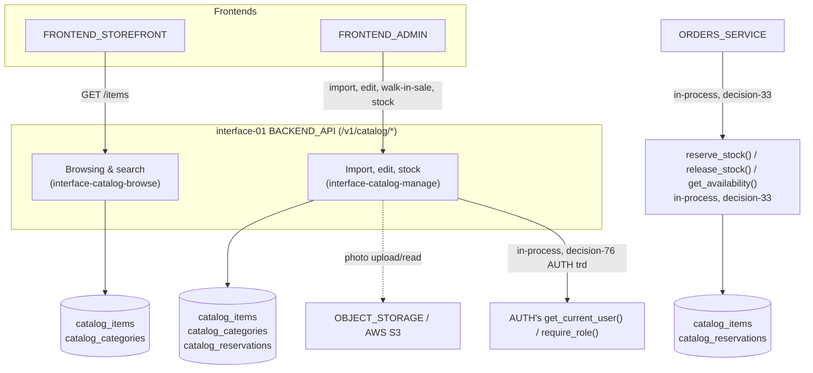
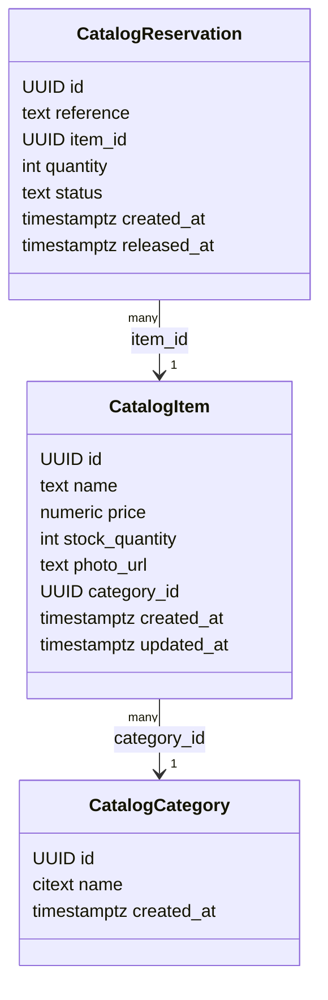
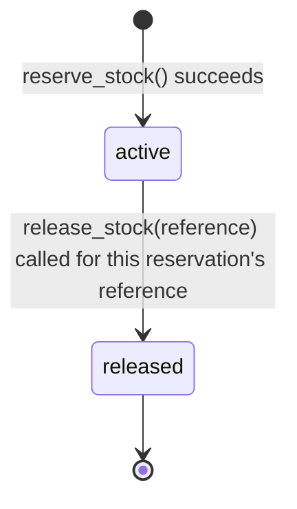
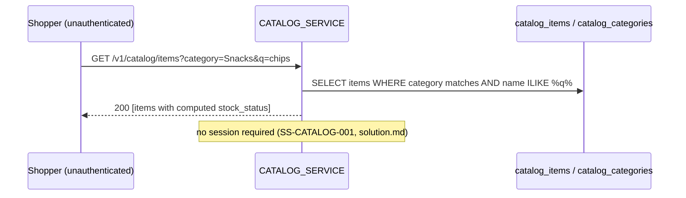
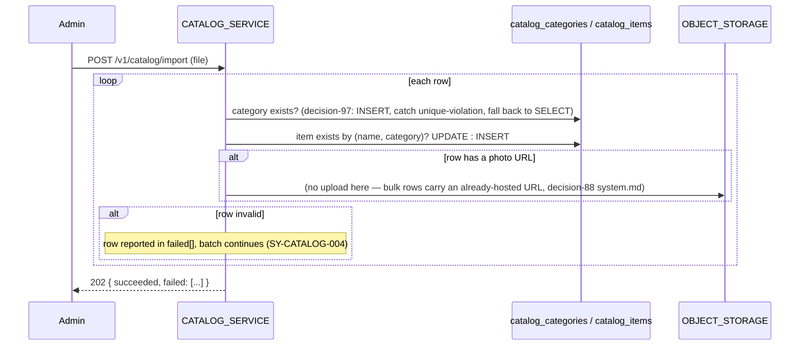
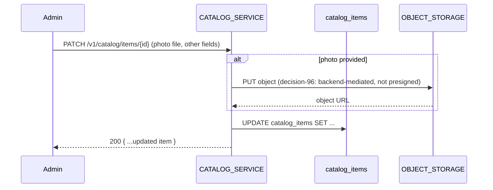
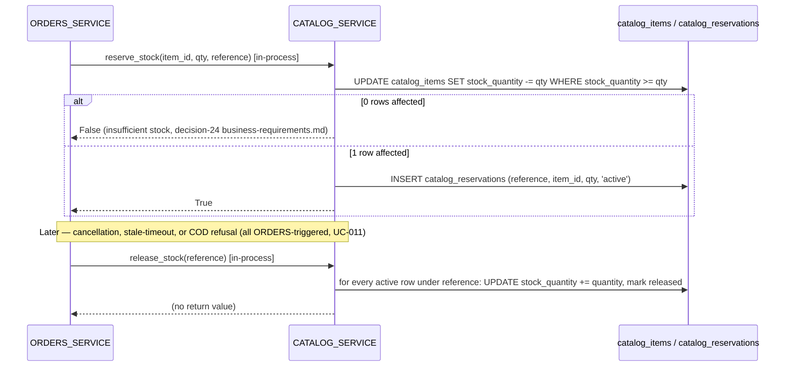

---
daksh:
  type: trd
  subtype: null
  stage: "50a"
  module: CATALOG
---

# CATALOG TRD

CATALOG's [System spec](system.md) fixed *what* the module must do — fourteen testable behaviors, one state machine, three logical data shapes — and its [Experience Design Spec](experience-design.md) fixed the frontend contract those behaviors serve. This document fixes *how*: the concrete Postgres schema for items, categories, and the stock-reservation ledger; the exact atomic mechanism that makes "first to confirm wins" true under concurrent checkouts; the formal API contracts for all five `/v1/catalog/*` routes plus the in-process `reserve_stock()`/`release_stock()`/`get_availability()` contract ORDERS depends on; and the photo-upload mechanism that finally puts [infra-03](../../system-architecture.md#database-architecture) `OBJECT_STORAGE` to its originally-planned use. Every design flow this TRD rests on ([dt-catalog-001](experience-design.md#4b-design-task-breakdown) through [dt-catalog-004](experience-design.md#4b-design-task-breakdown)) is complete — all eight `DS-CATALOG-NNN` screens have 4C evidence and prototype coverage, none pending. The audience is whoever implements `app/catalog` next (stage 50d), and whoever writes CATALOG's Test Specification (stage 50b) against the `TRD-CATALOG-NNN` requirements below.

<details>
<summary>Graph: Where are CATALOG's seams and contracts, and what crosses them?</summary>

```items
---
id: 50a-catalog-trd-cognition
title: CATALOG TRD — Seams and Contracts
default_open_depth: 1
default_color_by: kind
color_palette_source: .daksh/color-palette.json
width: 95vw
---
id: 50a-catalog-trd-cognition
title: CATALOG TRD — Seams and Contracts
Components:
  - component-04 :: CATALOG_SERVICE | kind: component | summary: "The `app/catalog` Python package inside the single FastAPI deployable — owns items, categories, stock, and the reservation ledger for all callers." | spec: [Architecture Overview](trd.md#architecture-overview) | boundary: "In: browsing/search, bulk import, single-item edit, walk-in sale, the reserve/release/availability contract. Out: no order or payment data — reused unchanged from system-architecture.md and system.md, not re-split into fake sub-components, per decision-33's import-discipline internal boundary."
  - infra-01 :: DATABASE | kind: infrastructure | summary: "The shared Postgres 16 instance, reused from AUTH's own TRD — CATALOG owns three `catalog_*`-prefixed tables in it, no separate database." | spec: [Data Model](trd.md#data-model) | kind_detail: managed_db
  - infra-03 :: OBJECT_STORAGE (AWS S3) | kind: infrastructure | summary: "Reused from system-architecture.md ([decision-40](../../system-architecture.md#architecture-decisions)) — planned for catalog item photos from the start, but never actually wired up until this TRD; AUTH's own agent-photo field used a data-URL stand-in instead (a known, flagged gap in TASK-AUTH-008's implementation)." | spec: [10a Deployment and Operations](trd.md#10a-deployment-and-operations) | kind_detail: object_storage
Interfaces:
  - interface-catalog-browse :: Catalog browsing & search interface | kind: interface | summary: "Public, no session — category/keyword lookup, deepened here with the concrete request/response schema and the ILIKE-based search decision." | spec: [API Contracts](trd.md#api-contracts) | shape: "[API Contracts §browse](trd.md#api-contracts)" | version: "v1" | compatibility: additive
  - interface-catalog-manage :: Catalog & stock management interface | kind: interface | summary: "Admin-only — bulk import, single-item edit, walk-in sale, low-stock list — now with the concrete multipart/JSON schemas and the photo-upload mechanism." | spec: [API Contracts](trd.md#api-contracts) | shape: "[API Contracts §manage](trd.md#api-contracts)" | version: "v1" | compatibility: additive
StateMachines:
  - sm-catalog-reservation :: Stock reservation lifecycle | kind: statemachine | summary: "Reused from system.md; `active`/`released` map to `catalog_reservations.status`, concretized here as the one write-pair that makes reserve/release atomic (decision-95)." | spec: [5b State Machines](trd.md#5b-state-machines) | entity: "StockReservation (catalog_reservations row)"
Decisions:
  - decision-95 :: reserve_stock() uses a single atomic conditional UPDATE, not row locking | kind: decision | summary: "A reservation attempt runs one SQL statement — `UPDATE catalog_items SET stock_quantity = stock_quantity - :qty WHERE id = :item_id AND stock_quantity >= :qty` — and checks the affected-row count; zero rows means insufficient stock. This is what makes system.md's own deferred 'first to confirm wins under concurrency' requirement concretely true: Postgres's own row-level write lock during the UPDATE makes two simultaneous callers serialize automatically, with no explicit SELECT FOR UPDATE needed." | spec: [Business Rules and Validation](trd.md#business-rules-and-validation) | alternatives: "SELECT ... FOR UPDATE then a separate UPDATE — two round-trips instead of one, and the same guarantee; strictly worse for no benefit at this module's scale. An application-level lock (e.g. Redis) — new infrastructure this cost-conscious project has consistently avoided (AUTH's own decision-72 made the identical call for OTP rate limiting)." | reversal_trigger: "This single-statement pattern proves insufficient once reservation logic grows more complex than a flat decrement (e.g. per-category stock pools) — unlikely at Phase 1 scope."
  - decision-96 :: Photo upload goes through the backend, not a presigned S3 URL | kind: decision | summary: "Both bulk import (a URL per row, decision-88 system.md) and single-item edit (a real file) reach [infra-03](../../system-architecture.md#database-architecture) the same way: the backend receives the file/URL and itself performs the S3 PUT via `boto3`, returning the resulting object URL. Deep because it hides S3's own SDK, bucket policy, and credential handling behind one function every future OBJECT_STORAGE consumer (ORDERS, if it ever needs one) can call without touching AWS directly." | spec: [API Contracts](trd.md#api-contracts) | alternatives: "A presigned-URL flow (frontend uploads directly to S3, backend only receives the resulting URL) — lower backend bandwidth for large files, but adds a second round-trip and a token-expiry edge case for a single-store catalog's photo volume that doesn't justify it yet." | reversal_trigger: "Photo upload volume or file size grows large enough that routing every upload through the backend process becomes a measured bandwidth or latency problem."
  - decision-97 :: Category auto-creation relies on a unique constraint, not a check-then-insert | kind: decision | summary: "Creating a category on first use ([decision-83](system.md#business-rules-and-validation)) attempts an INSERT and catches a unique-violation on `catalog_categories.name`, falling back to a lookup — the same race-safe pattern AUTH's own agent registration ([TRD-AUTH-014](../AUTH/trd.md#5a-persistence-constraints)) already established, rather than a check-then-insert that a concurrent import could race past." | spec: [5a Persistence Constraints](trd.md#5a-persistence-constraints) | alternatives: "SELECT first, INSERT only if missing — simpler to read, but leaves a real race window between two rows of the same import (or two concurrent imports) both seeing 'missing' and both inserting, which the unique constraint would then reject one of anyway — better to design for that outcome from the start than treat it as a surprise." | reversal_trigger: "None expected — this is the same proven pattern already in production use in this codebase."
  - decision-98 :: Bulk import runs synchronously within one request, not a background job | kind: decision | summary: "A submitted import file is validated and applied row-by-row before the response returns — no job queue, no polling for status. Matches system.md's own Module Quality Budgets call (no formal import-throughput target at Phase 1's single-store catalog size)." | spec: [Business Rules and Validation](trd.md#business-rules-and-validation) | alternatives: "A background job with a polled status endpoint — the standard pattern for large imports, but adds a job queue this cost-conscious project has no other use for yet, for a catalog small enough that synchronous processing finishes well within a normal request timeout." | reversal_trigger: "Real catalog files grow large enough that synchronous processing risks a request timeout — at that point a background job becomes worth the added infrastructure."
Events: []
Invariants:
  - inv-catalog-nonnegative-stock :: catalog_items.stock_quantity is never negative | kind: invariant | summary: "Enforced at the database level via a CHECK constraint, not just application logic — every write path (reservation, release, walk-in sale, admin edit) that would take it below zero fails the statement outright." | spec: [5a Persistence Constraints](trd.md#5a-persistence-constraints) | violation_signal: "Any row in catalog_items with stock_quantity < 0 — should be structurally impossible, not just monitored."
  - inv-catalog-reservation-consistency :: An active reservation's quantity was actually deducted from its item | kind: invariant | summary: "Realizes decision-86's (system.md) ledger design as a hard guarantee: reserve_stock()'s UPDATE and its catalog_reservations INSERT happen in one database transaction, so there is no code path where one exists without the other." | spec: [5a Persistence Constraints](trd.md#5a-persistence-constraints) | violation_signal: "An active catalog_reservations row whose item's stock_quantity doesn't reflect that deduction, or a stock deduction with no matching reservation row — either indicates a bypassed transaction boundary."
Risks:
  - risk-catalog-s3-outage :: OBJECT_STORAGE (S3) outage blocks photo upload, not the rest of CATALOG | kind: risk | summary: "If S3 is unreachable, bulk import rows with a photo and single-item photo edits fail; browsing, search, walk-in sale, and stock management are entirely unaffected since none of them touch S3." | spec: [10a Deployment and Operations](trd.md#10a-deployment-and-operations) | likelihood: "unknown — unvalidated, no incident history for this project" | impact: "low — narrowly scoped to the photo field, every other CATALOG behavior keeps working" | mitigation: "No automated failover; a failed photo upload fails just that row/edit with a specific reason (per FR-015's own per-row failure model), never the whole request. Revisit if a real outage is observed." | phase: runtime
component-04 -> interface-catalog-browse | relation: produces
component-04 -> interface-catalog-manage | relation: produces
infra-03 -> component-04 | relation: enables
decision-95 -> sm-catalog-reservation | relation: governs
decision-95 -> interface-catalog-manage | relation: governs
decision-96 -> interface-catalog-manage | relation: governs
decision-97 -> component-04 | relation: governs
decision-98 -> interface-catalog-manage | relation: governs
risk-catalog-s3-outage -> interface-catalog-manage | relation: threatens
inv-catalog-nonnegative-stock -> component-04 | relation: watches
inv-catalog-reservation-consistency -> sm-catalog-reservation | relation: watches
```

</details>

> [!note]
> This graph carries 18 nodes across 7 groups — thinner than AUTH's own 29-node TRD graph, since CATALOG's own scope is smaller (one state machine, not three; three tables, not seven) and `Components`/`Interfaces`/`StateMachines` are near-total reuse by ID from `system-architecture.md` and `system.md`, exactly as AUTH's own TRD reused its upstream IDs rather than reinventing them. `Events: []` is deliberate and stated explicitly, not omitted — unlike AUTH's `event-agent-status-changed`, CATALOG has no cross-module event ORDERS reads passively; ORDERS instead calls CATALOG's interfaces directly, so there is nothing to fire and forget. `component-04` is not re-split into sub-components for the same reason AUTH's `component-06` wasn't: decision-33 fixed import-discipline, not seam-discipline, inside the monolith, and none of CATALOG's internal concerns (browsing, import, stock) would survive the deletion test as an independently replaceable unit. `decision-95` through `decision-98` are where this stage's genuinely new material lives — all four resolved directly, without a follow-up question round, since each is a reversible implementation-mechanism choice within this stage's own remit (matching how AUTH's own `decision-68` through `decision-78` were resolved the same way, reserving actual open questions for real policy gaps).

## Scope

This TRD designs `app/catalog`'s concrete implementation: the Postgres schema for CATALOG's three logical data shapes, the atomic reservation mechanism, the formal `/v1/catalog/*` API contracts (five endpoints) plus the in-process stock contract, idempotency and failure behavior, and CATALOG's slice of deployment configuration — including finally wiring up [infra-03](../../system-architecture.md#database-architecture) `OBJECT_STORAGE`. It rests on all four design tasks in [experience-design.md](experience-design.md#4b-design-task-breakdown) — [dt-catalog-001](experience-design.md#4b-design-task-breakdown) through [dt-catalog-004](experience-design.md#4b-design-task-breakdown) are complete, all eight `DS-CATALOG-NNN` screens have 4C evidence and prototype coverage; none is pending, so nothing here designs against an unexecuted flow.

**Explicit non-goals:** no AUTH or ORDERS implementation detail (only the already-fixed in-process `get_current_user()`/`require_role()` contract CATALOG calls, and the `reserve_stock()`/`release_stock()`/`get_availability()` contract ORDERS calls). No frontend component code — that's stage 50d, and the frontend's mock contract already exists in [experience-design.md](experience-design.md#mock-contracts-and-data). No test cases (stage 50b). No hosting/infrastructure-provider decision (`oq-27`, system-architecture.md, still open) — this TRD names environments and pipelines by ID without redefining them.

## Architecture Overview

CATALOG ships as the `app/catalog` package inside the single FastAPI process ([decision-33](../../system-architecture.md#backend-architecture)) — no new deployable, no new network seam beyond the already-fixed [interface-01](../../system-architecture.md#module-interactions-and-versioned-logical-interfaces) `BACKEND_API`'s `/v1/catalog/*` prefix. Internally it is organized around one concern — items, categories, and stock — exposed through two HTTP interfaces (browsing, management) and one in-process contract (reservation). This TRD does not carve those into separately-versioned internal components: none would survive the deletion test as an independently replaceable unit, they share one database, one deploy.

The one genuine architectural tension this TRD resolves is the same one [system.md](system.md#logical-interfaces-and-data-flow) already surfaced: `release_stock(order_id)`'s own name implies a lookup CATALOG shouldn't be able to perform, since CATALOG owns no order data. [Decision-86](system.md#business-rules-and-validation) already fixed the resolution shape (an opaque reservation ledger); this TRD's own contribution is making that ledger's write pattern concretely atomic ([decision-95](#)) rather than just logically described.

## Component Diagram



Both `/v1/catalog/*` route groups and the in-process reservation contract live in one process against one Postgres instance ([infra-01](../../system-architecture.md#database-architecture) `DATABASE`); the only outbound external call is to [infra-03](../../system-architecture.md#database-architecture) `OBJECT_STORAGE`, for photo storage only — no inbound callback surface.

## Data Model

CATALOG owns three Postgres tables, one per logical shape [system.md](system.md#logical-data-ownership-and-invariants) already named, prefixed `catalog_` per [system-architecture.md](../../system-architecture.md#database-architecture)'s per-module table-naming convention. The reservation status vocabulary (`active`/`released`) is new since AUTH's own TRD — appended to [domain-glossary.md](../../domain-glossary.md#stock-reservation-status) as this stage's own required step.



### DDL

```sql
CREATE EXTENSION IF NOT EXISTS citext;
CREATE EXTENSION IF NOT EXISTS pgcrypto; -- gen_random_uuid()

CREATE TABLE catalog_categories (
    id UUID PRIMARY KEY DEFAULT gen_random_uuid(),
    name CITEXT NOT NULL UNIQUE, -- case-insensitive: prevents "Snacks"/"snacks" auto-creating two categories
    created_at TIMESTAMPTZ NOT NULL DEFAULT now()
);

CREATE TABLE catalog_items (
    id UUID PRIMARY KEY DEFAULT gen_random_uuid(),
    name TEXT NOT NULL,
    price NUMERIC(10,2) NOT NULL CHECK (price > 0),
    stock_quantity INTEGER NOT NULL DEFAULT 0 CHECK (stock_quantity >= 0), -- TRD-CATALOG-001 (inv-catalog-nonnegative-stock)
    photo_url TEXT, -- nullable: decision-84 (solution.md) made photos optional
    category_id UUID NOT NULL REFERENCES catalog_categories(id) ON DELETE RESTRICT,
    created_at TIMESTAMPTZ NOT NULL DEFAULT now(),
    updated_at TIMESTAMPTZ NOT NULL DEFAULT now()
);
CREATE UNIQUE INDEX ix_catalog_items_name_category ON catalog_items (name, category_id); -- TRD-CATALOG-002: decision-82 (solution.md) identity key, enforced structurally, not just checked in application code
CREATE INDEX ix_catalog_items_category ON catalog_items (category_id); -- serves browsing's category filter (SY-CATALOG-001)
CREATE INDEX ix_catalog_items_low_stock ON catalog_items (stock_quantity) WHERE stock_quantity <= 5; -- TRD-CATALOG-003: serves the low-stock list (SY-CATALOG-011) at the exact threshold decision-87 (system.md) fixed

CREATE TABLE catalog_reservations (
    id UUID PRIMARY KEY DEFAULT gen_random_uuid(),
    reference TEXT NOT NULL, -- opaque caller-supplied key (decision-86, system.md) — never interpreted as an order
    item_id UUID NOT NULL REFERENCES catalog_items(id) ON DELETE RESTRICT,
    quantity INTEGER NOT NULL CHECK (quantity > 0),
    status TEXT NOT NULL DEFAULT 'active' CHECK (status IN ('active', 'released')),
    created_at TIMESTAMPTZ NOT NULL DEFAULT now(),
    released_at TIMESTAMPTZ
);
CREATE INDEX ix_catalog_reservations_reference ON catalog_reservations (reference, status); -- serves release_stock(reference)'s lookup of every active row under it
```

## 5a Persistence Constraints

| Entity | Primary key | Uniqueness | FK / on-delete | Indexes (query served) | Retention | Migration policy | Dedupe key |
|---|---|---|---|---|---|---|---|
| `catalog_categories` | Surrogate UUID (`gen_random_uuid()`) — no natural key, a name can theoretically be renamed later | `name` unique (CITEXT, case-insensitive — see [decision-97](#)'s race-safe creation, **TRD-CATALOG-004**) | None outward; never deleted (an item always references one) | PK only; name uniqueness index serves auto-creation's lookup | Indefinite, no auto-purge — matches [decision-85](solution.md#business-states-decisions-and-recovery)'s items-never-deleted reasoning extended to their categories | Additive-only | `name` (case-insensitive) |
| `catalog_items` | Surrogate UUID | `(name, category_id)` composite unique — [decision-82](solution.md#business-states-decisions-and-recovery)'s identity key made concrete | `category_id` FK `ON DELETE RESTRICT` (a category with items can't be deleted out from under them — though nothing in this module's own scope ever deletes a category either) | `(name, category_id)` unique — serves import's match-or-create (SY-CATALOG-005); `category_id` — serves browsing's category filter; partial `stock_quantity <= 5` — serves the low-stock list without scanning every row | Indefinite, never deleted ([decision-85](solution.md#business-states-decisions-and-recovery)) | Additive-only | `(name, category_id)` |
| `catalog_reservations` | Surrogate UUID | None beyond PK — multiple rows per reference are expected (one per line item, per [system.md](system.md#logical-data-ownership-and-invariants)'s own note) | `item_id` FK `ON DELETE RESTRICT` (items are never deleted per decision-85, so this should never fire — RESTRICT documents the intent explicitly) | `(reference, status)` — serves `release_stock(reference)`'s lookup of every active row under it, the hottest query path this table has | No auto-purge in Phase 1 — [decision-86](system.md#business-rules-and-validation) already flagged ledger growth as a future archival concern, not a current one | Additive-only | None — every `reserve_stock()` call is a new row by design, matching AUTH's own `auth_otp_codes` reasoning |

## 5b State Machines

[sm-catalog-reservation](#) is reused unchanged from [system.md](system.md#state-machines) at the business level; this section adds only how its one transition is realized as a write against the schema above.



| Transition | Trigger | Write? |
|---|---|---|
| `[*] -> active` | `reserve_stock(item_id, qty, reference)` — the conditional UPDATE in [decision-95](#) affects exactly one row | One transaction: `UPDATE catalog_items SET stock_quantity = stock_quantity - qty WHERE id = item_id AND stock_quantity >= qty`, then `INSERT INTO catalog_reservations (reference, item_id, quantity, status) VALUES (reference, item_id, qty, 'active')` (**TRD-CATALOG-005**, [inv-catalog-reservation-consistency](#)) |
| `active -> released` | `release_stock(reference)` | One transaction per reference: for every `catalog_reservations` row where `reference = :reference AND status = 'active'`, `UPDATE catalog_items SET stock_quantity = stock_quantity + quantity WHERE id = item_id`, then `UPDATE catalog_reservations SET status = 'released', released_at = now() WHERE id = <that row>` |

## API Contracts

```yaml
openapi: 3.0.3
info:
  title: CATALOG API
  version: "1.0.0"
paths:
  /v1/catalog/items:
    get:
      summary: Browse and search (interface-catalog-browse)
      parameters:
        - name: category
          in: query
          required: false
          schema: { type: string }
        - name: q
          in: query
          required: false
          schema: { type: string }
      responses:
        "200":
          description: Matching items, or every item if both params are omitted (decision-94, experience-design.md)
          content:
            application/json:
              schema:
                type: array
                items:
                  type: object
                  required: [id, name, price, category, stock_status]
                  properties:
                    id: { type: string, format: uuid }
                    name: { type: string }
                    price: { type: number }
                    category: { type: string }
                    photo_url: { type: string, nullable: true }
                    stock_status: { type: string, enum: [in_stock, low_stock, out_of_stock] }
  /v1/catalog/import:
    post:
      summary: Bulk import (interface-catalog-manage), admin session required
      requestBody:
        content:
          multipart/form-data:
            schema:
              type: object
              required: [file]
              properties:
                file: { type: string, format: binary }
      responses:
        "202":
          description: Every row processed — succeeded or individually reported, never a whole-batch failure (TRD-CATALOG-007, FR-015)
          content:
            application/json:
              schema:
                type: object
                required: [succeeded, failed]
                properties:
                  succeeded: { type: integer }
                  failed:
                    type: array
                    items:
                      type: object
                      required: [row, reason]
                      properties:
                        row: { type: integer }
                        reason: { type: string }
        "401": { description: "No admin session" }
        "403": { description: "Session present but not admin role" }
  /v1/catalog/items/{id}:
    patch:
      summary: Single-item edit (interface-catalog-manage), admin session required
      requestBody:
        content:
          multipart/form-data:
            schema:
              type: object
              properties:
                name: { type: string }
                price: { type: number }
                category: { type: string }
                stock_quantity: { type: integer }
                photo: { type: string, format: binary }
      responses:
        "200":
          description: Updated item
        "400":
          description: One field failed validation
          content:
            application/json:
              schema:
                type: object
                required: [error, field]
                properties:
                  error: { type: string, const: invalid_field }
                  field: { type: string }
        "401": { description: "No admin session" }
        "403": { description: "Session present but not admin role" }
        "404": { description: "No item with that id" }
  /v1/catalog/walk-in-sale:
    post:
      summary: Record a walk-in sale (interface-catalog-manage), admin session required
      requestBody:
        content:
          application/json:
            schema:
              type: object
              required: [item_id, quantity]
              properties:
                item_id: { type: string, format: uuid }
                quantity: { type: integer, minimum: 1 }
      responses:
        "200":
          description: Updated stock quantity
          content:
            application/json:
              schema:
                type: object
                required: [item_id, stock_quantity]
                properties:
                  item_id: { type: string, format: uuid }
                  stock_quantity: { type: integer }
        "409":
          description: Would take stock negative (TRD-CATALOG-006, SY-CATALOG-010) — rejected, not clamped
          content:
            application/json:
              schema:
                type: object
                required: [error]
                properties:
                  error: { type: string, const: insufficient_stock }
        "401": { description: "No admin session" }
        "403": { description: "Session present but not admin role" }
  /v1/catalog/stock:
    get:
      summary: Stock list with low-stock flagging (interface-catalog-manage), admin session required
      responses:
        "200":
          description: Every item's current stock; empty array if the catalog is empty (not an error)
          content:
            application/json:
              schema:
                type: array
                items:
                  type: object
                  required: [id, name, stock_quantity, low_stock]
                  properties:
                    id: { type: string, format: uuid }
                    name: { type: string }
                    stock_quantity: { type: integer }
                    low_stock: { type: boolean }
        "401": { description: "No admin session" }
        "403": { description: "Session present but not admin role" }
```

**In-process contract (no Interface node, per [decision-33](../../system-architecture.md#architecture-decisions)):** ORDERS calls these three Python functions directly — not documented as OpenAPI, since there is no network seam:

- `reserve_stock(item_id: UUID, quantity: int, reference: str) -> bool` — `True` if reserved, `False` if insufficient stock (no exception for the ordinary "not enough stock" case; an exception is reserved for a genuine failure like an unknown `item_id`).
- `release_stock(reference: str) -> None` — reverses every active reservation under `reference`; a no-op (not an error) if none exist, since a caller releasing a reference twice should be harmless.
- `get_availability(item_id: UUID) -> int` — current `stock_quantity`, read-only, never raises for a valid `item_id`.

**Enum tables:** `stock_status` (`in_stock`, `low_stock`, `out_of_stock` — [domain-glossary.md](../../domain-glossary.md#stock-status)); `catalog_reservations.status` (`active`, `released` — [domain-glossary.md](../../domain-glossary.md#stock-reservation-status)).

## 6a Idempotency and Failure Contracts

CATALOG handles no money and has no inbound webhook/callback surface — its one external integration (S3) is a plain PUT/GET, no callback either. This resolves mostly to "not applicable, and here is why," matching how AUTH's own 6a section reads:

- **Idempotency keys:** none of the five HTTP endpoints use a client-supplied idempotency key. `GET /v1/catalog/items`, `GET /v1/catalog/stock` are naturally safe to retry (pure reads). `POST /v1/catalog/import` is naturally safe to retry (**TRD-CATALOG-010**): re-submitting the same file re-applies the same match-or-create logic ([decision-82](solution.md#business-states-decisions-and-recovery)), landing on the same end state, not a duplicate. `PATCH /v1/catalog/items/{id}` and `POST /v1/catalog/walk-in-sale` are **not** safely retryable with the same body after a genuine success — a retried walk-in sale would double-deduct stock. No idempotency key is added regardless: both are admin-driven, low-frequency, human-initiated actions (Admin clicks one button once), and the risk is judged low enough at this scale to accept rather than build a key mechanism for — the same low-formality call AUTH's own 6a section made for its own non-money admin actions.
- **Retry semantics:** reads and import are retryable by the caller; edit and walk-in-sale are not meant to be automatically retried on failure — each failure is informative (invalid field, insufficient stock), not transient.
- **Duplicate callback handling:** not applicable — CATALOG has no inbound callback endpoint.
- **At-least-once vs exactly-once:** the in-process `reserve_stock()`/`release_stock()` contract is deliberately **not** idempotent by design — calling `reserve_stock()` twice reserves twice. This is intentional: CATALOG trusts ORDERS (its one caller) not to double-call for the same logical checkout, matching [solution.md](solution.md#integration-intent)'s own "pure answerer" framing — CATALOG has no way to tell a genuine second reservation apart from an accidental retry, since it doesn't know what an order is. If a call raises before completing, the whole transaction rolls back (both the stock UPDATE and the reservation INSERT), so a failed attempt never leaves partial state behind for a caller to retry against.
- **Failure response replay:** a retried `PATCH`/`walk-in-sale` request that previously failed validation gets the identical `400`/`409` again, deterministically — nothing about CATALOG's own state changes between identical failed attempts.
- **Photo upload failure:** if an S3 PUT fails during import or edit, that one row/edit fails with a specific reason (`"photo upload failed"`), never silently succeeding without the photo — consistent with FR-015's per-row failure model, extended to the photo field.

## Data Flow









## Technology Choices

Conforms to Technology Baseline: Python 3.12, FastAPI, PostgreSQL 16, SQLAlchemy 2.0 (async) + Alembic, uv ([system-architecture.md](../../system-architecture.md#technology-baseline)) — no deviation from any fixed baseline item. Module-discretionary choices, each already justified above with `alternatives`/`reversal_trigger` in the graph and linked here for a scanning reader:

| Choice | Library | Justification | Decision |
|---|---|---|---|
| S3 client | `boto3` (AWS's own official SDK) | infra-03 is already fixed as AWS S3 ([decision-40](../../system-architecture.md#architecture-decisions)); boto3 is the canonical, best-supported client for it | [decision-96](#) |
| CSV/spreadsheet parsing | Python stdlib `csv` module | A Phase 1 catalog small enough that stdlib parsing is genuinely sufficient — no new dependency (pandas or similar) for a simple row-by-row read | [decision-98](#) |
| Reservation concurrency | A single atomic conditional `UPDATE`, no new library | Postgres's own row-level write locking already provides the guarantee; no ORM-level optimistic-locking library needed | [decision-95](#) |

No new database, cache, or message-queue dependency — `catalog_items`/`catalog_categories`/`catalog_reservations` reuse the one Postgres instance every other module already shares, per [decision-33](../../system-architecture.md#backend-architecture)'s single-monolith call.

## Security Design

**Authentication:** every write path ([interface-catalog-manage](#)) requires an Admin session via AUTH's `require_role("admin")` dependency ([decision-76](../AUTH/trd.md#security-design)) — the same in-process contract every module calls, not a new mechanism. [Interface-catalog-browse](#) requires no session at all (**TRD-CATALOG-009**), matching [SS-CATALOG-001](solution.md#module-responsibilities-boundaries-and-dependencies)'s own public framing.

**Data protection:** CATALOG holds no PII and no payment data — item/category/stock data is business, not personal, information. Photo files are validated by content type (`image/jpeg`, `image/png`, `image/webp` only) and capped at 5MB before an S3 PUT is attempted (**TRD-CATALOG-008**), rejecting anything else with a specific error rather than a silent pass-through to S3.

**Audit trail:** none, by [decision-89](system.md#catalog-system-decisions) — walk-in sales and import-driven stock changes leave no change history in Phase 1, already decided at the System stage and not revisited here.

**Authorization boundary:** [interface-catalog-manage](#)'s five write/admin-only routes all sit behind the identical `require_role("admin")` check — no per-route variation, no partial admin capability, matching how AUTH's own Admin account has no tiered-permission concept in Phase 1 ([decision-22](../../vision.md#vision-decisions), singleton Admin).

## NFR Design

**Performance:** inherited unchanged from [system.md's Module Quality Budgets](system.md#module-quality-budgets) — the ~2s page-load target, [SY-CATALOG-003](system.md#testable-behaviors)'s live-stock-status freshness (no caching layer that could serve a stale count), and the sub-100ms authorization-overhead budget AUTH's own [SY-AUTH-013](../AUTH/system.md#testable-behaviors) already established for every protected route CATALOG's writes go through.

**Reliability:** [inv-catalog-nonnegative-stock](#) and [inv-catalog-reservation-consistency](#) are both database-enforced (a CHECK constraint and a single-transaction write pair, respectively), not just application-level hopes — the same "structural guarantee over convention" discipline AUTH's own `inv-auth-singleton-admin` used.

**Scalability:** no formal target beyond system.md's own explicit non-goal for import throughput at Phase 1 catalog size ([decision-98](#)). The partial low-stock index and the `(name, category_id)` unique index both exist specifically to keep the two highest-frequency Admin queries (low-stock list, import match-or-create) fast without a specialized search engine.

## 10a Deployment and Operations

**Environments:** deploys to the same environments AUTH's own backend does — no CATALOG-specific environment. Runs on [infra-05](../../system-architecture.md#backend-architecture) `BACKEND_COMPUTE`, the single FastAPI process, per [decision-33](../../system-architecture.md#backend-architecture).

**Infrastructure:** [infra-01](../../system-architecture.md#database-architecture) `DATABASE` (shared Postgres, unchanged) and, newly wired up by this TRD, [infra-03](../../system-architecture.md#database-architecture) `OBJECT_STORAGE` (AWS S3) — a single bucket, no per-module bucket split, matching [infra-01](../../system-architecture.md#database-architecture)'s own single-instance reasoning at this scale.

**Pipeline:** ships via the same [pipeline-01](../../implementation-roadmap.md#build-order) (CI), pipeline-02 (CD_PREVIEW), pipeline-03 (CD_PRODUCTION) every module uses — no CATALOG-specific pipeline stage.

**Module-specific runtime invariants:** [inv-catalog-nonnegative-stock](#), [inv-catalog-reservation-consistency](#) — see the graph and [5a](#5a-persistence-constraints) for what "always true" means for each.

**Module-specific failure modes:** [risk-catalog-s3-outage](#) — see the graph; mitigation is that a photo-touching request fails narrowly, the rest of CATALOG stays up.

**Configuration surface:** `AWS_S3_BUCKET`, `AWS_REGION`, `AWS_ACCESS_KEY_ID`/`AWS_SECRET_ACCESS_KEY` (or an IAM role, once the eventual hosting target resolves `oq-27`) — read from environment variables only, never committed, the same discipline AUTH's own JWT secret and OTP pepper already follow. Rotated by the PTL if ever suspected leaked.

**Rollback story:** CATALOG's own migrations are additive-only (see [5a](#5a-persistence-constraints)'s migration-policy column for all three tables) — a rollback is a code revert, not a data-migration reversal. Uploaded S3 objects are never deleted by a rollback; an orphaned photo from a since-reverted upload is judged an acceptable, low-cost artifact rather than something worth a cleanup mechanism in Phase 1.

**Observability:** CATALOG emits to the same application log stream every module does — no CATALOG-specific metric or trace exists yet, since [infra-04](../../system-architecture.md#project-wide-quality-requirements) `LOGGING_MONITORING`'s provider is still TBD (same open item AUTH's own TRD already named, not re-litigated here).

## Open Questions

None. The four technical decisions this stage needed to make ([decision-95](#) through [decision-98](#)) were all resolved directly as reversible implementation-mechanism choices within this stage's own remit — none surfaced a genuine policy gap needing a follow-up round, unlike AUTH's own TRD (which had three: security-event logging, rejected-agent reconsideration, password policy). If a real gap surfaces during stage 50b (Test Specification) or implementation, it flows back through [`/daksh change CATALOG`](../../glossary#change-record).

## Approval

Approved by: Bhargav
Role:        PTL
Date:        2026-09-05
Hash:        5e401d8fe76f…
